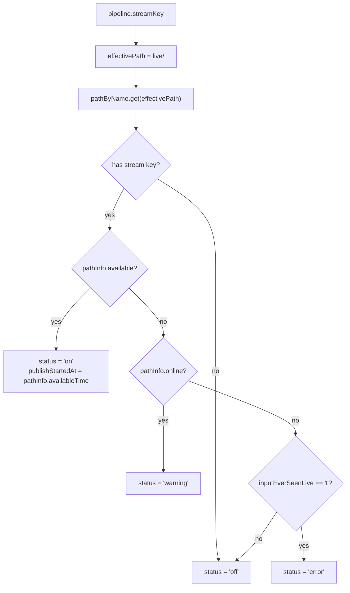
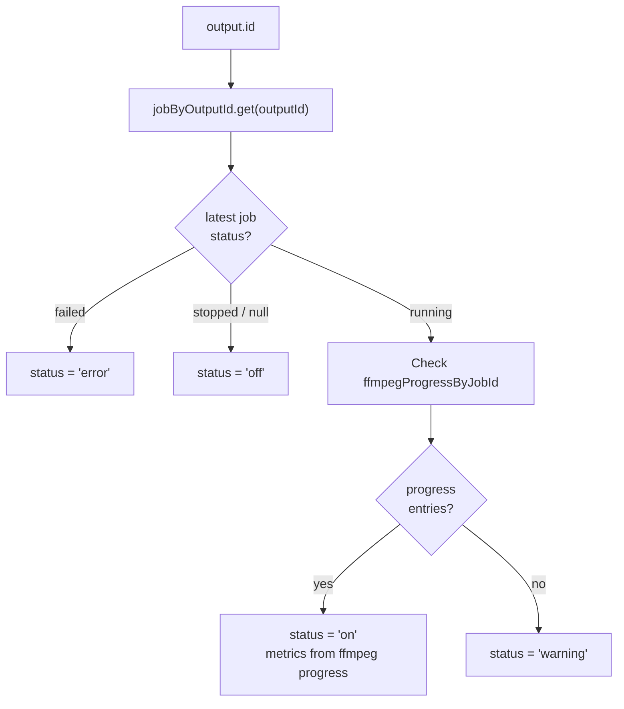

# Health Mapping: Status Derivation

This document explains exactly how input and output health statuses are derived for the periodic health collector that backs `GET /health`.

---

## 1. Data Sources

The background health collector fetches multiple MediaMTX APIs in parallel on a fixed interval, then merges that runtime data with DB state and stores an in-memory snapshot. `GET /health` serves that cached snapshot and adds `ageMs` plus an `ETag` header. The interval defaults to 2000 ms and can be overridden with `HEALTH_SNAPSHOT_INTERVAL_MS`.

| Source | What it provides |
|---|---|
| `GET /v3/paths/list` | Per-path: online, available, availableTime (plus deprecated ready/readyTime), bytesReceived, bytesSent, tracks2, readers list |
| `GET /v3/rtmpconns/list` | RTMP publisher sessions (state/path/remote and byte counters) |
| `GET /v3/srtconns/list` | SRT publisher sessions and ingest quality counters (RTT/loss/retrans/drop/undecrypt/rate) |
| DB: `listPipelines()` | Pipeline ↔ stream key mapping |
| DB: `listOutputs()` | Output ↔ pipeline mapping |
| DB: `listJobs()` | One current job row per output (upsert model) |
| FFmpeg progress (in-memory) | Per-job `key=value` progress from fd3; used for output health and runtime stats |

The collector loop also performs bounded DB writes for lifecycle bookkeeping:

- marks `pipelines.input_ever_seen_live = 1` when a configured input first becomes available
- appends pipeline-level history events (`pipeline_state`) only when status changes

---

## 2. Input Health Derivation

For each pipeline, the input status is derived from the pipeline's `streamKey`:



**Input status values:**

| Value | Condition |
|-------|-----------|
| `on` | Path exists AND `pathInfo.available === true` *(fallback to deprecated `ready` for older MediaMTX versions)* |
| `warning` | Path exists, `pathInfo.online === true`, but not yet `available` |
| `error` | Stream key is configured, path is neither online nor available, and `inputEverSeenLive === 1` |
| `off` | No stream key configured, or stream key configured but never seen live |

**Additional input fields from MediaMTX:**

- `publishStartedAt` — `pathInfo.availableTime` (fallback `readyTime`) ISO timestamp when input became available, across publisher protocols (RTMP, SRT)
- `video` — from `pathInfo.tracks2` (first H264 track) + `ffprobe` cache for FPS only
- `audio` — from `pathInfo.tracks2` (first non-video codec) + `ffprobe` cache for codec/profile, with fallback for channels/sample rate
- `audioTracks` — full audio stream list from the SRT `ffprobe` cache, used by output remap UI for explicit track selection
- `readers` — `pathInfo.readers.length`
- `bytesReceived` / `bytesSent` — from `pathInfo`

**ffprobe caching:**

When a path is available, the collector checks `streamProbeCache` and triggers `ffprobe` refreshes using stale-while-revalidate semantics. The probe connects via SRT (`srt://localhost:8890?streamid=read:live/<streamKey>`) and reads codec and format details. Probe results stay cached in `streamProbeCache` for `PROBE_CACHE_TTL_MS` (default 30 s). The probe is intentionally narrow: it supplements MediaMTX with video FPS plus audio codec/profile details, while MediaMTX remains the primary source for video dimensions/profile/level and audio channel count/sample rate.

Probe connections are tracked by the health collector using the SRT `streamid` pattern so they can be excluded from unexpected-reader counts.

### 2.1 Publisher And Reader-Safety Signals

The input health payload also includes:

- `input.publisher`: active publisher identity and protocol-specific ingest quality counters (RTMP/SRT), including SRT RTT, receive rate, packet loss/drop/retransmit counters, latency buffers, estimated link capacity, and NAK count when MediaMTX exposes them.
- `input.unexpectedReaders`: reader inventory that excludes expected managed output readers and internal probes

`input.unexpectedReaders.count` is surfaced in the dashboard as a warning badge. It excludes managed output types (`rtmpconn`, `srtconn`, `hlsMuxer`) and internal probe readers.

---

## 3. Output Health Derivation

### 3.1 Overview

Output health combines the latest DB job state with live FFmpeg progress data from the in-memory progress map (populated via fd3).



### 3.2 FFmpeg Progress (Primary Mechanism)

Each FFmpeg output process writes progress data to fd3 (`-progress pipe:3`). The app reads that stream and stores the latest key=value block in `ffmpegProgressByJobId` keyed by job ID.

When a job is running:

- **`on`** — `ffmpegProgressByJobId.get(jobId)` has at least one entry (FFmpeg has sent progress)
- **`warning`** — the map entry exists but is empty, meaning FFmpeg is running but has not emitted progress yet

This approach is direct: the presence of progress data from the process is the health signal, without any dependency on MediaMTX connection tracking.

Output runtime progress fields sourced from FFmpeg fd3:

- `totalSize` — from `total_size`, normalized to a numeric byte count (`N/A` → `null`)
- `bitrate` — raw `bitrate` string (e.g. `1842.5kbits/s`), or `null`
- `bitrateKbps` — server-normalized numeric Kbps
- `progressFrame` — from `frame`, normalized to an integer (`N/A` → `null`)
- `progressFps` — from `fps`, normalized to a numeric value (`N/A` → `null`)

### 3.3 Diagnosing `warning` Output Status

A running output stuck at `warning` means the job is running but FFmpeg has not emitted any progress data yet. Common causes:

1. **FFmpeg failed immediately at startup.** Check `job_logs` in SQLite for the latest output job; the 250 ms stability check will usually have caught a fast exit, but borderline cases can slip through.
2. **FFmpeg is running but stalled before producing output.** This can happen if the source path is not actually delivering data even though the MediaMTX path shows as available.
3. **Transient startup delay.** Status is briefly `warning` for 1–2 poll cycles while FFmpeg initialises and begins writing progress.

---

## 4. `jobByOutputId` Map Construction

With upsert in place, `jobs` has at most one row per `(pipeline_id, output_id)`. `/health` maps rows directly by `outputId` without timestamp reduction:

```
for each job from db.listJobs():
  map.set(job.outputId, job)
```

This keeps `/health` processing bounded to output count and avoids scanning historical job rows.

---

## 5. UI Color Mapping

The split badge on each pipeline card in the dashboard maps statuses to colors:

| Status | Badge color | Applies to |
|--------|-------------|------------|
| `on` | Green | input + output |
| `warning` | Yellow | input + output |
| `error` | Red | input + output |
| `off` | Grey | input + output |

The left half shows input status (`on` / `warning` / `off`); the right half shows the aggregate of all output statuses for that pipeline (worst-case wins: `error` > `warning` > `on` > `off`).

---

## 6. Field Source Matrix (MediaMTX vs ffprobe)

### 6.1 Input Fields

| Field | Source | Notes |
|---|---|---|
| `input.status` | MediaMTX | `on` when `pathInfo.available`; `warning` when `pathInfo.online && !pathInfo.available`; fallback to deprecated `ready` for older MediaMTX versions. |
| `input.publishStartedAt` | MediaMTX | `pathInfo.availableTime` (fallback `readyTime`). |
| `input.streamKey` | DB/config | Pipeline `streamKey` from DB-backed pipeline config. |
| `input.readers` | MediaMTX | `pathInfo.readers.length`. |
| `input.bytesReceived` | MediaMTX | `pathInfo.bytesReceived`. |
| `input.bytesSent` | MediaMTX | `pathInfo.bytesSent`. |
| `input.video.codec` | MediaMTX | First H264-like track in `pathInfo.tracks2`. |
| `input.video.width` | MediaMTX | `firstVideoTrack.codecProps.width`. |
| `input.video.height` | MediaMTX | `firstVideoTrack.codecProps.height`. |
| `input.video.profile` | MediaMTX | `firstVideoTrack.codecProps.profile`. |
| `input.video.level` | MediaMTX | `firstVideoTrack.codecProps.level`. |
| `input.video.fps` | ffprobe | `probeInfo.video.fps` from cached SRT probe; MediaMTX does not expose FPS. |
| `input.audio.codec` | Mixed | Prefer `probeInfo.audio.codec` (e.g. `aac`), fallback to MediaMTX track codec. |
| `input.audio.channels` | Mixed | Prefer `probeInfo.audio.channels`, fallback to `firstAudioTrack.codecProps.channelCount`. |
| `input.audio.sample_rate` | Mixed | Prefer `probeInfo.audio.sampleRate`, fallback to `firstAudioTrack.codecProps.sampleRate`. |
| `input.audio.profile` | Mixed | Prefer `probeInfo.audio.profile`; MediaMTX often does not expose audio profile. |

Frontend-only derived input stats:

| Field | Source | Notes |
|---|---|---|
| `input.bitrateKbps` | Computed in UI | Calculated from deltas of `input.bytesReceived` across poll intervals. |
| `input.time` | Computed in UI | Derived from `publishStartedAt` to now. |

### 6.2 Output Fields

| Field | Source | Notes |
|---|---|---|
| `outputs[outputId].status` | Mixed | Base from latest DB job status, then `on/warning` from FFmpeg progress presence. |
| `outputs[outputId].jobId` | DB | Latest job row ID for this output. |
| `outputs[outputId].totalSize` | FFmpeg progress (fd3) | Parsed from `total_size` into a numeric byte count; `N/A` becomes `null`. |
| `outputs[outputId].bitrate` | FFmpeg progress (fd3) | Raw `bitrate` string from in-memory progress map, or `null`. |
| `outputs[outputId].bitrateKbps` | Server-normalized | Parsed from `bitrate` into numeric Kbps; `N/A` becomes `null`. |
| `outputs[outputId].progressFrame` | FFmpeg progress (fd3) | Parsed from `frame` into an integer frame count; `N/A` becomes `null`. |
| `outputs[outputId].progressFps` | FFmpeg progress (fd3) | Parsed from `fps` into a numeric FPS value; `N/A` becomes `null`. |

Notes on HLS outputs:

- Transcoded HLS outputs can emit `progressFrame` and `progressFps` normally.
- HLS `source` copy outputs may omit `frame` and `fps` in ffmpeg progress, so those fields can remain `null` even while the output is healthy.
- HLS uploads commonly report `N/A` for `bitrate` and `total_size`; the backend converts those to `null` before the dashboard sees them.
