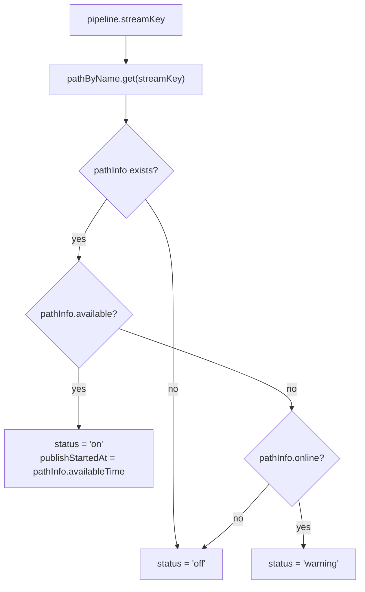
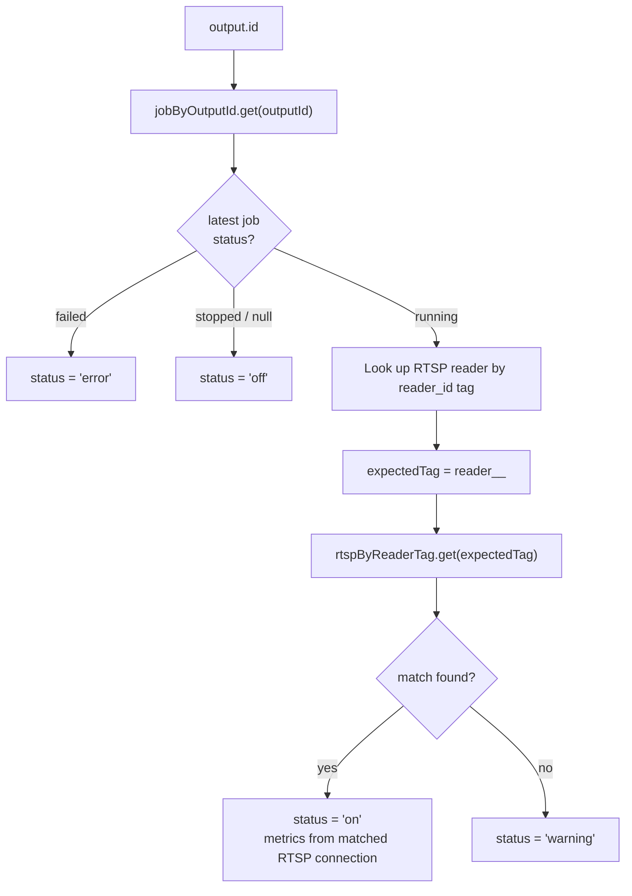
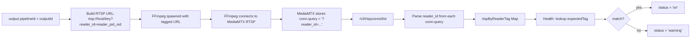

# Health Mapping: Status Derivation and Reader Correlation

This document explains exactly how input and output health statuses are derived in `GET /health`.

---

## 1. Data Sources

The `/health` endpoint fetches three MediaMTX APIs in parallel, then merges with DB state:

| Source                      | What it provides                                         |
|-----------------------------|----------------------------------------------------------|
| `GET /v3/paths/list`        | Per-path: online, available, availableTime (plus deprecated ready/readyTime), bytesReceived, bytesSent, tracks2, readers list |
| `GET /v3/rtspconns/list`    | All RTSP connections including `query` field (contains `reader_id`) |
| `GET /v3/rtspsessions/list` | RTSP sessions for fallback field lookup                  |
| DB: `listPipelines()`       | Pipeline ↔ stream key mapping                            |
| DB: `listOutputs()`         | Output ↔ pipeline mapping                                |
| DB: `listJobs()`            | One current job row per output (upsert model)            |

---

## 2. Input Health Derivation

For each pipeline, the input status is derived from the pipeline's `streamKey`:



**Input status values:**

| Value | Condition                                                            |
|-------|----------------------------------------------------------------------|
| `on`  | Path exists AND `pathInfo.available === true` *(fallback to deprecated `ready` for older MediaMTX versions)* |
| `warning` | Path exists, `pathInfo.online === true`, but not yet `available` |
| `off` | No path info, or path is neither online nor available |

**Additional input fields from MediaMTX:**

- `publishStartedAt` — `pathInfo.availableTime` (fallback `readyTime`) ISO timestamp when input became available, across publisher protocols (RTMP, RTSP, SRT, WebRTC)
- `video` — from `pathInfo.tracks2` (first H264 track) + `ffprobe` cache for FPS only
- `audio` — from `pathInfo.tracks2` (first non-video codec) + `ffprobe` cache for codec/profile, with fallback for channels/sample rate
- `readers` — `pathInfo.readers.length`
- `bytesReceived` / `bytesSent` — from `pathInfo`

**ffprobe caching:**

When a path is available, the backend calls `ffprobe -rtsp_transport tcp rtsp://localhost:8554/<streamKey>` and caches the result in `streamProbeCache` for `PROBE_CACHE_TTL_MS` (default 30 s). The probe is intentionally narrow: it supplements MediaMTX with video FPS plus audio codec/profile details, while MediaMTX remains the primary source for video dimensions/profile/level and audio channel count/sample rate.

---

## 3. Output Health Derivation

### 3.1 Overview

Output health combines the latest DB job state with live RTSP reader connection data from MediaMTX.



### 3.2 Reader Tag Correlation (Primary Mechanism)

Each FFmpeg output is launched with a unique `reader_id` embedded in its RTSP pull URL:

```
rtsp://localhost:8554/<streamKey>?reader_id=reader_<pipelineId>_<outputId>
```

MediaMTX surfaces the full query string in `/v3/rtspconns/list` as `conn.query`. The health endpoint parses `reader_id` from each connection's query at run-time:

```
getReaderIdFromQuery(conn.query)
  → URLSearchParams.get('reader_id')
  → "reader_<pipelineId>_<outputId>"
```

This builds `rtspByReaderTag: Map<tag, conn[]>`. For each running output, the expected tag is regenerated identically:

```
generateReaderTag(pipelineId, outputId)
  → "reader_" + (pipelineId + "_" + outputId).replace(/[^a-zA-Z0-9_-]/g, '_')
```

If `rtspByReaderTag.get(expectedTag)` returns at least one connection, status is `on`. Output counters and bitrate are sourced from ffmpeg progress keyed by `jobId`: `total_size` (raw), `bitrate` (raw), and `bitrateKbps` (server-normalized numeric Kbps).



### 3.3 User-Agent (Diagnostics Only)

Reader correlation is exclusively `reader_id` query-param based.

### 3.4 Why Query Param, Not Position-Based

An earlier design inferred output→reader mapping by ordering (output N maps to reader N). This was fragile under dynamic starts/stops and restarts. The `reader_id` approach is:

- **Deterministic**: the same tag is generated identically on every health check with no stored state
- **Restart-safe**: no dependency on order or startup timing
- **Strict 1:1**: each output has a unique tag; no ambiguity even when multiple outputs share the same pipeline/path

---

## 4. `jobByOutputId` Map Construction

With upsert in place, `jobs` has at most one row per `(pipeline_id, output_id)`. `/health` now maps rows directly by `outputId` without timestamp reduction:

```
for each job from db.listJobs():
  map.set(job.outputId, job)
```

This keeps `/health` processing bounded to output count and avoids scanning historical job rows.

---

## 5. UI Color Mapping

The split badge on each pipeline card in the dashboard maps statuses to colors:

| Status    | Badge color | Applies to      |
|-----------|-------------|-----------------|
| `on`      | Green       | input + output  |
| `warning` | Yellow      | input + output  |
| `error`   | Red         | output only     |
| `off`     | Grey        | input + output  |

The left half shows input status (`on` / `warning` / `off`); the right half shows the aggregate of all output statuses for that pipeline (worst-case wins: `error` > `warning` > `on` > `off`).

---

## 6. Diagnosing `warning` Output Status

A running output stuck at `warning` means MediaMTX has no RTSP connection with the expected `reader_id`. Common causes:

1. **MediaMTX version does not expose `query` on RTSP connections.** Check `/v3/rtspconns/list` manually — if `conn.query` is always empty, the query-param approach will not work. The server logs a `warn`-level entry if RTSP connections exist but `rtspByReaderTag` is empty.
2. **FFmpeg failed to connect to RTSP.** Check `job_logs` in SQLite for the latest output job details.
3. **FFmpeg is running but using a different path.** Verify MediaMTX is listening on `localhost:8554`.
4. **Race condition at startup.** Status may briefly be `warning` for 1–2 poll cycles while MediaMTX registers the RTSP session.

---

## 7. Future Hardening

- If `conn.query` exposure is lost in a future MediaMTX release, fall back to user-agent based correlation by parsing `conn.useragent`.
- Add timestamps to reader tags for audit trails.
- Validate output existence server-side on job start to enforce 1:1 output→reader invariant.

---

## 8. Field Source Matrix (MediaMTX vs ffprobe)

This section lists where each input/output field is sourced from in the current implementation.

### 8.1 Input Fields

| Field | Source | Notes |
|---|---|---|
| `input.status` | MediaMTX | `on` when `pathInfo.available`; `warning` when `pathInfo.online && !pathInfo.available`; fallback to deprecated `ready` for older MediaMTX versions. |
| `input.publishStartedAt` | MediaMTX | `pathInfo.availableTime` (fallback `readyTime`). |
| `input.streamKey` | DB/config | Pipeline `streamKey` from DB-backed pipeline config. |
| `input.readers` | MediaMTX | `pathInfo.readers.length`. |
| `input.bytesReceived` | MediaMTX | `pathInfo.bytesReceived`. |
| `input.bytesSent` | MediaMTX | `pathInfo.bytesSent`. |
| `input.video.codec` | MediaMTX | First H264-like track in `pathInfo.tracks2`. |
| `input.video.width` | MediaMTX | `firstVideoTrack.codecProps.width`. |
| `input.video.height` | MediaMTX | `firstVideoTrack.codecProps.height`. |
| `input.video.profile` | MediaMTX | `firstVideoTrack.codecProps.profile`. |
| `input.video.level` | MediaMTX | `firstVideoTrack.codecProps.level`. |
| `input.video.fps` | ffprobe | `probeInfo.video.fps` from cached RTSP probe; MediaMTX does not expose FPS. |
| `input.audio.codec` | Mixed | Prefer `probeInfo.audio.codec` (for example `aac`), fallback to MediaMTX track codec (for example `MPEG-4 Audio`). |
| `input.audio.channels` | Mixed | Prefer `probeInfo.audio.channels`, fallback to `firstAudioTrack.codecProps.channelCount`. |
| `input.audio.sample_rate` | Mixed | Prefer `probeInfo.audio.sampleRate`, fallback to `firstAudioTrack.codecProps.sampleRate`. |
| `input.audio.profile` | Mixed | Prefer `probeInfo.audio.profile`; MediaMTX often does not expose audio profile. |

Frontend-only derived input stats:

| Field | Source | Notes |
|---|---|---|
| `input.bitrateKbps` | Computed in UI | Calculated from deltas of `input.bytesReceived` across poll intervals. |
| `input.time` | Computed in UI | Derived from `publishStartedAt` to now. |

### 8.2 Output Fields

| Field | Source | Notes |
|---|---|---|
| `outputs[outputId].status` (backend `/health`) | Mixed | Base from latest DB job status, then runtime `on/warning` from MediaMTX reader-tag match. |
| `outputs[outputId].jobId` | DB | Latest job row ID for this output. |
| `outputs[outputId].totalSize` | ffmpeg progress | Raw ffmpeg `total_size` from in-memory progress map for the running `jobId`. |
| `outputs[outputId].bitrate` | ffmpeg progress | Raw ffmpeg `bitrate` string from in-memory progress map for the running `jobId`. |
| `outputs[outputId].bitrateKbps` | Server-normalized | Parsed from ffmpeg `bitrate` into numeric Kbps in backend health aggregation. |

Frontend-only derived output stats and display values:

| Field | Source | Notes |
|---|---|---|
| `out.status` (dashboard model) | Backend `/health` | UI treats backend `outputs[outputId].status` as source of truth. |
| `out.bitrateKbps` | Backend `/health` | Direct passthrough from `outputs[outputId].bitrateKbps` (numeric). |
| `pipe.stats.outputBitrateKbps` | Computed in UI | Sum of active `out.bitrateKbps` values for display. |
| `out.video`, `out.audio` for `copy/source` | Reused from input | Output display reuses input media metadata; ffprobe influence is indirect via input fields. |
