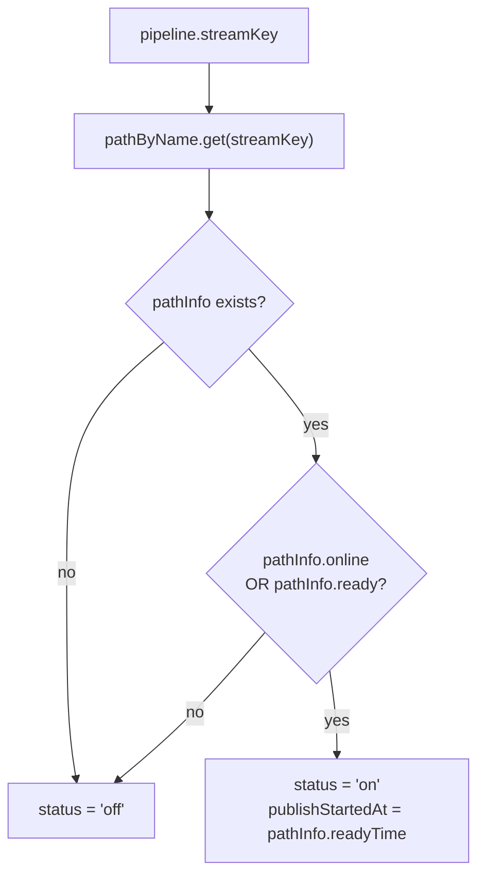
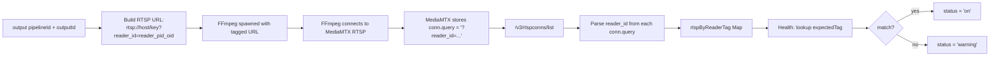

# Health Mapping: Status Derivation and Reader Correlation

This document explains exactly how input and output health statuses are derived in `GET /health`.

---

## 1. Data Sources

The `/health` endpoint fetches three MediaMTX APIs in parallel, then merges with DB state:

| Source                      | What it provides                                         |
|-----------------------------|----------------------------------------------------------|
| `GET /v3/paths/list`        | Per-path: online, ready, readyTime, bytesReceived, bytesSent, tracks2, readers list |
| `GET /v3/rtspconns/list`    | All RTSP connections including `query` field (contains `reader_id`) |
| `GET /v3/rtspsessions/list` | RTSP sessions for fallback field lookup                  |
| DB: `listPipelines()`       | Pipeline ↔ stream key mapping                            |
| DB: `listOutputs()`         | Output ↔ pipeline mapping                                |
| DB: `listJobs()`            | Latest job status per output                             |

---

## 2. Input Health Derivation

For each pipeline, the input status is derived from the pipeline's `streamKey`:



**Input status values:**

| Value | Condition                                                            |
|-------|----------------------------------------------------------------------|
| `on`  | Path exists AND (`pathInfo.online === true` OR `pathInfo.ready === true`) |
| `off` | No path info, or path neither online nor ready                        |

**Additional input fields from MediaMTX:**

- `publishStartedAt` — `pathInfo.readyTime` (ISO timestamp when the path became ready, covers all publisher protocols: RTMP, RTSP, SRT, WebRTC)
- `video` — from `pathInfo.tracks2` (first H264 track) + `ffprobe` cache for FPS
- `audio` — from `pathInfo.tracks2` (first non-video codec) + `ffprobe` cache
- `readers` — `pathInfo.readers.length`
- `bytesReceived` / `bytesSent` — from `pathInfo`

**ffprobe caching:**

When a path is online, the backend calls `ffprobe -rtsp_transport tcp rtsp://<host>/<streamKey>` and caches the result in `streamProbeCache` for `PROBE_CACHE_TTL_MS` (default 30 s). This supplements track metadata with accurate FPS and audio codec details.

---

## 3. Output Health Derivation

### 3.1 Overview

Output health combines the latest DB job state with live RTSP reader connection data from MediaMTX.


### 3.2 Reader Tag Correlation (Primary Mechanism)

Each FFmpeg output is launched with a unique `reader_id` embedded in its RTSP pull URL:

```
rtsp://localhost:8554/<streamKey>?reader_id=reader_<pipelineId>_<outputId>
```

MediaMTX surfaces the full query string in `/v3/rtspconns/list` as `conn.query`. The health endpoint parses `reader_id` from each connection's query at run-time:

```
getReaderIdFromQuery(conn.query)
  → URLSearchParams.get('reader_id')
  → "reader_<pipelineId>_<outputId>"
```

This builds `rtspByReaderTag: Map<tag, conn[]>`. For each running output, the expected tag is regenerated identically:

```
generateReaderTag(pipelineId, outputId)
  → "reader_" + (pipelineId + "_" + outputId).replace(/[^a-zA-Z0-9_-]/g, '_')
```

If `rtspByReaderTag.get(expectedTag)` returns at least one connection, status is `on` and metrics (`bytesReceived`, `bytesSent`, `remoteAddr`) come from that connection.



### 3.3 User-Agent (Diagnostics Only)

Reader correlation is exclusively `reader_id` query-param based.

### 3.4 Why Query Param, Not Position-Based

An earlier design inferred output→reader mapping by ordering (output N maps to reader N). This was fragile under dynamic starts/stops and restarts. The `reader_id` approach is:

- **Deterministic**: the same tag is generated identically on every health check with no stored state
- **Restart-safe**: no dependency on order or startup timing
- **Strict 1:1**: each output has a unique tag; no ambiguity even when multiple outputs share the same pipeline/path

---

## 4. `latestJobByOutputId` Map Construction

Jobs are loaded with `db.listJobs()` (all jobs, ordered by `started_at DESC`). The map keeps only the single most-recent job per `outputId`:

```
for each job (newest-first):
  key = job.outputId
  if key not in map:
    map.set(key, job)
  else:
    compare timestamps; keep whichever is newer
```

This means the output status reflects the **latest** job run, not any historical failed run.

---

## 5. UI Color Mapping

The split badge on each pipeline card in the dashboard maps statuses to colors:

| Status    | Badge color | Applies to      |
|-----------|-------------|-----------------|
| `on`      | Green       | input + output  |
| `warning` | Yellow      | output only     |
| `error`   | Red         | output only     |
| `off`     | Grey        | input + output  |

The left half shows input status (`on` / `off`); the right half shows the aggregate of all output statuses for that pipeline (worst-case wins: `error` > `warning` > `on` > `off`).

---

## 6. Diagnosing `warning` Output Status

A running output stuck at `warning` means MediaMTX has no RTSP connection with the expected `reader_id`. Common causes:

1. **MediaMTX version does not expose `query` on RTSP connections.** Check `/v3/rtspconns/list` manually — if `conn.query` is always empty, the query-param approach will not work. The server logs a `warn`-level entry if RTSP connections exist but `rtspByReaderTag` is empty.
2. **FFmpeg failed to connect to RTSP.** Check `GET /pipelines/:pipelineId/outputs/:outputId/logs` or read `job_logs` from DB directly.
3. **FFmpeg is running but using a different path.** Verify MediaMTX is listening on `localhost:8554`.
4. **Race condition at startup.** Status may briefly be `warning` for 1–2 poll cycles while MediaMTX registers the RTSP session.

---

## 7. Future Hardening

- If `conn.query` exposure is lost in a future MediaMTX release, fall back to user-agent based correlation by parsing `conn.useragent`.
- Add timestamps to reader tags for audit trails.
- Validate output existence server-side on job start to enforce 1:1 output→reader invariant.
