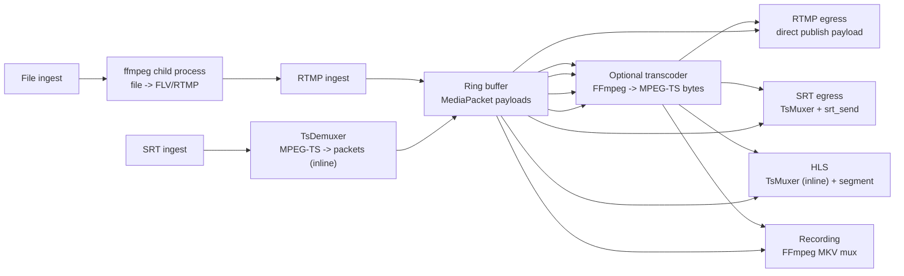
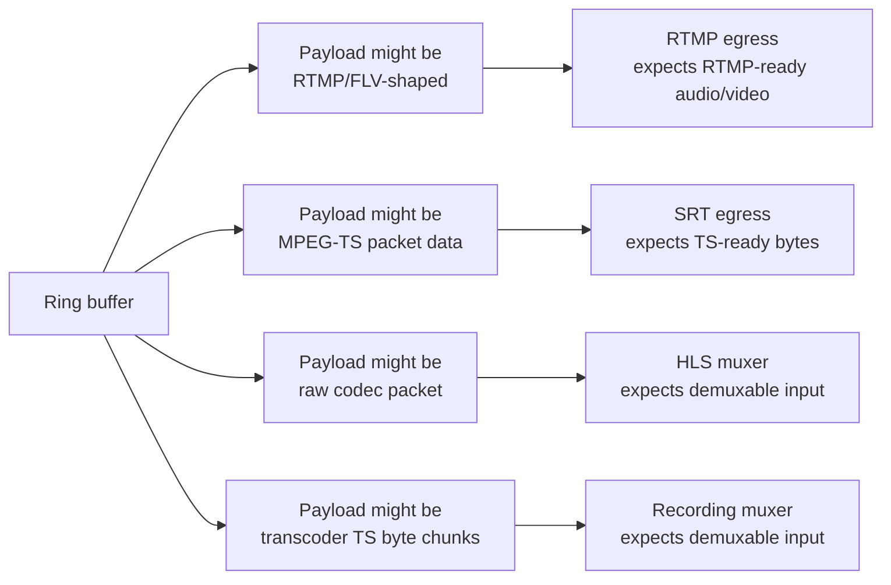
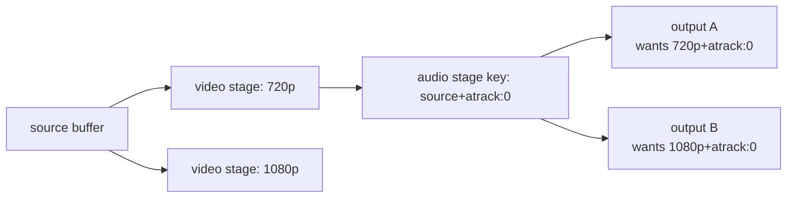
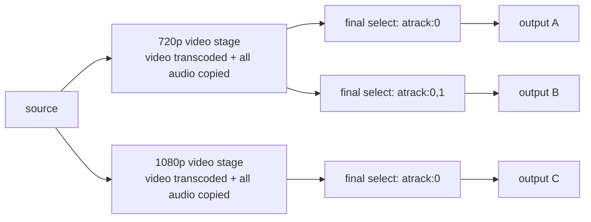
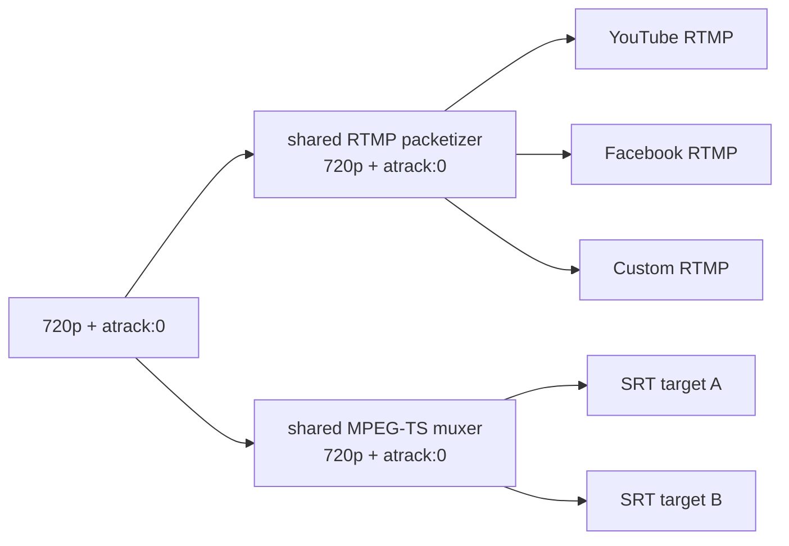
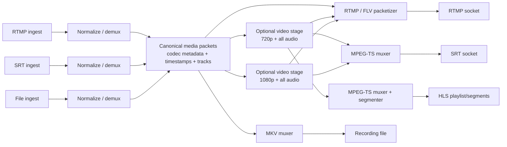
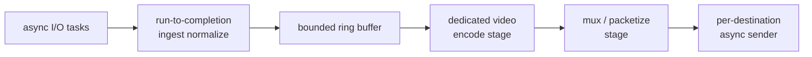
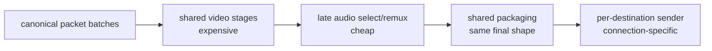

# Media Pipeline Stage Design

This note captures the current ingest-to-egress media pipeline, the risks in the
current packet contract, and a proposed stage-sharing design that minimizes
duplicate work while keeping protocol packaging correct.

## Current Shape

The rewrite is moving toward a single Rust binary with in-process transport,
transcoding, muxing, diagnostics, and orchestration. Most FFmpeg work is done
through linked FFmpeg libraries on OS threads. The main exception today is
file-based ingest, which currently spawns an `ffmpeg` child process and pushes
the file into the local RTMP server.



Runtime child processes:

- One `ffmpeg` child per running file ingest.
- No child process for RTMP egress, SRT egress, HLS, recording, or in-process
  transcoding.
- `build.rs` also runs `git rev-parse --short HEAD`, but that is build-time
  metadata collection, not runtime media work.

## Recognized Resolution Presets

The configuration and stage-key code recognizes these presets. They are not yet
working transforms: the transcoder creates encoder/output parameters but then
writes the original compressed packets without a decode/filter/encode loop.

| Preset | Resolution | Notes |
|---|---|---|
| `source` | passthrough | preserves original resolution and frame rate |
| `720p` | 1280x720 | recognized; transform incomplete |
| `1080p` | 1920x1080 | recognized; transform incomplete |
| `2160p` / `4k` | 3840x2160 | recognized; transform incomplete |
| `vertical-crop` | 1080x1920 | no crop filter yet |
| `vertical-rotate` | 1080x1920 | no rotate filter yet |
| `h264` | source resolution | intended H.265→H.264 conversion; incomplete |
| `custom` | user-specified | reserved for future custom encoder params |

The encoder time base is inherited from the input stream, but no frame-rate or
4K60 throughput guarantee should be made until the encode loop exists and is
benchmarked.

## H.265 Egress Policy

Standard RTMP (non-Enhanced) does not carry H.265. The reconciler enforces:

| Egress protocol | H.265 input | Behavior |
|---|---|---|
| RTMP | H.265 source | Auto-inserts intended `h264` stage; conversion incomplete |
| RTMP | H.265 + resolution preset | Intended H.264 transform; incomplete |
| SRT | H.265 source | Passthrough (MPEG-TS carries HEVC natively) |
| SRT | H.265 + resolution preset | Intended HEVC transform; incomplete |
| HLS | H.265 source | Intended passthrough; live HLS generation contract is broken |

Enhanced RTMP/HEVC packetization is not implemented. RTMPS is also not currently
dispatched by the reconciler.

## Current Protocol Matrix

The code implements RTMP and SRT ingest, file ingest through the RTMP loopback
bridge, and RTMP/SRT/HLS/recording egress. The matrix below separates
passthrough paths from incomplete transform paths.

| Ingest | RTMP egress | SRT egress | HLS preview | Recording |
|---|---|---|---|---|
| RTMP H.264 | Basic interoperability only; B-frame timestamp defect | Implemented; full matrix gate | Store/routes exist; live generation contract broken | Mux path exists; live generation contract broken |
| RTMP H.265 | Not supported without Enhanced RTMP | Not assumed | Not assumed | Not assumed |
| SRT H.264 | Not protocol-correct | Locally validated | Store/routes exist; live generation contract broken | Mux path exists; live generation contract broken |
| SRT H.265 | H.264 conversion incomplete | Passthrough implemented; E2E gate | Store/routes exist; live generation contract broken | Mux path exists; live generation contract broken |
| File | RTMP-shaped source; basic path only and same timestamp caveat | Implemented for compatible FLV codecs | Live generation contract broken | Live generation contract broken |

The weak spots are not mostly about FFmpeg availability. They are about what
`MediaPacket.payload` means on each path.

## Buffer Sizing Target (4K 60fps)

Sizing target: 4K UHD (3840×2160) at 60 fps. A 4K60 H.264 stream runs
20–50 Mbps; H.265 runs 10–25 Mbps. Individual I-frames can be 200–500 KB
(H.264) or 100–250 KB (H.265). P/B-frames are 5–20× smaller. The table
below states each component's size, the constraint that drove it, and the
source file where the constant lives.

| Component | Size | Constraint | Source |
|---|---|---|---|
| RingBuffer capacity | 4096 slots | Working estimate of ~24s at an assumed 170 packets/sec. Actual depth depends on packetization, frame rate, and audio tracks. Overflow fast-forwards to the most recent keyframe. | `engine.rs`, `ring_buffer.rs` |
| AVIO buffer | 32 KB | FFmpeg's internal AVIO read/write chunk. Smaller values increase callback frequency ~8× per frame without throughput gain. | `avio.rs:18` |
| MemoryQueue | Unbounded `VecDeque<u8>` | Auto-grows. Backpressure is structural: the downstream consumer blocks on `read()`, so the queue only grows if the producer is faster than the consumer (which is transient for live streams). | `avio.rs:26` |
| sync_channel (muxer) | 256 `Arc<MediaPacket>` | ~1.5s at 4K60. Bounded to provide backpressure — if the MPEG-TS muxer stalls, the feeder blocks instead of growing unbounded. Slots hold refcounted pointers, not copies. | `srt.rs` play/egress muxer |
| HLS segment accumulator | 8 MB initial alloc | A 4K60 H.264 segment at 6s target duration can reach 12 MB (50 Mbps × 2s GOP, though typical is 4–8 MB). Pre-allocating avoids repeated reallocs during the first segment. Vec grows beyond 8 MB if needed. | `hls.rs:243` |
| HLS MAX_SEGMENTS | 10 | ~60s sliding window at 6s target duration. Bounded to cap memory — 10 × 8 MB = 80 MB worst case per pipeline at 4K. | `hls.rs:36` |
| HLS TARGET_DURATION | 6s | Standard HLS segment length. MIN_SEGMENT (1s) prevents micro-segments from keyframe bursts. | `hls.rs:34–35` |
| RTMP TCP SO_RCVBUF / SO_SNDBUF | 8 MB | Applied to accepted ingest sockets. The egress client currently sets only `TCP_NODELAY`. | `rtmp.rs` |
| SRT SRTO_LATENCY | 250 ms | Dejitter + retransmit window. Formula: 4×RTT + 2×jitter for 50 ms RTT, ~10 ms jitter = 220 ms, rounded to 250 ms for margin. At 50 Mbps, 250 ms = 1.56 MB in flight. Sender and receiver negotiate the max of both sides at handshake. | `srt.rs` `srt_set_highbitrate_opts` |
| SRT SRTO_LOSSMAXTTL | 256 packets | Reorder tolerance before declaring loss. At 50 Mbps / 1316 B = ~4750 pkt/s, 256 packets ≈ 54 ms. Prevents premature NACK storms on jittery links. Default (0) = auto-detect, which can react too slowly on first jitter burst. | `srt.rs` `srt_set_highbitrate_opts` |
| SRT UDP socket (SRTO_UDP_SNDBUF / RCVBUF) | 8 MB | Kernel UDP buffers — libsrt does **not** propagate `SRTO_SNDBUF` to the kernel socket. Default ~208 KB fills in 33 ms at 50 Mbps; any scheduling hiccup causes irrecoverable kernel drops. Must be set explicitly via `SRTO_UDP_SNDBUF`/`RCVBUF` (option IDs 8/9). Requires `net.core.rmem_max` / `wmem_max` ≥ 8 MB; startup warns if too low. | `srt.rs` `srt_set_highbitrate_opts` |
| SRT internal (SRTO_SNDBUF / RCVBUF) | 12 MB | SRT's own retransmission and reordering buffers (option IDs 5/6). Must be ≥ latency × bitrate × (1 + loss_overhead). At 250 ms, 50 Mbps, 5% loss: 1.56 MB × 1.15 ≈ 1.8 MB minimum. 12 MB gives ~2s headroom for retransmission bursts on lossy links. | `srt.rs` `srt_set_highbitrate_opts` |
| SRT SRTO_FC | 32768 packets | Flow control window (option ID 4). Default 8192 limits throughput on high-latency links (FC × payload ÷ RTT = max throughput). At 1316 B/pkt, 32768 × 1316 = ~43 MB window. | `srt.rs` `srt_set_highbitrate_opts` |
| SRT SRTO_MAXBW | -1 (unlimited) | Lets SRT auto-detect bandwidth from the input rate (option ID 16). A fixed cap would throttle 4K streams. | `srt.rs` `srt_set_highbitrate_opts` |
| SRT recv loop buffer | 1316 bytes | One SRT payload (1500 MTU − IP/UDP/SRT headers). Matches libsrt's internal packet size. | `srt.rs:669` |

**Runtime verification hook**: `srt_log_effective_opts` reads back values after
`srt_setsockopt` and logs them, warning if the kernel clamped UDP buffers.
Example output:

```
[srt] listener config: latency=250ms lossmaxttl=256 UDP snd=8192KB rcv=8192KB, SRT snd=12287KB rcv=12287KB, FC=32768
```

**Kernel socket verification via `ss`**: `ss -ulnm sport = :10080` shows `rb` (recv buf) and `tb` (transmit buf) — kernel doubles the requested value per `SO_RCVBUF` convention, so 8 MB request → `rb16777216`.

## SRT Bonding

SRT connection bonding provides link redundancy by sending data over multiple
network paths simultaneously. Two modes are available:

- **Backup** (`SRT_GTYPE_BACKUP`): one active link, failover to standby on
  loss. Lower bandwidth cost.
- **Broadcast** (`SRT_GTYPE_BROADCAST`): all links active, highest resilience.

### Ingest bonding

The SRT listener requests `SRTO_GROUPCONNECT=1`. This requires libsrt compiled
with `ENABLE_BONDING=ON`; startup warns and retains single-link ingest if the
linked library rejects the option. A publisher-created bonded connection is
accepted as one logical group:

1. The first member causes `srt_accept` to return a group ID.
2. `handle_client` runs once for that group ID.
3. Later member links in the same group are attached by libsrt in the
   background and do not produce additional application accepts.
4. The existing `srt_recv(group_id, ...)` loop receives the recovered logical
   payload and feeds one queue/demuxer/ring producer.
5. `srt_group_data` reports total, connected, active, and broken members through
   health/diagnostic publisher quality.

This works through the single `:10080` listener when both publisher paths target
that endpoint. `srt_accept_bond` is only needed when the application listens on
multiple local endpoints.

The publisher must use SRT's group/bonding API. Matching StreamIDs on two
independent caller sockets are not enough; those are separate publishers and
are rejected by the single-producer reservation rather than byte-merged.

### Egress bonding

Specify additional link targets via the `bond=` URL parameter:

```
srt://primary:10080?streamid=publish:live/key&bond=secondary:10080,tertiary:10080
```

When `bond=` is present, the egress creates an `SRT_GTYPE_BACKUP` group, calls
`srt_connect_group` with all member endpoints, and uses the group socket for
`srt_send`. The first address has weight=1 (primary), additional addresses have
weight=0 (standby). The streamid is shared across all members via
`srt_create_config` / `srt_config_add`.

Without `bond=`, the egress uses a single `srt_create_socket` + `srt_connect`
(no change from prior behavior).

The bonded group branch does not currently call `srt_set_highbitrate_opts()`;
only the listener and single-link egress do. Live failover and effective option
inheritance remain to be verified.

## Packet Contract Issue

`MediaPacket` currently carries media type, track index, timestamps, keyframe
flag, and payload bytes. It does not carry enough codec/container metadata to
unambiguously know whether the payload is:

- RTMP/FLV-shaped audio/video payload.
- MPEG-TS-ready bytes.
- Raw codec packet data from a demuxer.
- Chunks of muxed MPEG-TS bytes from the transcoder.



RTMP egress is simple because it publishes `packet.payload` directly as RTMP
audio/video data. That works best when ingest already produced RTMP-ready
payloads. File ingest currently works around this by using an external FFmpeg
process to normalize files into FLV/RTMP before Rust sees the media.

SRT egress is packaged with a proper MPEG-TS mux stage using the native `TsMuxer` (running on a dedicated thread) before transport via `srt_send` (also running on a dedicated sender thread).

## Muxing Stages

| Stage | Current role |
|---|---|
| Transcoder | FFmpeg `CustomInput -> CustomOutput("mpegts")`, then pushes output chunks back into a ring buffer |
| HLS | Native `TsMuxer` remux to MPEG-TS, then segment in memory (inline) |
| Recording | FFmpeg remux to MKV file |
| SRT Ingest | Native `TsDemuxer` demux from MPEG-TS into `MediaPacket`s (inline) |
| SRT Egress | Native `TsMuxer` remux to MPEG-TS (on dedicated thread) |

## Audio Stage Cache Concern

The current output reconciliation splits compound encodings into a video stage
and an audio-filter stage. The audio stage key is currently shaped like:

```text
source+atrack:0
```

That is unsafe because the audio-filter stage also carries video copied from its
input. If `720p+atrack:0` starts first, the `source+atrack:0` stage may read from
the `720p` buffer. A later `1080p+atrack:0` output can reuse that same cached
stage and accidentally receive `720p`.



This correctness issue is resolved. Audio/filter stages are keyed by the upstream stage identity as well as the audio operation (e.g. `audio:atrack:0:from:video:720p`), preventing outputs using different presets from cross-contaminating.

## Proposed Near-Term Model

The best near-term tradeoff is to share expensive video work and carry all audio
through each unique video preset. Then apply audio selection as a cheap late
remux/filter step.



This preserves AV sync better than splitting audio and video into independent
shared branches, because audio and video stay in the same muxed timestamp
timeline through the expensive shared video stage.

It does not remove every possible sync issue. Sync can still break if:

- A video transcode stage rewrites timestamps incorrectly.
- A final mux/filter stage rewrites PTS/DTS incorrectly.
- A reader starts mid-buffer without a clean keyframe and matching audio point.
- A future audio decode/filter/encode operation introduces uncompensated delay.
- Different output protocols impose different buffering or timestamp behavior.

## Protocol Packaging Sharing

Packaging can also be shared, but only when outputs need the same packaged byte
stream. Grouping by protocol alone is not enough.

Outputs can share a packaging stage when these match:

- Pipeline.
- Video preset or source shape.
- Audio selection/routing.
- Codec parameters.
- Container/protocol packaging settings.
- Timing policy.



Suggested package-stage key:

```text
PackageStageKey {
  pipeline_id,
  protocol,
  video_preset,
  audio_route,
  container_options,
}
```

Example concrete keys:

```text
pkg:rtmp:720p:atrack=0
pkg:rtmp:720p:atrack=0,1
pkg:srt:720p:atrack=0
pkg:hls:720p:atrack=0
```

For SRT/MPEG-TS, sharing final TS packets across multiple sockets is
straightforward. For RTMP, the actual socket byte stream includes
connection/session-specific envelopes, acknowledgements, chunking, and control
messages. The shareable RTMP layer is therefore usually the media message or
FLV/RTMP packetized payload layer, with each RTMP connection wrapping those
messages for its own session.

## Cleaner Target Architecture

The long-term model should make normalization, transforms, packaging, and
sending explicit stages.



The stage graph should let the engine cache work by operation plus upstream
identity, not by free-form encoding strings alone.

## In-Process File Ingest

File ingest can be moved in-process, but it needs a clear packet contract.

The current flow is:

```text
media file -> ffmpeg child -> local RTMP -> Rust RTMP ingest -> ring buffer
```

A future in-process flow would be:

```text
media file -> FFmpeg demux/remux in-process -> canonical packets -> ring buffer
```

Implementation responsibilities:

- Look up the ingest and associated pipeline/stream key.
- Register the ingest as protocol `file`.
- Open `media/<filename>` with FFmpeg libraries.
- Seek to `start_time` when present.
- Loop when `loop_flag` is true.
- Pace packet reads according to timestamps, similar to `ffmpeg -re`.
- Preserve or rewrite timestamps consistently.
- Push packets into the pipeline ring buffer.
- Update bytes, keyframes, metadata, and lifecycle state.
- Stop when the ingest cancellation token is cancelled.

The child-process bridge should remain until the in-process path can normalize
common files safely. MP4, MKV, and TS can package H.264/H.265/AAC differently,
so the in-process path may need bitstream filters or a remux step before packets
are safe for all egress protocols.

## Performance Architecture Techniques

The processing pipeline can borrow ideas from query planning, packet processing,
SIMD scanners, and cache-aware data layout. The main goal is not to make every
stage maximally clever. It is to share expensive work, keep cheap work local,
and make packet contracts explicit enough that each protocol does the right
packaging once.

### Algorithmic Techniques

Treat output planning like common-subexpression elimination:

```text
requested outputs -> group by required media shape -> build shared stages -> fan out
```

Useful techniques:

- Common subexpression elimination: one `720p` encode feeds all `720p` outputs.
- Late materialization: carry all audio through video stages, then select audio
  near final packaging.
- Protocol package sharing: share `mpegts:720p+atrack0` across compatible SRT
  outputs; share RTMP media messages before per-connection RTMP wrapping.
- GOP-aware startup: readers should start at a recent keyframe plus nearby audio,
  not at an arbitrary packet.
- Timestamp normalization: normalize PTS/DTS/time bases once at ingest, then
  preserve or rescale deliberately at mux boundaries.
- Backpressure by output class: live egress can fast-forward on overflow,
  preview can lag/drop, recording should avoid dropping when possible.
- Stage-key correctness: cache by operation plus upstream identity, not by
  encoding text alone.

The planner should prefer this shape:

```text
canonical source
  -> unique video presets
  -> unique final media shapes
  -> unique package streams
  -> per-destination senders
```

### Threading Model

The best model is a hybrid:

- Run-to-completion inside cheap packet-local stages.
- Pipelined stages around expensive or shareable work.

Run-to-completion is good for:

```text
read packet -> classify -> normalize timestamp -> update counters -> push batch
```

Pipeline stages are good for:

```text
source -> video preset stage -> audio select/remux -> protocol packetizer -> senders
```



Recommended ownership:

- Tokio tasks own sockets, API handlers, timers, and connection lifecycle.
- Dedicated OS threads own FFmpeg decode, encode, filter, and mux work.
- Bounded queues or ring buffers connect expensive stages.
- Each stage should process small batches where possible to amortize queue
  wakeups and improve cache locality.

Avoid turning every tiny operation into its own queue boundary. Queue boundaries
are useful where they isolate slow work, enable fan-out, or create a clear
backpressure policy. They are overhead when the work is cheap and packet-local.

### SIMD Techniques

FFmpeg already handles codec-heavy SIMD. The application should use SIMD around
the edges, where it scans or validates byte streams before handing work to
FFmpeg or protocol libraries.

Good candidates:

- MPEG-TS sync byte scanning for `0x47` packet alignment.
- H.264/H.265 start-code scanning for `00 00 01` and `00 00 00 01`.
- AAC ADTS sync scanning.
- Fast delimiter search in protocol parsers.
- Vectorized validation of fixed-size packet headers.
- Batched byte classification for demux helpers.

The preferred pattern is:

```text
SIMD scan -> candidate offsets -> scalar verification
```

This keeps the SIMD code simple and safe. It uses wide registers to reject most
bytes quickly, then uses ordinary scalar code for the exact protocol rules.

Do not hand-roll SIMD for codec transforms unless there is a very specific,
measured reason. The linked codec libraries are already highly optimized.

### Memory Layout Techniques

Use array-of-structs where the code needs ergonomic, cold objects. Use
struct-of-arrays where hot loops scan or schedule the same field across many
packets.

The current packet shape is ergonomic:

```rust
MediaPacket {
    media_type,
    track_index,
    pts,
    dts,
    is_keyframe,
    payload,
}
```

That is a reasonable object shape at API boundaries, but hot loops often want:

```text
pts[] dts[] flags[] track[] payload_ptr[] payload_len[]
```

Suggested direction:

- Keep payload bytes out-of-line with `Bytes`, `Arc<[u8]>`, or pooled buffers.
- Split hot metadata from cold metadata.
- Hot metadata: media type, flags, track, PTS, DTS, payload pointer, payload len.
- Cold metadata: codec parameters, extradata, source labels, debug details.
- Align producer and consumer indexes to cache lines.
- Keep unrelated atomic counters on separate cache lines to avoid false sharing.
- Use slab or chunk pools for payload buffers to reduce allocator pressure.
- Move packets between heavy stages in small batches instead of one packet at a
  time when latency budgets allow.

A future canonical batch type could look like:

```text
PacketBatch
  hot arrays: pts[], dts[], flags[], track[], payload_len[]
  payload refs: Bytes[]
  shared stream metadata: codec, time_base, extradata
```

This gives scanning, scheduling, and mux planning a cache-friendly view while
still preserving reference-counted payload sharing.

### Practical Pipeline Shape

Combining these techniques gives the intended architecture:



This is the highest-leverage split:

- Share video encoding because it is expensive.
- Carry all audio with each video preset to preserve sync.
- Select audio late because stream selection/remux is cheap.
- Share packaging only for identical final media shapes.
- Keep final network sessions separate because destinations have independent
  connection state and failure modes.

## Recommended Implementation Order

1. Fix the current stage-cache correctness issue by including upstream identity
   in audio/filter stage keys.
2. Make SRT egress use a proper MPEG-TS mux stage instead of directly sending
   `MediaPacket.payload`.
3. Introduce explicit stage identifiers such as `Source`, `VideoPreset`,
   `AudioSelect`, `Package`, and `Sender`.
4. Carry all audio through each unique video preset, then select audio late.
5. Add package-stage sharing for outputs with identical final media shape and
   protocol packaging.
6. Strengthen `MediaPacket` or introduce a canonical packet type that includes
   codec parameters, time bases, extradata, and payload framing.
7. Replace file-ingest child processes with in-process demux/remux once the
   canonical packet contract is strong enough.

## Summary

The safest direction is:

```text
normalize once
share expensive video stages
carry all audio with each video preset
select audio late
share packaging only for identical final media shapes
keep per-destination network sessions separate
```

This minimizes duplicate encoding, reduces AV sync risk, and gives each output
protocol a clear place to perform the packaging it actually needs.
