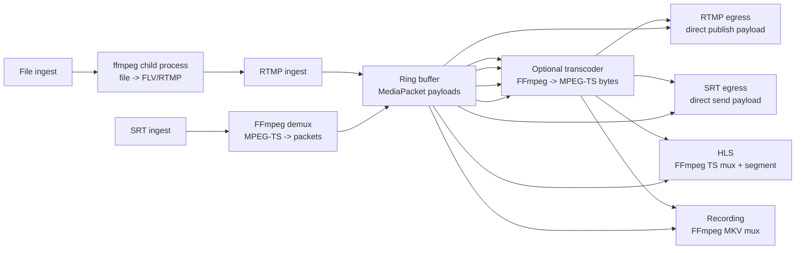
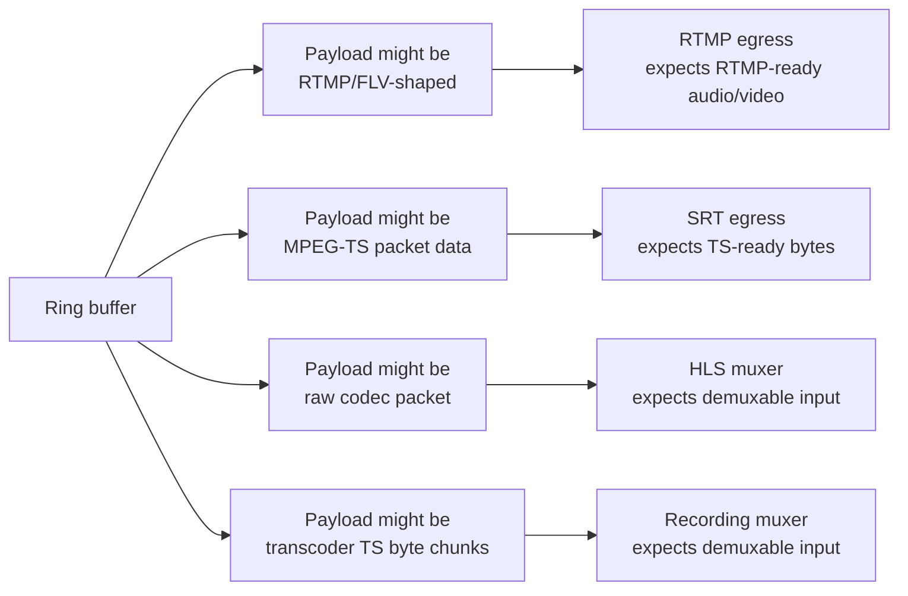
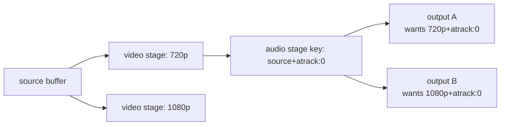
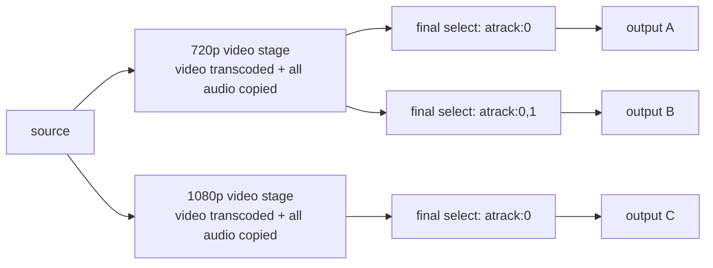
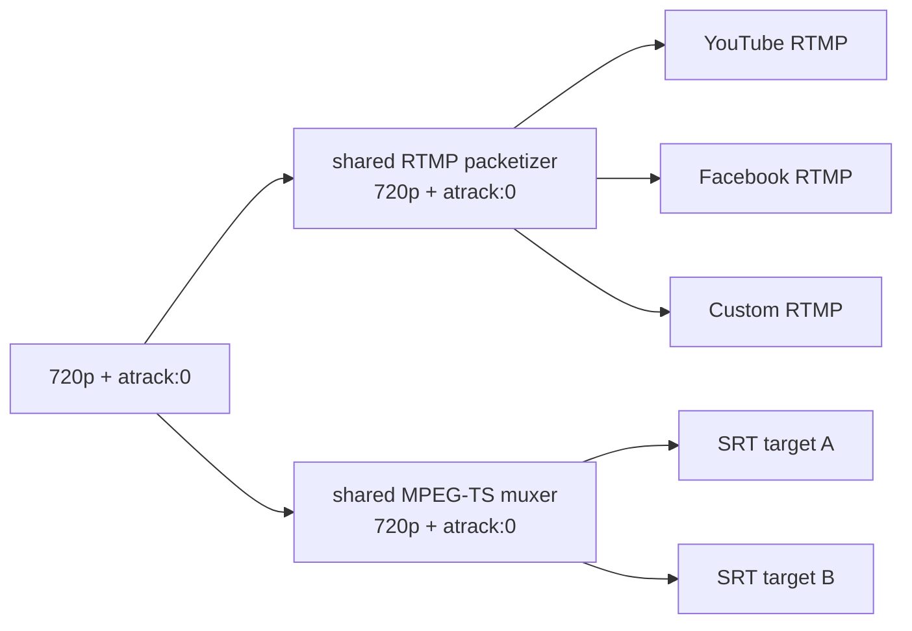
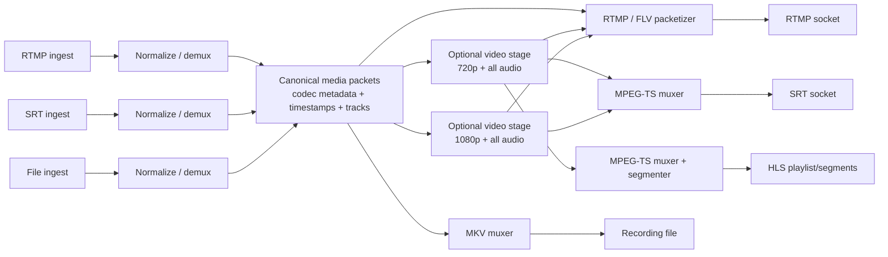
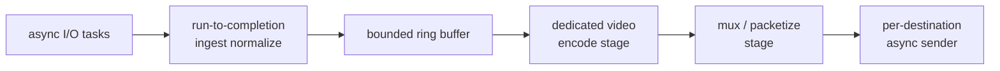
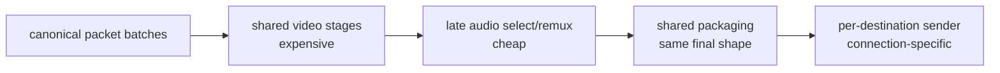

# Media Pipeline Stage Design

This note captures the current ingest-to-egress media pipeline, the risks in the
current packet contract, and a proposed stage-sharing design that minimizes
duplicate work while keeping protocol packaging correct.

## Current Shape

The rewrite is moving toward a single Rust binary with in-process transport,
transcoding, muxing, diagnostics, and orchestration. Most FFmpeg work is done
through linked FFmpeg libraries on OS threads. The main exception today is
file-based ingest, which currently spawns an `ffmpeg` child process and pushes
the file into the local RTMP server.



Runtime child processes:

- One `ffmpeg` child per running file ingest.
- No child process for RTMP egress, SRT egress, HLS, recording, or in-process
  transcoding.
- `build.rs` also runs `git rev-parse --short HEAD`, but that is build-time
  metadata collection, not runtime media work.

## Current Protocol Matrix

The code nominally supports RTMP and SRT ingest, file ingest through the RTMP
loopback bridge, and RTMP/SRT/HLS/recording egress. It does not yet have a fully
correct universal ingest-to-egress matrix.

| Ingest | RTMP egress | SRT egress | HLS preview | Recording |
|---|---|---|---|---|
| RTMP | Likely | Weak | Likely | Likely |
| SRT | Suspect | Weak | Likely | Likely |
| File | Likely through RTMP bridge | Weak | Likely | Likely |

The weak spots are not mostly about FFmpeg availability. They are about what
`MediaPacket.payload` means on each path.

## Packet Contract Issue

`MediaPacket` currently carries media type, track index, timestamps, keyframe
flag, and payload bytes. It does not carry enough codec/container metadata to
unambiguously know whether the payload is:

- RTMP/FLV-shaped audio/video payload.
- MPEG-TS-ready bytes.
- Raw codec packet data from a demuxer.
- Chunks of muxed MPEG-TS bytes from the transcoder.



RTMP egress is simple because it publishes `packet.payload` directly as RTMP
audio/video data. That works best when ingest already produced RTMP-ready
payloads. File ingest currently works around this by using an external FFmpeg
process to normalize files into FLV/RTMP before Rust sees the media.

SRT egress is currently the clearest gap: it directly sends `packet.payload` over
SRT, but SRT outputs normally need a proper MPEG-TS muxed byte stream.

## Existing Muxing Stages

There are muxing stages today, but they are path-specific rather than a universal
egress packaging layer.

| Stage | Current role |
|---|---|
| Transcoder | FFmpeg `CustomInput -> CustomOutput("mpegts")`, then pushes output chunks back into a ring buffer |
| HLS | FFmpeg remux to MPEG-TS, then segment in memory |
| Recording | FFmpeg remux to MKV file |
| SRT ingest | FFmpeg demux from MPEG-TS into `MediaPacket`s |

What is missing is a consistent final layer:

```text
canonical packets -> protocol mux/packetizer -> protocol sender
```

## Audio Stage Cache Concern

The current output reconciliation splits compound encodings into a video stage
and an audio-filter stage. The audio stage key is currently shaped like:

```text
source+atrack:0
```

That is unsafe because the audio-filter stage also carries video copied from its
input. If `720p+atrack:0` starts first, the `source+atrack:0` stage may read from
the `720p` buffer. A later `1080p+atrack:0` output can reuse that same cached
stage and accidentally receive `720p`.



The short-term correctness fix is to key audio/filter stages by the upstream
stage identity as well as the audio operation:

```text
pipeline:video:720p:from:source
pipeline:audio:atrack:0:from:video:720p
pipeline:audio:atrack:0:from:video:1080p
```

## Proposed Near-Term Model

The best near-term tradeoff is to share expensive video work and carry all audio
through each unique video preset. Then apply audio selection as a cheap late
remux/filter step.



This preserves AV sync better than splitting audio and video into independent
shared branches, because audio and video stay in the same muxed timestamp
timeline through the expensive shared video stage.

It does not remove every possible sync issue. Sync can still break if:

- A video transcode stage rewrites timestamps incorrectly.
- A final mux/filter stage rewrites PTS/DTS incorrectly.
- A reader starts mid-buffer without a clean keyframe and matching audio point.
- A future audio decode/filter/encode operation introduces uncompensated delay.
- Different output protocols impose different buffering or timestamp behavior.

## Protocol Packaging Sharing

Packaging can also be shared, but only when outputs need the same packaged byte
stream. Grouping by protocol alone is not enough.

Outputs can share a packaging stage when these match:

- Pipeline.
- Video preset or source shape.
- Audio selection/routing.
- Codec parameters.
- Container/protocol packaging settings.
- Timing policy.



Suggested package-stage key:

```text
PackageStageKey {
  pipeline_id,
  protocol,
  video_preset,
  audio_route,
  container_options,
}
```

Example concrete keys:

```text
pkg:rtmp:720p:atrack=0
pkg:rtmp:720p:atrack=0,1
pkg:srt:720p:atrack=0
pkg:hls:720p:atrack=0
```

For SRT/MPEG-TS, sharing final TS packets across multiple sockets is
straightforward. For RTMP, the actual socket byte stream includes
connection/session-specific envelopes, acknowledgements, chunking, and control
messages. The shareable RTMP layer is therefore usually the media message or
FLV/RTMP packetized payload layer, with each RTMP connection wrapping those
messages for its own session.

## Cleaner Target Architecture

The long-term model should make normalization, transforms, packaging, and
sending explicit stages.



The stage graph should let the engine cache work by operation plus upstream
identity, not by free-form encoding strings alone.

## In-Process File Ingest

File ingest can be moved in-process, but it needs a clear packet contract.

The current flow is:

```text
media file -> ffmpeg child -> local RTMP -> Rust RTMP ingest -> ring buffer
```

A future in-process flow would be:

```text
media file -> FFmpeg demux/remux in-process -> canonical packets -> ring buffer
```

Implementation responsibilities:

- Look up the ingest and associated pipeline/stream key.
- Register the ingest as protocol `file`.
- Open `media/<filename>` with FFmpeg libraries.
- Seek to `start_time` when present.
- Loop when `loop_flag` is true.
- Pace packet reads according to timestamps, similar to `ffmpeg -re`.
- Preserve or rewrite timestamps consistently.
- Push packets into the pipeline ring buffer.
- Update bytes, keyframes, metadata, and lifecycle state.
- Stop when the ingest cancellation token is cancelled.

The child-process bridge should remain until the in-process path can normalize
common files safely. MP4, MKV, and TS can package H.264/H.265/AAC differently,
so the in-process path may need bitstream filters or a remux step before packets
are safe for all egress protocols.

## Performance Architecture Techniques

The processing pipeline can borrow ideas from query planning, packet processing,
SIMD scanners, and cache-aware data layout. The main goal is not to make every
stage maximally clever. It is to share expensive work, keep cheap work local,
and make packet contracts explicit enough that each protocol does the right
packaging once.

### Algorithmic Techniques

Treat output planning like common-subexpression elimination:

```text
requested outputs -> group by required media shape -> build shared stages -> fan out
```

Useful techniques:

- Common subexpression elimination: one `720p` encode feeds all `720p` outputs.
- Late materialization: carry all audio through video stages, then select audio
  near final packaging.
- Protocol package sharing: share `mpegts:720p+atrack0` across compatible SRT
  outputs; share RTMP media messages before per-connection RTMP wrapping.
- GOP-aware startup: readers should start at a recent keyframe plus nearby audio,
  not at an arbitrary packet.
- Timestamp normalization: normalize PTS/DTS/time bases once at ingest, then
  preserve or rescale deliberately at mux boundaries.
- Backpressure by output class: live egress can fast-forward on overflow,
  preview can lag/drop, recording should avoid dropping when possible.
- Stage-key correctness: cache by operation plus upstream identity, not by
  encoding text alone.

The planner should prefer this shape:

```text
canonical source
  -> unique video presets
  -> unique final media shapes
  -> unique package streams
  -> per-destination senders
```

### Threading Model

The best model is a hybrid:

- Run-to-completion inside cheap packet-local stages.
- Pipelined stages around expensive or shareable work.

Run-to-completion is good for:

```text
read packet -> classify -> normalize timestamp -> update counters -> push batch
```

Pipeline stages are good for:

```text
source -> video preset stage -> audio select/remux -> protocol packetizer -> senders
```



Recommended ownership:

- Tokio tasks own sockets, API handlers, timers, and connection lifecycle.
- Dedicated OS threads own FFmpeg decode, encode, filter, and mux work.
- Bounded queues or ring buffers connect expensive stages.
- Each stage should process small batches where possible to amortize queue
  wakeups and improve cache locality.

Avoid turning every tiny operation into its own queue boundary. Queue boundaries
are useful where they isolate slow work, enable fan-out, or create a clear
backpressure policy. They are overhead when the work is cheap and packet-local.

### SIMD Techniques

FFmpeg already handles codec-heavy SIMD. The application should use SIMD around
the edges, where it scans or validates byte streams before handing work to
FFmpeg or protocol libraries.

Good candidates:

- MPEG-TS sync byte scanning for `0x47` packet alignment.
- H.264/H.265 start-code scanning for `00 00 01` and `00 00 00 01`.
- AAC ADTS sync scanning.
- Fast delimiter search in protocol parsers.
- Vectorized validation of fixed-size packet headers.
- Batched byte classification for demux helpers.

The preferred pattern is:

```text
SIMD scan -> candidate offsets -> scalar verification
```

This keeps the SIMD code simple and safe. It uses wide registers to reject most
bytes quickly, then uses ordinary scalar code for the exact protocol rules.

Do not hand-roll SIMD for codec transforms unless there is a very specific,
measured reason. The linked codec libraries are already highly optimized.

### Memory Layout Techniques

Use array-of-structs where the code needs ergonomic, cold objects. Use
struct-of-arrays where hot loops scan or schedule the same field across many
packets.

The current packet shape is ergonomic:

```rust
MediaPacket {
    media_type,
    track_index,
    pts,
    dts,
    is_keyframe,
    payload,
}
```

That is a reasonable object shape at API boundaries, but hot loops often want:

```text
pts[] dts[] flags[] track[] payload_ptr[] payload_len[]
```

Suggested direction:

- Keep payload bytes out-of-line with `Bytes`, `Arc<[u8]>`, or pooled buffers.
- Split hot metadata from cold metadata.
- Hot metadata: media type, flags, track, PTS, DTS, payload pointer, payload len.
- Cold metadata: codec parameters, extradata, source labels, debug details.
- Align producer and consumer indexes to cache lines.
- Keep unrelated atomic counters on separate cache lines to avoid false sharing.
- Use slab or chunk pools for payload buffers to reduce allocator pressure.
- Move packets between heavy stages in small batches instead of one packet at a
  time when latency budgets allow.

A future canonical batch type could look like:

```text
PacketBatch
  hot arrays: pts[], dts[], flags[], track[], payload_len[]
  payload refs: Bytes[]
  shared stream metadata: codec, time_base, extradata
```

This gives scanning, scheduling, and mux planning a cache-friendly view while
still preserving reference-counted payload sharing.

### Practical Pipeline Shape

Combining these techniques gives the intended architecture:



This is the highest-leverage split:

- Share video encoding because it is expensive.
- Carry all audio with each video preset to preserve sync.
- Select audio late because stream selection/remux is cheap.
- Share packaging only for identical final media shapes.
- Keep final network sessions separate because destinations have independent
  connection state and failure modes.

## Recommended Implementation Order

1. Fix the current stage-cache correctness issue by including upstream identity
   in audio/filter stage keys.
2. Make SRT egress use a proper MPEG-TS mux stage instead of directly sending
   `MediaPacket.payload`.
3. Introduce explicit stage identifiers such as `Source`, `VideoPreset`,
   `AudioSelect`, `Package`, and `Sender`.
4. Carry all audio through each unique video preset, then select audio late.
5. Add package-stage sharing for outputs with identical final media shape and
   protocol packaging.
6. Strengthen `MediaPacket` or introduce a canonical packet type that includes
   codec parameters, time bases, extradata, and payload framing.
7. Replace file-ingest child processes with in-process demux/remux once the
   canonical packet contract is strong enough.

## Summary

The safest direction is:

```text
normalize once
share expensive video stages
carry all audio with each video preset
select audio late
share packaging only for identical final media shapes
keep per-destination network sessions separate
```

This minimizes duplicate encoding, reduces AV sync risk, and gives each output
protocol a clear place to perform the packaging it actually needs.
