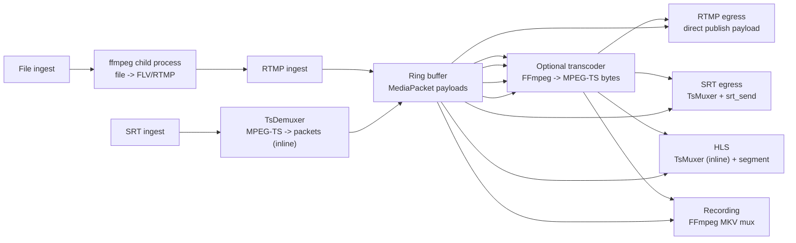
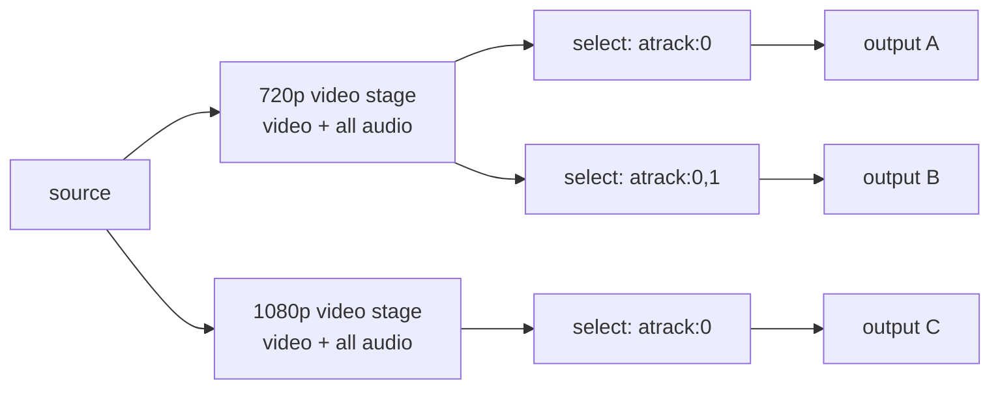
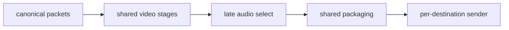

# Media Pipeline

This document covers the ingest-to-egress media pipeline: current shape,
protocol/codec boundaries, stage sharing, buffer sizing, and correctness
requirements.

For the performance optimization plan and benchmark results, see
[High-Performance Data Path](high-performance-data-path.md).

## Current Shape



Runtime child processes:

- One `ffmpeg` child per running file ingest.
- No child process for RTMP egress, SRT egress, HLS, recording, or in-process
  transcoding.

## Muxing Stages

| Stage | Role |
|---|---|
| SRT Ingest | Native `TsDemuxer` demux from MPEG-TS into `MediaPacket`s (inline async) |
| Transcoder | FFmpeg `CustomInput -> CustomOutput("mpegts")`, then pushes output packets into a ring buffer |
| SRT Egress | Native `TsMuxer` remux to MPEG-TS (inline in async feed loop) |
| HLS | Native `TsMuxer` remux to MPEG-TS, then segment in memory (inline async) |
| Recording | FFmpeg remux to MKV file (OS thread) |

## Protocol and Codec Boundaries

| Area | Current state |
|---|---|
| RTMP H.264/AAC | Native ingest/play/egress; video uses DTS and carries FLV composition offset. B-frame round-trip still an E2E gate |
| SRT H.264/AAC | Native ingest/read/egress with MPEG-TS demux/remux |
| SRT H.265 | Codec mapping implemented; full E2E matrix remains a gate |
| RTMP H.265 | Enhanced RTMP is not implemented; an H.264 stage is selected but actual decode/encode is incomplete |
| Multi-track audio | SRT ingest preserves audio track indices |
| Audio remap/downmix | Stream selection only; channel-level filtering is open |
| HLS pull routes/store | Implemented and tested; live segment generation uses native TsMuxer |
| HLS upload | Not implemented; HTTP/HTTPS output URL starts local segmenter and ignores destination |
| RTMPS output | Parser support exists, but reconciler dispatch is not wired |

## Resolution Presets

The configuration and stage-key code recognizes these presets. They are not yet
working transforms: the transcoder creates encoder/output parameters but then
writes the original compressed packets without a decode/filter/encode loop.

| Preset | Resolution | Notes |
|---|---|---|
| `source` | passthrough | preserves original resolution and frame rate |
| `720p` | 1280x720 | recognized; transform incomplete |
| `1080p` | 1920x1080 | recognized; transform incomplete |
| `2160p` / `4k` | 3840x2160 | recognized; transform incomplete |
| `vertical-crop` | 1080x1920 | no crop filter yet |
| `vertical-rotate` | 1080x1920 | no rotate filter yet |
| `h264` | source resolution | intended H.265→H.264 conversion; incomplete |
| `custom` | user-specified | stored but treated as passthrough |

The encoder time base is inherited from the input stream, but no frame-rate or
4K60 throughput guarantee exists until the encode loop is implemented and
benchmarked.

## H.265 Egress Policy

Standard RTMP (non-Enhanced) does not carry H.265. The reconciler enforces:

| Egress protocol | H.265 input | Behavior |
|---|---|---|
| RTMP | H.265 source | Auto-inserts intended `h264` stage; conversion incomplete |
| RTMP | H.265 + preset | Intended H.264 transform; incomplete |
| SRT | H.265 source | Passthrough (MPEG-TS carries HEVC natively) |
| SRT | H.265 + preset | Intended HEVC transform; incomplete |
| HLS | H.265 source | Intended passthrough |

Enhanced RTMP/HEVC packetization is not implemented.

## Current Protocol Matrix

| Ingest | RTMP egress | SRT egress | HLS preview | Recording |
|---|---|---|---|---|
| RTMP H.264 | Basic interop; B-frame timestamp gate | Implemented; full matrix gate | Store/routes exist; live TsMuxer | Mux path exists; contract broken |
| RTMP H.265 | Not supported without Enhanced RTMP | Not assumed | Not assumed | Not assumed |
| SRT H.264 | Not protocol-correct (raw payload as FLV) | Locally validated | Store/routes exist; live TsMuxer | Mux path exists; contract broken |
| SRT H.265 | H.264 conversion incomplete | Passthrough implemented; E2E gate | Store/routes exist; live TsMuxer | Mux path exists; contract broken |
| File | RTMP-shaped via child FFmpeg | Implemented for compatible FLV codecs | Live TsMuxer | Contract broken |

## Audio Stage Cache

Output reconciliation splits compound encodings into a video stage and an audio
stage. Audio stages are keyed by the upstream stage identity as well as the
audio operation (e.g. `audio:atrack:0:from:video:720p`), preventing outputs
using different presets from cross-contaminating.

## Buffer Sizing (4K 60fps Target)

| Component | Size | Constraint | Source |
|---|---|---|---|
| RingBuffer capacity | 4096 slots | ~24s at 170 pkt/s (4K60). Overflow fast-forwards to most recent keyframe | `engine.rs` |
| AVIO buffer | 32 KB | FFmpeg internal read/write chunk | `avio.rs` |
| MemoryQueue | Unbounded `VecDeque<u8>` | Backpressure is structural: consumer blocks on `read()` | `avio.rs` |
| HLS segment accumulator | 8 MB initial | 4K60 H.264 segment at 6s can reach 12 MB; grows if needed | `hls.rs` |
| HLS MAX_SEGMENTS | 10 | ~60s sliding window. 10 × 8 MB = 80 MB worst case per pipeline at 4K | `hls.rs` |
| HLS TARGET_DURATION | 6s | MIN_SEGMENT (1s) prevents micro-segments from keyframe bursts | `hls.rs` |
| RTMP TCP SO_RCVBUF/SO_SNDBUF | 8 MB | Applied to accepted ingest sockets | `rtmp.rs` |
| SRT SRTO_LATENCY | 250 ms | Dejitter + retransmit window. At 50 Mbps = 1.56 MB in flight | `srt.rs` |
| SRT SRTO_LOSSMAXTTL | 256 packets | Reorder tolerance. At 50 Mbps/1316 B ≈ 54 ms | `srt.rs` |
| SRT UDP buffers | 8 MB | Kernel SO_RCVBUF/SNDBUF. Requires `rmem_max`/`wmem_max` ≥ 8 MB | `srt.rs` |
| SRT internal buffers | 12 MB | libsrt retransmission/reordering. ≥ latency × bitrate × (1+loss) | `srt.rs` |
| SRT SRTO_FC | 32768 packets | Flow control window. 32768 × 1316 B ≈ 43 MB window | `srt.rs` |
| SRT SRTO_MAXBW | unlimited | Auto-detect bandwidth from input rate | `srt.rs` |
| SRT recv buffer | 1316 bytes (single) / 2048 bytes (group) | One SRT payload per receive | `srt.rs` |

Runtime verification: `srt_log_effective_opts` reads back values after
`srt_setsockopt` and warns if the kernel clamped UDP buffers.

## SRT Bonding

### Ingest

The SRT listener requests `SRTO_GROUPCONNECT=1`. A publisher-created bonded
connection is accepted as one logical group: the first member returns a group
ID from `srt_accept`, later members attach in the background, and one
`srt_recv(group_id)` loop feeds one demuxer/ring producer. `srt_group_data()`
reports member state through health/diagnostics.

StreamID alone does not create a group. Two independent sockets with matching
StreamIDs are rejected as duplicate publishers.

Requires libsrt compiled with `ENABLE_BONDING=ON`; startup warns and retains
single-link ingest otherwise. The static release build supplies a
bonding-enabled libsrt; development builds depend on the system library.

### Egress

Backup links via `bond=` URL parameter:

```text
srt://primary:10080?streamid=publish:live/key&bond=backup1:10080,backup2:10080
```

Creates an `SRT_GTYPE_BACKUP` group. The bonded group does not currently call
`srt_set_highbitrate_opts()` after creation; only the listener and single-link
egress do.

## Protocol Correctness Requirements

### Probe with matching ingest protocol

Probing must use the same read protocol as the active ingest. Cross-protocol
probing can create false positives (e.g., probing SRT ingest through RTMP
requires additional packetization). The diagnostics endpoint rejects mismatched
probe protocols.

### SRT Stream ID normalization

The listener accepts these shapes:

```text
publish:live/<key>        publisher:<key>
read:live/<key>           play:<key>           subscriber:<key>
<key>
#!::r=live/<key>,m=publish
#!::r=live/<key>,m=request
```

Query parameters are stripped before database validation.

### Media streams only

Read endpoints must emit media payload only. The pipeline selects the first
video stream and preserves all audio tracks. Subtitles, private data, second
video PIDs, and unknown stream types are excluded. The MPEG-TS remuxer rejects
unknown codec metadata rather than guessing H.264/AAC.

### Timestamp semantics

RTMP video timestamps are decode timestamps. AVC/HEVC packets carry a signed
24-bit composition-time offset:

```text
DTS = RTMP timestamp
PTS = DTS + signed composition-time offset
```

Ingest stores both values correctly. RTMP play and egress use `packet.dts` as
the RTMP message timestamp for video (audio uses PTS). B-frame round-trip tests
remain desirable.

### H.265

H.265 must be tested explicitly and cannot be inferred from H.264 results.
SRT/MPEG-TS should preserve HEVC codec identity. RTMP H.265 requires Enhanced
RTMP handling. Until RTMP H.265 is proven end-to-end, diagnostics should prefer
SRT read/probe for SRT H.265 publishers.

## Stage Sharing Design

### Near-Term Model

Share expensive video work and carry all audio through each unique video
preset, then apply audio selection as a cheap late step:



### Protocol Package Sharing

Outputs can share a packaging stage when pipeline, video preset, audio routing,
codec parameters, container settings, and timing policy all match. For SRT,
sharing final TS packets is straightforward. For RTMP, the shareable layer is
the media message/FLV payload; each connection wraps those for its own session.

### Target Architecture



```text
normalize once → share video → carry all audio → select audio late
→ share packaging for identical final shapes → separate senders
```

### Recommended Implementation Order

1. Implement the decode/filter/encode packet loop.
2. Introduce explicit stage identifiers (`Source`, `VideoPreset`, `AudioSelect`,
   `Package`, `Sender`).
3. Carry all audio through each unique video preset, select late.
4. Add package-stage sharing for identical final media shapes.
5. Strengthen `MediaPacket` or introduce a canonical packet type with codec
   parameters, time bases, and payload framing.
6. Replace file-ingest child processes with in-process demux/remux.

## Code Gaps

These are tracked in [REWRITE-STATUS.md](../REWRITE-STATUS.md) as release
blockers or hardening work:

- **Transcoder**: configures encoder parameters but copies compressed packets;
  no decode/filter/encode loop.
- **Recording**: packet-payload-to-`CustomInput` contract needs repair.
- **HLS upload**: HTTP/HTTPS URLs start local segmenter and ignore destination.
- **Custom encoding**: API persists value; reconciler treats `custom` as
  passthrough.
- **RTMPS**: URL parser accepts it, but reconciler does not dispatch TLS egress.
- **SRT→RTMP egress**: raw demuxed payload forwarded as FLV media payload
  (protocol-incorrect).
- **File ingest**: list endpoint reports `running: false` placeholder; exited
  children are not reaped.
- **Ring buffer**: no per-reader lag, overflow, or queue-residency metrics
  exposed.
- **MemoryQueue**: no depth, high-water mark, or blocked time exposed.
