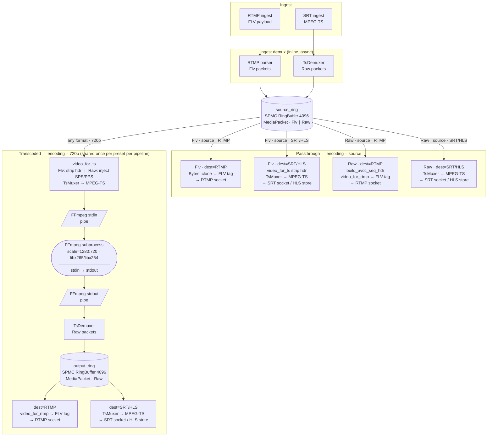
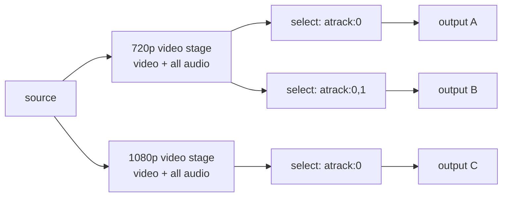
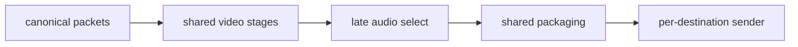

# Media Pipeline

This document covers the ingest-to-egress media pipeline: current shape,
protocol/codec boundaries, stage sharing, buffer sizing, and correctness
requirements.

For the performance optimization plan and benchmark results, see
[High-Performance Data Path](high-performance-data-path.md).

## Current Shape



## Transcoder Stages

Every non-passthrough encoding creates a **shared stage**: one process per
`(pipeline_id, preset)` pair regardless of how many outputs use that preset.

### Stage graph

```
source_ring
    │  [if video preset]            video preset stage  (get_or_create_transcoder)
    │  [if audio routing suffix]    audio filter stage  (get_or_create_transcoder)
    │  [if RTMP + H.265 ingest]     hevc_to_h264 stage  (get_or_create_h264_transcoder)
    ▼
ring_buf  ◄── all egresses for this (pipeline, encoding) read here
```

The `hevc_to_h264` stage is the **last** stage in the chain, applied only for
RTMP outputs when the ingest is H.265. SRT outputs receive native H.265 from the
preset ring without any additional conversion. RTMP and SRT outputs sharing the
same preset (e.g. both 720p) share the `video:720p` stage — only the final RTMP
edge gets a `hevc_to_h264` stage appended.

### Passthrough rule

`source` encodings **never** enter any transcoder stage. The egress reads
directly from `source_ring`. This is enforced in the reconciler (`src/lib.rs`)
before any `get_or_create_transcoder` call. `custom` output encodings are
rejected during output create/update because custom FFmpeg arguments are stored
for future implementation but not applied by the runtime.

### Stage-key naming

| Stage | Key format | Example |
|---|---|---|
| Video preset | `video:<preset>` | `video:720p` |
| H.265→H.264 | `hevc_to_h264:from:<upstream_key>` | `hevc_to_h264:from:source`, `hevc_to_h264:from:720p` |
| Audio filter | `audio:<op>:from:<video_key>` | `audio:atrack:0:from:720p` |

The `upstream_key` in the `hevc_to_h264` key encodes what ring feeds the
converter: `source` for passthrough RTMP, the preset name (e.g. `720p`) for
transcoded RTMP without audio routing, or the full audio key (e.g.
`audio:atrack:0:from:720p`) for transcoded RTMP with audio routing. This allows
RTMP-passthrough and RTMP-720p converters to be **independent stages** (each
runs its own libavcodec thread) while all RTMP egresses on the same encoding
**share** one converter.

The video-preset key is shared across all compound encodings with the same
video part (e.g. `720p`, `720p+atrack:0`, `720p+remap:0:1` all use key
`video:720p`). The audio key embeds the upstream video key to prevent
cross-contamination between presets.

### External transcoder (default)

```
source_ring
    │  (Reader + TsMuxer → MPEG-TS bytes)
    ▼
FFmpeg stdin ──► [scale + libx265/libx264 + …] ──► FFmpeg stdout (MPEG-TS)
                                                   │
                                       TsDemuxer → MediaPackets (Raw)
                                                   │
                                             output_ring ◄── shared
                                                   │
                              ┌────────────────────┼──────────────┐
                           RTMP-out1           SRT-out1       HLS-out1
```

One `ffmpeg` subprocess per `(pipeline, preset)`. FFmpeg reads MPEG-TS from
stdin and writes transcoded MPEG-TS to `pipe:1` (stdout). A Tokio task reads
stdout, runs it through `TsDemuxer`, and pushes the resulting `MediaPacket`s
into `output_ring`.

This is the **default** backend. It is robust because FFmpeg errors are
isolated to the subprocess and logged to stderr; a crash restarts cleanly on
the next reconciler cycle.

### Internal transcoder (opt-in)

Set `RESTREAM_USE_INTERNAL_TRANSCODER=1` to use the in-process libavcodec path
(`src/media/transcoder.rs`). The data flow is identical — the same
`source_ring → output_ring` contract holds — but uses `MemoryQueue`/`avio`
callbacks instead of a subprocess pipe.

Current behavior: for `video:*` presets, the internal path uses
`run_ffmpeg_transcode_with_scale` and performs decode→scale→encode in-process
(`libx264` for H.264 input, `libx265` for H.265 input), while audio streams are
passed through. Source passthrough still bypasses the video transcoder.

The external FFmpeg subprocess backend remains the default and is still the
most battle-tested path for production deployments.

### Muxing stages summary

| Stage | Role |
|---|---|
| SRT Ingest | `TsDemuxer` — demux MPEG-TS into `MediaPacket`s (inline async) |
| External transcoder | subprocess FFmpeg stdin→stdout; `TsMuxer` writes stdin, `TsDemuxer` reads stdout |
| Internal transcoder | in-process FFmpeg via `MemoryQueue`+`avio`; `TsMuxer` feeds input, output packets pushed directly to ring |
| SRT Egress | Shared `TsMuxer` task per unique `(pipeline, preset)` feeding a shared `TsChunkRing` (SPMC lock-free package ring) |
| HLS | `TsMuxer` remux to MPEG-TS, then segment in memory (inline async) |
| Recording | Raw MPEG-TS write to `.ts` file via `MemoryQueue` (OS thread) |


## Protocol and Codec Boundaries

| Area | Current state |
|---|---|
| RTMP H.264/AAC | Native ingest/play/egress; video uses DTS and carries FLV composition offset. B-frame round-trip still an E2E gate |
| SRT H.264/AAC | Native ingest/read/egress with MPEG-TS demux/remux |
| SRT H.265 | Codec mapping implemented; full E2E matrix remains a gate |
| RTMP H.265 | Enhanced RTMP ingest (H.265 arriving over RTMP) is not implemented. RTMP *egress* with H.265 source works: `hevc_to_h264` stage does full libavcodec decode→encode |
| Multi-track audio | SRT ingest preserves audio track indices plus MPEG-TS PID/language metadata where present |
| Audio remap/downmix | Channel-level DSP routes use an external FFmpeg audio stage (`pan` for remap, stereo resample for downmix); `atrack` remains packet-only |
| HLS pull routes/store | Implemented and tested; live segment generation uses native TsMuxer |
| HLS upload | Implemented; HTTP/HTTPS output URLs PUT new segments plus playlist to the target |
| RTMPS output | `rtmps://` URLs accepted by API and routed through RTMP egress with Rustls wrapping before the RTMP handshake |
| Custom output encoding | Not applied; `custom` is rejected by output create/update instead of being exposed as a passthrough runtime option |

## Resolution Presets

The external transcoder stage applies `scale=WxH` and re-encodes preserving the
input codec: `libx265 -preset veryfast` for H.265 input, `libx264 -preset
veryfast` for H.264 input. The internal transcoder (when enabled with
`RESTREAM_USE_INTERNAL_TRANSCODER=1`) uses the same preset table via
`run_ffmpeg_transcode_with_scale`.

| Preset | Resolution | Scale filter |
|---|---|---|
| `source` | passthrough | none — never enters transcoder |
| `480p` | 854×480 | `scale=854:480` |
| `720p` | 1280×720 | `scale=1280:720` |
| `1080p` | 1920×1080 | `scale=1920:1080` |


## H.265 Egress Policy

Standard RTMP (non-Enhanced) does not carry H.265. The reconciler enforces:

| Egress protocol | H.265 input | Behavior |
|---|---|---|
| RTMP | H.265 source | `hevc_to_h264:from:source` stage inserted; full libavcodec H.265→H.264 — **working** |
| RTMP | H.265 + video preset | `video:preset` runs first (H.265 output, shared); `hevc_to_h264:from:<preset>` converts after — H.264 to RTMP — **working** |
| SRT | H.265 source | Passthrough (MPEG-TS carries HEVC natively) — **working** |
| SRT | H.265 + video preset | `video:preset` with libx265 → H.265 720p output; same ring shared with RTMP — **working** |
| HLS preview | H.265 source | Preview-only `hevc_preview_h264` stage converts to H.264 720p before MPEG-TS HLS — **current browser-compatible path** |

Enhanced RTMP/HEVC packetization is not implemented.

## Current Protocol Matrix

| Ingest | RTMP egress | SRT egress | HLS preview | Recording |
|---|---|---|---|---|
| RTMP H.264 | Basic interop; B-frame timestamp gate | Implemented; full matrix gate | Store/routes exist; live TsMuxer | Mux path exists; contract broken |
| RTMP H.265 | Not supported without Enhanced RTMP | Not assumed | Not assumed | Not assumed |
| SRT H.264 | Packetization implemented; live matrix gate | Locally validated | Store/routes exist; live TsMuxer | Mux path exists; contract broken |
| SRT H.265 | RTMP: `hevc_to_h264` conversion working; SRT: passthrough working | Passthrough implemented; E2E gate | HEVC preview converts to H.264 720p before MPEG-TS HLS | Mux path exists; contract broken |
| File | RTMP-shaped via child FFmpeg | Implemented for compatible FLV codecs | Live TsMuxer | Contract broken |

HLS preview currently prioritizes browser compatibility over HEVC preservation.
If ingest video is HEVC/H.265, the API starts a preview-only
`hevc_preview_h264` stage, feeds that H.264 720p ring into the native MPEG-TS
segmenter, and serves `.ts` segments. The code does not yet implement HEVC
fMP4/CMAF HLS (`EXT-X-MAP`, init segment, `.m4s`). Product-level HEVC HLS
passthrough would require that separate fMP4 path.

## Minimum Work Per Consumer

All consumers that process packets from a ring buffer avoid per-packet heap
allocation by using the zero-allocation `_into` variants:

| Consumer | Video conversion | Audio conversion | Burst size |
|---|---|---|---|
| RTMP egress | `video_for_rtmp_into` | `audio_for_rtmp_into` | `pull_burst` 32 |
| SRT egress | None (Shared `TsMuxer`) | None (Shared `TsMuxer`) | `pull_burst` 32 (`TsChunkReader`) |
| SRT play subscriber | None (Shared `TsMuxer`) | None (Shared `TsMuxer`) | `pull_burst` 32 (`TsChunkReader`) |
| HLS segmenter | `video_for_ts_into` | `audio_for_ts_into` | `pull_burst` 32 |
| Recording | `video_for_ts_into` | `audio_for_ts_into` | `pull_burst` 32 |
| Transcoder feed | `video_for_ts` (Raw→Raw passthrough) | `audio_for_ts` | `pull_burst` 32 |

Scratch buffers (`video_conv_buf`, `audio_conv_buf`) are allocated once at
consumer startup and reused across packets. For `PayloadFormat::Raw` video, the
borrowed payload slice is returned directly (zero copy).

## Scale Test Pipeline Paths

`scripts/resource-limit target/bench/test_harness mixed-input-matrix` exercises
the closed-GOP input matrix. Individual rows use
`mixed-<codec>-<protocol>-<single|multi>` for live inputs and
`mixed-file-<codec>-<single|multi>` for file ingest. RTMP input is intentionally
limited to `mixed-h264-rtmp-single`, because standard RTMP ingest carries H.264
with one audio track in the current product contract. SRT and file ingest cover
both H.264/H.265 and single/multi-track fixtures.

Each live row fans out to N RTMP-src + N RTMP-720p + N SRT-src + N SRT-720p
outputs unless the row's fixture-specific assertions add extra selected-track
outputs. The traces below show the exact mux/demux, conversion, and transcoding
at every hop for each path.

### h264-rtmp-single — H.264 RTMP ingest

```
RTMP ingest (TCP)
  → RTMP parser / FLV demux (inline async tokio task)
  → source_ring [Flv, H.264 + AAC]

source outputs
  RTMP-src:  source_ring ──► Bytes::clone → FLV tag → RTMP socket  (zero mux/demux)
  SRT-src:   source_ring ──► strip 5-byte FLV video hdr
                          ──► TsMuxer → MPEG-TS → SRT socket

720p outputs  (shared: 1 ext FFmpeg subprocess for all 720p outputs)
  source_ring
    ──► [Flv] strip FLV hdr, inject SPS/PPS → TsMuxer → MPEG-TS → FFmpeg stdin
    ──► [FFmpeg subprocess] scale=1280:720, libx264
    ──► FFmpeg stdout → TsDemuxer → output_ring [Raw, H.264 + AAC]
  RTMP-720p: output_ring ──► video_for_rtmp (AVCC wrap) → FLV tag → RTMP socket
  SRT-720p:  output_ring ──► TsMuxer → MPEG-TS → SRT socket
```

**Stages spawned:** 1 ext FFmpeg subprocess (`video:720p`).

---

### h264-srt-single — H.264 SRT ingest

```
SRT ingest (UDP)
  → srt_recv (non-blocking + SRT epoll) → TsDemuxer (inline async tokio task)
  → source_ring [Raw, H.264 + AAC]

source outputs
  RTMP-src:  source_ring ──► build_avcc_seq_hdr + video_for_rtmp → FLV tag → RTMP socket
  SRT-src:   source_ring ──► TsMuxer → MPEG-TS → SRT socket  (no codec conversion)

720p outputs  (same stage shape as h264-rtmp 720p)
  source_ring
    ──► [Raw] inject SPS/PPS from cache → TsMuxer → MPEG-TS → FFmpeg stdin
    ──► [FFmpeg subprocess] scale=1280:720, libx264
    ──► FFmpeg stdout → TsDemuxer → output_ring [Raw, H.264 + AAC]
  RTMP-720p: output_ring ──► video_for_rtmp → FLV tag → RTMP socket
  SRT-720p:  output_ring ──► TsMuxer → MPEG-TS → SRT socket
```

**Stages spawned:** 1 ext FFmpeg subprocess (`video:720p`).

Key difference from h264-rtmp-single: `source_ring` holds `Raw` packets.
RTMP-src must reconstruct AVCC/FLV headers (`build_avcc_seq_hdr + video_for_rtmp`)
rather than byte-cloning. SRT-src is a plain `TsMuxer` pass-through for both
ingest types.

---

### h265-srt-single — H.265 SRT ingest

Standard RTMP cannot carry H.265. The reconciler inserts a `hevc_to_h264`
stage **after** any video-preset transcoding, keyed by the upstream stage so
RTMP-passthrough and RTMP-720p each get an independent converter. SRT outputs
receive native H.265. The `video:720p` stage is shared between RTMP and SRT.

```
SRT ingest
  → TsDemuxer (inline async)
  → source_ring [Raw, H.265 + AAC]

RTMP-src  (reconciler: needs_rtmp_h264_conv = true, is_passthrough = true)
  source_ring ──► TsMuxer → MPEG-TS
    ──► MemoryQueue → [int OS thread] libavcodec H.265 decode → H.264 encode
    ──► TsDemuxer → h264_src_ring [Raw, H.264 + AAC]  (key: hevc_to_h264:from:source)
  h264_src_ring ──► video_for_rtmp → FLV tag → RTMP socket

SRT-src  (reconciler: needs_rtmp_h264_conv = false, is_passthrough = true)
  source_ring ──► TsMuxer → MPEG-TS → SRT socket  (HEVC in MPEG-TS, no conversion)

720p outputs  (shared ext FFmpeg subprocess; RTMP and SRT share the preset ring)
  source_ring
    ──► [Raw] inject SPS/PPS from cache → TsMuxer → MPEG-TS → FFmpeg stdin
    ──► [FFmpeg subprocess] scale=1280:720, libx265   ← H.265 in → H.265 out
    ──► FFmpeg stdout → TsDemuxer → output_ring [Raw, H.265 720p + AAC]

SRT-720p  (needs_rtmp_h264_conv = false)
  output_ring ──► TsMuxer → MPEG-TS → SRT socket  (H.265 720p, no conversion)

RTMP-720p  (needs_rtmp_h264_conv = true)
  output_ring ──► TsMuxer → MPEG-TS
    ──► MemoryQueue → [int OS thread] libavcodec H.265 decode → H.264 encode
    ──► TsDemuxer → h264_720p_ring [Raw, H.264 720p + AAC]  (key: hevc_to_h264:from:720p)
  h264_720p_ring ──► video_for_rtmp → FLV tag → RTMP socket
```

**Stages spawned:** 1 int OS thread (`hevc_to_h264:from:source`) +
1 ext FFmpeg subprocess (`video:720p`, libx265 encoder) +
1 int OS thread (`hevc_to_h264:from:720p`).

---

### h264-srt-multi — H.264 SRT ingest, 2 audio tracks

Publisher sends video + 2 AAC audio tracks. Compound encodings select audio tracks
per egress type:
- RTMP: `720p+atrack:0`   — select only track 0
- SRT:  `720p+atrack:0,1` — pass both tracks

```
SRT ingest
  → TsDemuxer (preserves two AAC PIDs as track 0 and track 1)
  → source_ring [Raw, H.264 + AAC track0 + AAC track1]

source outputs
  RTMP-src / SRT-src: identical to h264-srt-single source paths above.

RTMP-720p  encoding = "720p+atrack:0"
  source_ring → video:720p ext FFmpeg (shared) → output_ring [H.264 + track0 + track1]
  output_ring → audio:atrack:0:from:720p (tokio task, SelectTracks{0})
             → audio0_ring [H.264 + track0 only]
  audio0_ring ──► video_for_rtmp → FLV tag → RTMP socket

SRT-720p  encoding = "720p+atrack:0,1"
  output_ring (same shared video:720p ring)
  output_ring → audio:atrack:0,1:from:720p (tokio task, SelectTracks{0,1})
             → audio01_ring [H.264 + track0 + track1]
  audio01_ring ──► TsMuxer → MPEG-TS → SRT socket
```

**Stages spawned:** 1 ext FFmpeg subprocess (`video:720p`) + 2 audio-routing
tokio tasks (`audio:atrack:0:from:720p` and `audio:atrack:0,1:from:720p`).
Audio-routing stages are pure packet filters — no OS threads, no FFmpeg.

---

### h265-srt-multi — H.265 SRT ingest, 2 audio tracks

Combines H.265→H.264 conversion (post-preset, RTMP only) with multi-audio
track routing.

```
SRT ingest
  → TsDemuxer (H.265 video + 2 AAC audio track PIDs)
  → source_ring [Raw, H.265 + AAC track0 + AAC track1]

RTMP-src / SRT-src: identical to h265-srt-single source paths above.

720p preset  (shared ext FFmpeg subprocess)
  source_ring
    ──► [FFmpeg subprocess] scale=1280:720, libx265
    ──► output_ring [Raw, H.265 720p + track0 + track1]

RTMP-720p  encoding = "720p+atrack:0"
  output_ring → audio:atrack:0:from:720p (tokio task) → audio0_ring [H.265 720p + track0]
  audio0_ring ──► TsMuxer → MPEG-TS
    ──► MemoryQueue → [int OS thread] libavcodec H.265 decode → H.264 encode
    ──► TsDemuxer → h264_audio0_ring  (key: hevc_to_h264:from:audio:atrack:0:from:720p)
  h264_audio0_ring ──► video_for_rtmp → FLV tag → RTMP socket

SRT-720p  encoding = "720p+atrack:0,1"
  output_ring → audio:atrack:0,1:from:720p (tokio task) → audio01_ring
  audio01_ring ──► TsMuxer → MPEG-TS → SRT socket
```

**Stages spawned:** 1 int OS thread (`hevc_to_h264:from:source`, for RTMP-src) +
1 ext FFmpeg subprocess (`video:720p`, libx265) +
2 audio-routing tokio tasks +
1 int OS thread (`hevc_to_h264:from:audio:atrack:0:from:720p`, for RTMP-720p).

---

### Summary: stage counts per ingest config

All counts are **per pipeline**. Stages are shared regardless of how many
outputs use the same encoding — adding a 100th `720p` output does not spawn
a second subprocess.

| Ingest config | Ext FFmpeg subprocesses | Int OS threads | Audio-routing tokio tasks |
|---|:---:|:---:|:---:|
| `h264-rtmp` | 1 (`video:720p`) | 0 | 0 |
| `h264-srt` | 1 (`video:720p`) | 0 | 0 |
| `h265-srt` | 1 (`video:720p`) | 2 (`hevc_to_h264:from:source` + `hevc_to_h264:from:720p`) | 0 |
| `h264-srt-multi` | 1 (`video:720p`) | 0 | 2 |
| `h265-srt-multi` | 1 (`video:720p`) | 2 (`hevc_to_h264:from:source` + `hevc_to_h264:from:audio:…`) | 2 |

> **Why 2 OS threads for H.265 configs?** RTMP-passthrough and RTMP-720p feed
> different upstream rings into `hevc_to_h264`, so the reconciler creates a
> separate stage for each (keyed by upstream). Each stage runs its own
> libavcodec thread. If the config has no RTMP-passthrough outputs, only 1
> thread is needed.

The `ext_ffmpeg#` column in scale test output matches "Ext FFmpeg subprocesses".
In-process RSS growth (restream parent) correlates with "Int OS threads" — each
`hevc_to_h264` thread adds ~130–180 MB to the parent's RSS.

---

## What Is Shared When Multiple Outputs Use the Same Encoding

Stage sharing is keyed by `(pipeline_id, stage_key)`:

```
2 outputs: encoding="720p"
  → get_or_create_transcoder("720p")  — returns same Arc<RingBuffer>
  → 1 transcoder subprocess
  → 2 independent RTMP egress tasks, each read from the shared ring
  → per-packet codec work (video_for_rtmp_into) is done independently per egress
```

The per-packet format conversion (AVCC wrap, ADTS strip) is NOT shared between
egress tasks. This is intentional: sharing would require synchronization and
outweigh the ~700 ns per frame conversion cost. What IS shared is the far more
expensive encode stage (CPU-bound, seconds of latency). This invariant is
covered by `same_encoding_outputs_share_one_transcoder_stage` in engine tests.

### Resource Sharing Footprint (Verified June 23, 2026)

Bitrate scaling and load tests of the pipeline configurations at 1.5M, 4.0M, and 8.0M verified the following sharing footprints:
* **External Transcoder Subprocess (Shared):** The CPU-bound H.264 transcoding runs in an external `ffmpeg` subprocess. The memory footprint of this child process remains fixed at **~422 MB to 431 MB** regardless of ingest bitrate (from 1.5M to 8.0M), as frames and scale filters are allocated statically on startup. Only one subprocess is spawned per unique `(pipeline_id, preset)`.
* **In-Process Transcoding (Shared per upstream key):** In-process H.265→H.264 conversion (`hevc_to_h264`) runs inside the Restream parent process using FFmpeg C-FFI bindings. Stages are keyed by `(pipeline, upstream)` — all RTMP egresses on the same encoding share one converter, but RTMP-passthrough (`from:source`) and RTMP-720p (`from:720p`) are **separate** stages. Each stage consumes **67% to 83%** of a core and adds **~130 MB to 180 MB** RSS to the parent process. Configs with both passthrough and preset RTMP outputs can therefore have 2 such stages.
* **Egress Senders (Not Shared):** Each downstream egress stream (RTMP/SRT) runs as an independent Tokio task. Each task does its own lightweight packet formatting (e.g. `video_for_rtmp_into` or `video_for_ts_into`) and network socket writes. The resource overhead per output is extremely lightweight, scaling at **~350 KB to 1 MB** RSS delta per output with negligible CPU usage.

## Audio Stage Cache

Output reconciliation splits compound encodings into a video stage and an audio
stage. Audio stages are keyed by the upstream stage identity as well as the
audio operation (e.g. `audio:atrack:0:from:video:720p`), preventing outputs
using different presets from cross-contaminating.

`atrack` stages run in the lightweight packet router and only select/reindex
audio tracks. `remap` and `downmix` stages run through the external FFmpeg
stage, copy video, filter one selected audio track to stereo AAC, and then feed
the normal MPEG-TS demux back into the shared output ring.

## Buffer Sizing (4K 60fps Target)

| Component | Size | Constraint | Source |
|---|---|---|---|
| RingBuffer capacity | 4096 slots | ~24s at 170 pkt/s (4K60). Overflow fast-forwards to most recent keyframe | `engine.rs` |
| AVIO buffer | 32 KB | FFmpeg internal read/write chunk | `avio.rs` |
| MemoryQueue | Bounded `VecDeque<u8>` (2 MB) | Backpressure is structural: writer yields on full, consumer blocks on empty `read()` | `avio.rs` |
| HLS segment accumulator | 8 MB initial | 4K60 H.264 segment at 6s can reach 12 MB; grows if needed | `hls.rs` |
| HLS MAX_SEGMENTS | 10 | ~60s sliding window. 10 × 8 MB = 80 MB worst case per pipeline at 4K | `hls.rs` |
| HLS TARGET_DURATION | 6s | MIN_SEGMENT (1s) prevents micro-segments from keyframe bursts | `hls.rs` |
| RTMP TCP SO_RCVBUF/SO_SNDBUF | 8 MB | Applied to accepted ingest sockets | `rtmp.rs` |
| SRT SRTO_LATENCY | 250 ms | Dejitter + retransmit window. At 50 Mbps = 1.56 MB in flight | `srt.rs` |
| SRT SRTO_LOSSMAXTTL | 256 packets | Reorder tolerance. At 50 Mbps/1316 B ≈ 54 ms | `srt.rs` |
| SRT UDP buffers | 8 MB | Kernel SO_RCVBUF/SNDBUF. Requires `rmem_max`/`wmem_max` ≥ 8 MB | `srt.rs` |
| SRT internal buffers | 12 MB | libsrt retransmission/reordering. ≥ latency × bitrate × (1+loss) | `srt.rs` |
| SRT SRTO_FC | 32768 packets | Flow control window. 32768 × 1316 B ≈ 43 MB window | `srt.rs` |
| SRT SRTO_MAXBW | unlimited | Auto-detect bandwidth from input rate | `srt.rs` |
| SRT recv buffer | 1316 bytes (single) / 2048 bytes (group) | One SRT payload per receive | `srt.rs` |

Runtime verification: `srt_log_effective_opts` reads back values after
`srt_setsockopt` and warns if the kernel clamped UDP buffers.

## SRT Bonding

### Ingest

The SRT listener requests `SRTO_GROUPCONNECT=1`. A publisher-created bonded
connection is accepted as one logical group: the first member returns a group
ID from `srt_accept`, later members attach in the background, and one
`srt_recv(group_id)` loop feeds one demuxer/ring producer. `srt_group_data()`
reports member state through health/diagnostics.

StreamID alone does not create a group. Two independent sockets with matching
StreamIDs are rejected as duplicate publishers.

Requires libsrt compiled with `ENABLE_BONDING=ON`; startup warns and retains
single-link ingest otherwise. All builds link against the repo-managed static
SRT build from `.build/static/prefix`, so bonded-ingest support no longer
depends on the distro `libsrt` package.

### Egress

Backup links via `bond=` URL parameter:

```text
srt://primary:10080?streamid=publish:live/key&bond=backup1:10080,backup2:10080
```

Creates an `SRT_GTYPE_BACKUP` group. Both single-connection and bonded egress groups now call `srt_set_highbitrate_opts(client_sock)` immediately after creation to prevent packet drops and buffer overflows under high bitrates.

## Protocol Correctness Requirements

### Probe with matching ingest protocol

Probing must use the same read protocol as the active ingest. Cross-protocol
probing can create false positives (e.g., probing SRT ingest through RTMP
requires additional packetization). The diagnostics endpoint rejects mismatched
probe protocols.

### SRT Stream ID normalization

The listener accepts these shapes:

```text
publish:live/<key>        publisher:<key>
read:live/<key>           play:<key>           subscriber:<key>
<key>
#!::r=live/<key>,m=publish
#!::r=live/<key>,m=request
```

Query parameters are stripped before database validation.

### Media streams only

Read endpoints must emit media payload only. The pipeline selects the first
video stream and preserves all audio tracks. Subtitles, private data, second
video PIDs, and unknown stream types are excluded. The MPEG-TS remuxer rejects
unknown codec metadata rather than guessing H.264/AAC.

The control plane surfaces MPEG-TS stream identity metadata separately from the
media payload: video and audio metadata may include PID, language, and title
fields when descriptors are present, and audio tracks can be assigned local
operator-friendly labels in the dashboard.

### Timestamp semantics

RTMP video timestamps are decode timestamps. AVC/HEVC packets carry a signed
24-bit composition-time offset:

```text
DTS = RTMP timestamp
PTS = DTS + signed composition-time offset
```

Ingest stores both values correctly. RTMP play and egress use `packet.dts` as
the RTMP message timestamp for video (audio uses PTS). B-frame round-trip tests
remain desirable.

### H.265

H.265 must be tested explicitly and cannot be inferred from H.264 results.
SRT/MPEG-TS should preserve HEVC codec identity. RTMP H.265 requires Enhanced
RTMP handling. Until RTMP H.265 is proven end-to-end, diagnostics should prefer
SRT read/probe for SRT H.265 publishers.

## Stage Sharing Design

### Near-Term Model

Share expensive video work and carry all audio through each unique video
preset, then apply audio selection as a cheap late step:



### Protocol Package Sharing

Outputs can share a packaging stage when pipeline, video preset, audio routing,
codec parameters, container settings, and timing policy all match. For SRT,
sharing final TS packets is straightforward. For RTMP, the shareable layer is
the media message/FLV payload; each connection wraps those for its own session.

### Target Architecture



```text
normalize once → share video → carry all audio → select audio late
→ share packaging for identical final shapes → separate senders
```

### Recommended Implementation Order

1. Implement the decode/filter/encode packet loop.
2. Introduce explicit stage identifiers (`Source`, `VideoPreset`, `AudioSelect`,
   `Package`, `Sender`).
3. Carry all audio through each unique video preset, select late.
4. Add package-stage sharing for identical final media shapes.
5. Strengthen `MediaPacket` or introduce a canonical packet type with codec
   parameters, time bases, and payload framing.
6. Replace file-ingest child processes with in-process demux/remux.

## Code Gaps

These remain useful hardening themes even though the rewrite-status document is
gone:

- **Internal transcoder**: built-in video profiles run decode/scale/encode;
  non-built-in/custom profiles require explicit profiling and matrix evidence
  before being advertised.
- **Recording**: packet-payload-to-`CustomInput` contract needs repair. ~~Implemented as raw MPEG-TS write; no FFmpeg dependency.~~
- **Recording** (resolved): `recording.rs` writes raw MPEG-TS via `MemoryQueue`; naming was `run_mkv_muxer` (now `run_ts_writer`). Container upgrade (MP4/MKV) is a future roadmap item.
- **HLS upload**: HTTP/HTTPS output URLs run the shared segmenter and PUT
  `seg<N>.ts` objects plus the playlist to the target URL.
- **Custom encoding**: `/api/v1/encodings/custom` persists future args, but output
  create/update rejects `custom` so operators cannot select an inactive path.
- **RTMPS**: URL parser accepts it and the reconciler dispatches it through
  RTMP egress with Rustls wrapping before the RTMP handshake.
- **SRT→RTMP egress**: Raw Annex-B/ADTS packets are converted to FLV/AVCC/AAC
  for RTMP egress. `cargo run --bin test_harness -- correctness-srt-rtmp`
  verifies the live H.264/AAC cross-protocol packetization path.
- **File ingest**: implemented with child FFmpeg; running state is checked from
  the tracked child process, and exited children are reaped.
- **Ring buffer**: source-ring reader snapshots expose lag slots, overflow
  count, burst-size stats, and unread packet age through health, graph, and
  diagnostics.
- **MemoryQueue**: `stats()` exposes current buffer depth, capacity, high-water
  mark, blocked write count, blocked write time, and closed state.
