# Run-to-Completion Analysis: Protocol Combination Graph

This document maps every ingest/egress/transcoding branch, identifies decoupling points, and explains why run-to-completion is not achievable for all paths.

**Note:** ASCII diagrams below can also be viewed as clean SVG renderings in [diagrams/](diagrams/)

## Complete System Architecture

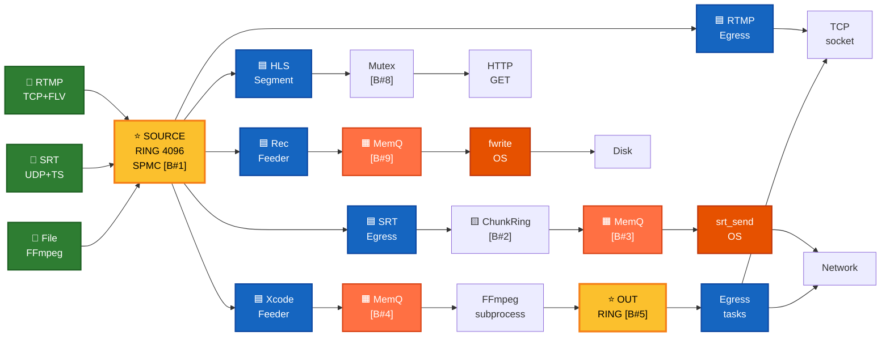

---

## Thread and Task Topology

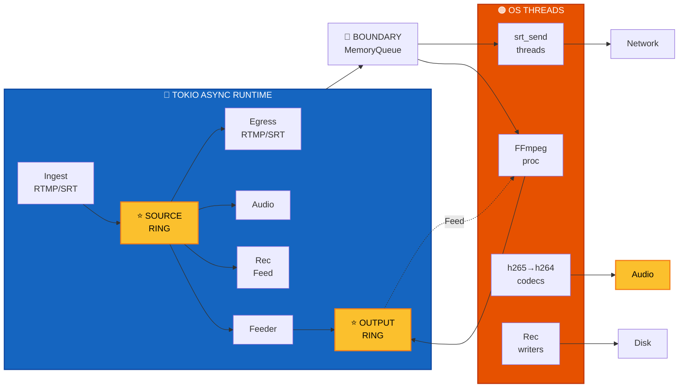

---

## Decoupling Boundaries Summary

All 9 boundaries and their purposes:

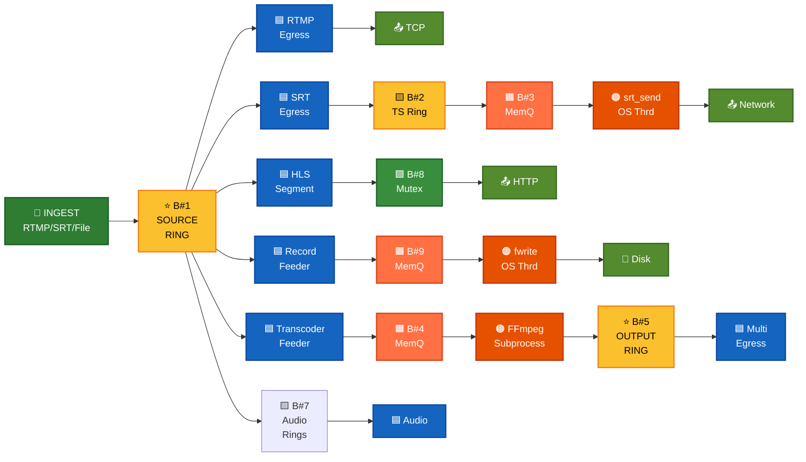

**Why each boundary exists:**
- **B#1:** Multi-egress at independent rates ← CANNOT REMOVE
- **B#2:** Shared muxer → multiple SRT connections
- **B#3:** MANDATORY → libsrt_send() blocks indefinitely
- **B#4:** MANDATORY → FFmpeg subprocess blocks  
- **B#5:** Multi-consumer egress at independent rates
- **B#6:** Per-SRT connection reader state
- **B#7:** Audio track routing per config
- **B#8:** HLS Mutex (0.17 Hz) ✅ BEST CASE (low contention)
- **B#9:** Disk I/O isolation

## Blocking Boundaries (Cannot Be Removed)

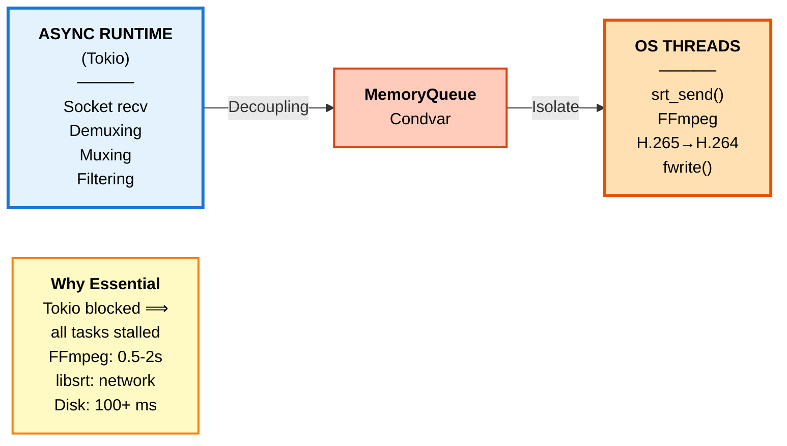

---

## Protocol Matrix

### Ingress protocols
- **RTMP** (TCP, FLV-wrapped payloads)
- **SRT** (UDP, MPEG-TS)
- **File** (FFmpeg subprocess, MPEG-TS)

### Egress protocols
- **RTMP** (TCP, FLV-wrapped)
- **SRT** (UDP, MPEG-TS)
- **HLS** (HTTP, MPEG-TS segments in memory)
- **Recording** (File, raw MPEG-TS)

### Transcoding modes
- **source** (passthrough, no video re-encode)
- **preset** (720p, 1080p, 480p with scale + re-encode)

---

## Branch-by-Branch Analysis

### Path 1: RTMP ingest → RTMP egress (source, passthrough)

**Current flow:**
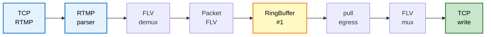

**Run-to-completion potential: 🟠 Medium**

**Why decoupled:** Multiple RTMP egress outputs read at independent rates. One publisher, N consumers. A ring is the right structure.

**Why not run-to-completion:** Cannot block one egress on another (backpressure isolation). Cannot guarantee single consumer.

**Could be run-to-completion if:** Only one RTMP egress output exists **and** we inline the socket write. But that eliminates multi-egress capability.

**Cost of decoupling:** One `Arc` allocation per packet (40B), one release-ordered store, one `notify_waiters()` wakeup per packet batch.

**Optimization opportunity:** None without losing multi-egress. The ring is necessary.

---

### Path 2: RTMP ingest → SRT egress (source, passthrough)

**Current flow:**
```mermaid
graph LR
    A["TCP<br/>RTMP"] --> B["FLV<br/>demux"] --> C["Packet<br/>Flv"] --> D["RingBuffer<br/>#1"]
    D --> E["pull<br/>egress"] --> F["video_for_ts<br/>TsMuxer"] --> G["TsChunkRing<br/>#2"]
    G --> H["MemoryQueue<br/>#3"] --> I["OS<br/>thread"] --> J["srt_send"] --> K["Network<br/>buffer"]
    
    style A fill:#e3f2fd,stroke:#1976d2,stroke-width:2px,color:#000
    style D fill:#fff9c4,stroke:#f57f17,stroke-width:2px,color:#000
    style G fill:#b39ddb,stroke:#512da8,stroke-width:2px,color:#fff
    style H fill:#ffccbc,stroke:#d84315,stroke-width:2px,color:#333
    style I fill:#ffb74d,stroke:#e65100,stroke-width:2px,color:#333
    style K fill:#ff6f6f,stroke:#c62828,stroke-width:2px,color:#fff
```

**Run-to-completion potential: 🔴 Low**

**Decoupling points:**
- **#1 (source ring):** Necessary for multi-egress
- **#2 (TsChunkRing):** Shared muxer result; one TsMuxer task feeds multiple SRT egress tasks. Avoids per-connection mux work.
- **#3 (MemoryQueue):** Isolates blocking libsrt_send on an OS thread from async Tokio. **Cannot be removed without changing SRT architecture.**

**Why multiple queues:**
- Source ring: multi-consumer fan-out (multiple egress outputs)
- TsChunkRing: sharing muxed TS packets across multiple SRT connections
- MemoryQueue: moving blocking I/O off the async runtime

**Optimization opportunity:** Could merge #1 and #2 if all SRT egress outputs fed directly to a single queue per connection, avoiding TsChunkRing. But MemoryQueue → OS thread boundary is hard.

---

### Path 3: SRT ingest → RTMP egress (source, passthrough)

**Current flow:**
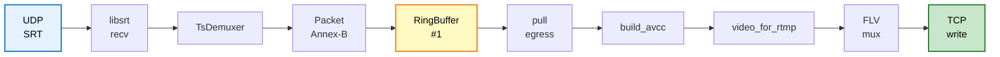

**Run-to-completion potential: 🟠 Medium**

**Why decoupled:** Multiple RTMP egress outputs.

**Codec cost:** Converting Raw → AVCC adds allocation overhead (2 small Vecs per video frame), but is unavoidable:
- SRT delivers Raw Annex-B (from MPEG-TS demux)
- RTMP requires AVCC wrapping (FLV standard)
- Conversion must happen per RTMP egress (cannot share, each frame may have different NALUs)

**Optimization:** Could use `annexb_to_avcc_with_scratch()` to reuse a single pre-allocated Vec, saving ~18B per frame (currently using two-pass which is faster for IDR frames).

---

### Path 4: SRT ingest → SRT egress (source, passthrough)

**Current flow:**
```mermaid
graph LR
    A["UDP<br/>SRT"] --> B["TsDemuxer"] --> C["Packet<br/>Raw"] --> D["RingBuffer<br/>#1"]
    D --> E["pull<br/>egress"] --> F["TsMuxer"] --> G["TsChunkRing<br/>#2"]
    G --> H["MemoryQueue<br/>#3"] --> I["OS<br/>thread"] --> J["srt_send"]
    
    style A fill:#e3f2fd,stroke:#1976d2,stroke-width:2px,color:#000
    style D fill:#fff9c4,stroke:#f57f17,stroke-width:2px,color:#000
    style G fill:#b39ddb,stroke:#512da8,stroke-width:2px,color:#fff
    style H fill:#ffccbc,stroke:#d84315,stroke-width:2px,color:#333
    style I fill:#ffb74d,stroke:#e65100,stroke-width:2px,color:#333
    style J fill:#ff6f6f,stroke:#c62828,stroke-width:2px,color:#fff
```

**Run-to-completion potential: 🔴 Low**

**Same as path 2**, but slightly cheaper (no codec conversion, Raw → Raw passthrough).

**Could be more run-to-completion if:**
- We inlined TsMuxer into the pull loop (currently done ✓)
- We collapsed source RingBuffer and TsChunkRing (but breaks multi-egress isolation)
- We eliminated MemoryQueue and called srt_send directly from Tokio (blocks, crashes runtime)

---

### Path 5: RTMP ingest → RTMP egress (720p preset, transcoded)

**Current flow:**
```mermaid
graph LR
    A["RTMP<br/>ingest"] --> B["FLV<br/>demux"] --> C["RingBuffer<br/>#1"] --> D["Feeder<br/>720p"]
    D --> E["pull_burst"] --> F["video_for_ts"] --> G["MemoryQueue<br/>#2a"] --> H["FFmpeg"]
    H --> I["stdout<br/>reader"] --> J["output_ring<br/>#3"] --> K["egress<br/>pull"] --> L["video_for_rtmp"]
    L --> M["TCP<br/>write"]
    
    style C fill:#fff9c4,stroke:#f57f17,stroke-width:2px,color:#000
    style G fill:#ffccbc,stroke:#d84315,stroke-width:2px,color:#333
    style H fill:#ffb74d,stroke:#e65100,stroke-width:2px,color:#333
    style J fill:#f3e5f5,stroke:#7b1fa2,stroke-width:2px,color:#333
    style M fill:#c8e6c9,stroke:#2e7d32,stroke-width:2px,color:#000
```

**Decoupling points:**
1. **source ring:** Multi-egress isolation (RTMP-src, SRT-src, HLS, recording, all share source)
2. **MemoryQueue→FFmpeg:** Isolates blocking subprocess I/O from async runtime
3. **FFmpeg stdout→output_ring:** Decouples subprocess stdout parsing from egress
4. *(implicit)* FFmpeg subprocess is a **separate process entirely** — not a thread hop, but a process boundary.

**Run-to-completion potential: 🔴 Very Low**

**Why:** Transcoding is **fundamentally blocking and expensive.** Cannot run end-to-end.
- FFmpeg decode (blocking, ~100–500 ms per second of video)
- Scale/filter (CPU-bound, varies by resolution)
- Encode (CPU-bound, ~500 ms–2s per second of video)

**Must be off the async runtime** to avoid starving other tasks.

**Current design is near-optimal:**
- Shared transcoder per `(pipeline, preset)` (one ffmpeg subprocess, not N)
- Feeder burst-reads from source ring
- Stdout reader burst-reads from FFmpeg
- Output ring allows multiple outputs to read at independent rates

**Optimization opportunity:** Could use internal transcoder (in-process via MemoryQueue + libavcodec) instead of subprocess, but doesn't change decoupling structure, only process/thread boundary.

---

### Path 6: SRT ingest → SRT egress (720p preset, transcoded)

**Current flow:**


**Run-to-completion potential: 🔴 Very Low**

**Same as path 5** (transcoding is blocking) **plus** the SRT sender isolation (#3b).

---

### Path 7: RTMP ingest → HLS egress (source, passthrough)

**Current flow:**
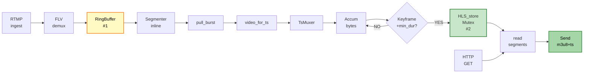

**Run-to-completion potential: 🟢 High**

**Why only one boundary (Mutex<HLS_store>):**
- Single async task does all muxing
- Segmenting happens inline in that task
- Storage is a simple Mutex — no queue, no thread hop
- HTTP reads are independent async handlers

**Could be fully run-to-completion if:**
- HLS had only one HTTP client (unlikely)
- We cached segments and didn't need the Mutex (could work, but needs careful cleanup)

**Current cost:** Mutex lock per 6-second segment (~0.17 Hz contention), not a hot path.

**Optimization opportunity:** Replace Mutex with lock-free atomic swaps of the segment list, or pre-allocate segment objects with atomic pointers. But overhead is already low; only worth it if HLS becomes heavy.

---

### Path 8: RTMP ingest → Recording (source, passthrough)

**Current flow:**


**Run-to-completion potential: 🔴 Low**

**MemoryQueue is necessary:**
- Disk I/O can stall (page evictions, fsync, scheduling delays)
- Cannot block async runtime on `fwrite()`
- Feeder must decouple from writer thread

**Could be run-to-completion if:**
- We eliminated the file write (not recording)
- We used async I/O (io-uring, but adds complexity)
- We used DirectI/O (kernel bypass, specialized setup)

**Current cost:** One write per burst (~8 ms), Condvar wakeup, thread scheduling. Not hot path.

**Optimization:** Already using `write_batch()` for burst writes. Could add io-uring support, but unlikely to show improvement on typical setups.

---

### Path 9: SRT ingest → H.265 RTMP egress with H.265→H.264 conversion

**Current flow:**
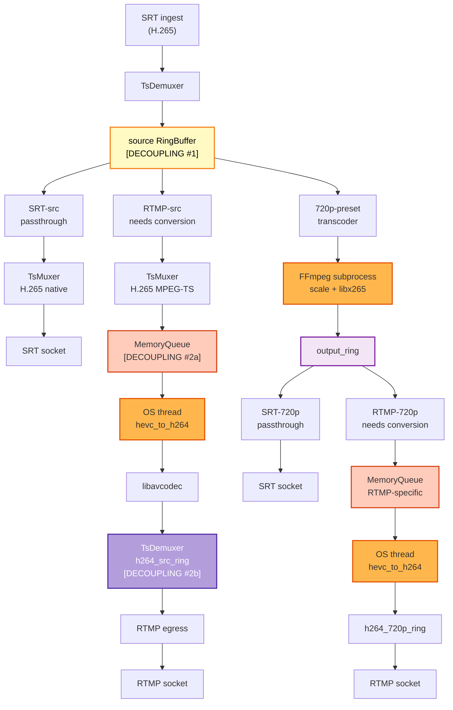

**Decoupling potential: 🔴 Very Low**

**Decoupling #1:** source ring (multi-egress)
**Decoupling #2a:** MemoryQueue (isolates H.265→H.264 OS thread from async)
**Decoupling #2b:** hevc_to_h264 output ring (multiple RTMP outputs may need same conversion)
**Decoupling #3:** FFmpeg transcoder (same as paths 5-6)
**Decoupling #4:** H.265→H.264 conversion again after transcode (different stage key)

**Why multiple stages for H.265→H.264?**
- RTMP-src and RTMP-720p feed different upstream rings
- Keying by upstream (`hevc_to_h264:from:source` vs. `hevc_to_h264:from:720p`) creates independent OS threads
- Allows parallel execution without contention
- **Cost:** 2 libavcodec threads, ~260 MB extra RSS, codec work parallelized

**Could reduce to 1 thread if:** Only one RTMP output exists, but that eliminates the multi-output capability.

---

### Path 10: SRT ingest with 2 audio tracks → 720p preset + audio track selection

**Current flow:**
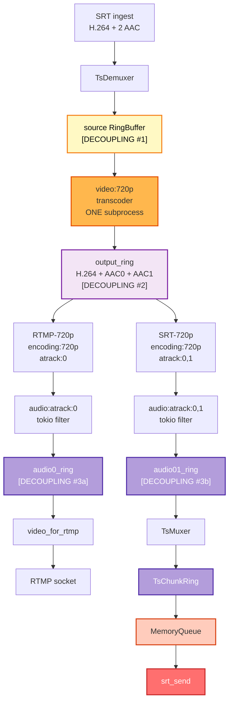

**Decoupling points:**
1. source ring (ingest)
2. output_ring (transcoder)
3. audio0_ring, audio01_ring (per audio selection)
4. SRT TsChunkRing → MemoryQueue → OS thread

**Run-to-completion potential: 🟠 Medium**

**Good news:** Audio routing tasks are **pure packet filters** (tokio tasks, no OS threads).
- Select or reindex tracks
- Push to audio routing ring
- Egress pulls and muxes

**Could merge audio routing + egress if:**
- Only one RTMP + one SRT output per preset (eliminates multi-consumer isolation)
- No track selection (direct passthrough)
- We inlined the audio ring

**Optimization:** Audio routing rings are necessary only for multi-output isolation. If there's a single RTMP-720p and single SRT-720p, we could:
```
output_ring → audio:atrack:0 (inline packet filter) → RTMP mux
            → audio:atrack:0,1 (inline packet filter) → SRT mux
```
But this requires knowing output count ahead of time. Current design is general.

---

## Visual Flow Graphs: All 10 Paths

### Path 1 & 4: RTMP/SRT Passthrough (No Transcode)

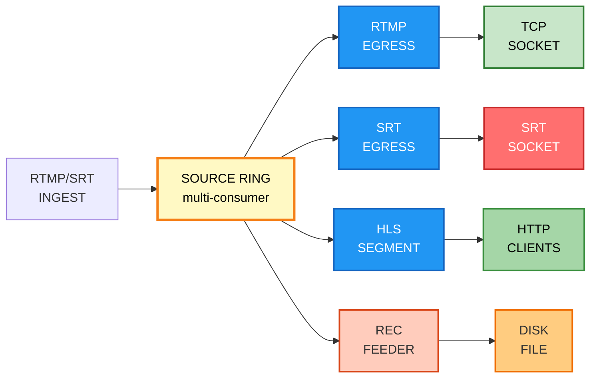

### Path 5 & 6: Transcoded (720p, External FFmpeg)

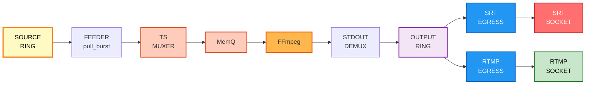

### Path 3 & 9: SRT Ingest with H.265→H.264 Conversion

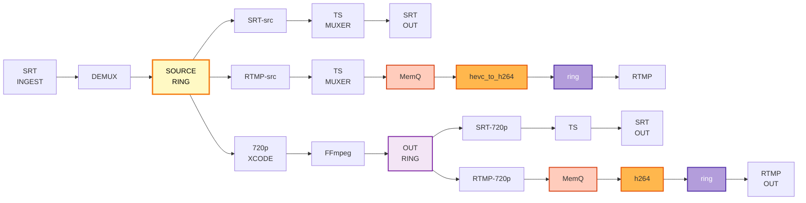

### Path 7: HLS Segmentation (Best Run-to-Completion)

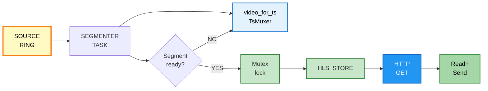

### Path 8: Recording (Disk I/O Blocking)


### Path 10: Multi-Audio Track Selection

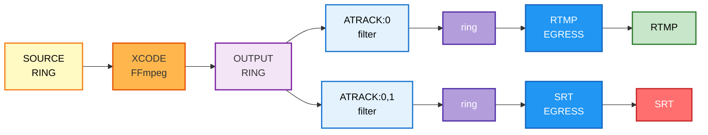

---

## Summary: Fundamental Decoupling Boundaries

| Decoupling reason | Can it be removed? | Cost of keeping | Priority |
|---|---|---|---|
| **Multi-consumer fan-out (rings)** | No, if N egress outputs at independent rates | 1 source ring + per-preset output ring(s) | Essential |
| **Transcoding isolation (FFmpeg subprocess or OS thread)** | No, if video decode/encode needed | Subprocess process or OS thread, MemoryQueue | Essential |
| **SRT libsrt_send blocking** | No, if using SRT protocol | 1 OS thread per SRT output, MemoryQueue | Essential |
| **Recording disk I/O blocking** | No, if recording to disk | 1 OS thread per recording, MemoryQueue | Low-priority (recording not in hot path) |
| **Codec conversion (Raw↔FLV↔AVCC)** | Partially: unavoidable per-output work, but can reuse scratch buffers | Small Vec allocations per frame | Low-priority (already optimized) |
| **Audio track selection (multi-audio)** | Partially: can inline if single consumer | One ring per audio configuration | Medium (only if multi-audio common) |
| **HLS segment store (Mutex)** | Mostly: could use lock-free swaps | Low contention (~0.17 Hz) | Very low |

---

## Current Run-to-Completion Opportunities

### 🟢 Already Implemented or Nearly So

1. **RTMP→RTMP passthrough (source):** Ring necessary for multi-egress, but ingest→ring→egress is minimal (FLV passthrough, no codec work).

2. **HLS segmenting:** Inline TsMuxer in async task, minimal Mutex contention, near-ideal design.

3. **Audio routing (atrack):** Pure packet filters in tokio tasks, no blocking, optimally cheap.

4. **SRT ingest demuxing:** Inline `TsDemuxer` (async), `push_batch()` directly to ring, no thread hop.

### 🟡 Partially Achievable (with trade-offs)

1. **SRT→SRT passthrough:** Could eliminate TsChunkRing if only one SRT egress (but breaks multi-SRT isolation). Current design is correct for N egresses.

2. **Recording:** Could use async I/O (io-uring), but adds kernel-version dependency and complexity. Current MemoryQueue + OS thread is portable.

3. **Codec conversions (FLV→AVCC, Raw→AVCC):** Already using `_into` scratch variants. Could pool scratch buffers per-task, but gains would be <2% per frame.

### 🔴 Fundamentally Unavoidable

1. **Transcoding (preset, 720p, etc.):** FFmpeg decode/encode is blocking and expensive. **Must be off async runtime.** Current shared-subprocess architecture is optimal.

2. **Multi-egress fan-out:** Different consumers may run at different rates (network jitter, socket backpressure). **Ring or queue required.** Source ring is the right structure.

3. **SRT sender blocking on libsrt_send():** libsrt blocks on network I/O. **Must isolate from Tokio.** Current MemoryQueue + dedicated OS thread is correct.

4. **H.265→H.264 conversion (RTMP-only):** RTMP cannot carry H.265. Conversion is mandatory for RTMP egress from H.265 sources. **Cannot be avoided** (only optimized via stage keying).

---

## Recommended Focus Areas

### If increasing run-to-completion is the goal:

1. **Verify multi-egress buffering is necessary:** Can we reduce source ring depth for single-output pipelines? (Currently 4096 slots, ~24s of video at 4K60.)
   - Measurement: Create a pipeline with 1 RTMP output, 1 SRT output. Measure ring overflow frequency and overflow→keyframe-seek frequency.
   - Action: If rare, could use adaptive sizing (shrink on creation, grow on first overflow).

2. **Consider direct socket writes instead of MemoryQueue for SRT egress (if libsrt allows non-blocking):**
   - Current: output_ring → MemoryQueue → OS thread → srt_send()
   - Possible: output_ring → TsChunkRing → Tokio task → srt_send_nonblocking()
   - **Blockers:** Need to verify libsrt supports non-blocking send with sufficient throughput, and that backpressure doesn't starve other tasks.

3. **Measure FFmpeg internal bottlenecks (decode vs. encode):**
   - If encode is the bottleneck, could parallelize by staging multiple FFmpeg instances per preset (pyramid sharding).
   - Measurement: Profile FFmpeg subprocess CPU with `perf`, identify which codec operations consume time.

4. **Reduce audio track routing rings for single-output cases:**
   - Current: output_ring → audio:atrack:0 → audio0_ring → egress
   - Possible: Direct inline filtering if only one output per audio configuration.
   - Measurement: Benchmark multi-audio pipelines; if rare, accept extra rings as generality cost.

### If optimizing within current constraints:

1. ✅ **Already done:** Burst APIs (`push_batch`, `pull_burst`), zero-allocation codec converters (`_into`), shared transcoder per preset.

2. ✅ **Already done:** Inline TsDemuxer for SRT ingest, inline TsMuxer for HLS and SRT egress.

3. ✅ **Already done:** Cached byte-counter atomics to eliminate per-packet registry lookups.

4. 🔄 **Consider:** Lock-free segment store for HLS (replace Mutex with atomic pointer swaps) — low priority, currently low contention.

5. 🔄 **Consider:** Pooled MemoryQueue chunks instead of byte-oriented VecDeque — would reduce allocations if many recordings run in parallel.

---

## Critical Files for Reference

- `src/media/engine.rs` (1,583 lines) — Stage graph, output reconciliation
- `src/media/ring_buffer.rs` (568 lines) — Lock-free SPMC ring, hot-path core
- `src/media/mpegts.rs` (2,111 lines) — TsDemuxer, TsMuxer, packet conversion
- `src/media/transcoder.rs` (420 lines) — Feeder/reader tasks, external FFmpeg subprocess
- `src/media/srt.rs` (2,387 lines) — SRT ingest, shared muxer, egress sender threads
- `src/media/rtmp.rs` (1,690 lines) — RTMP ingest/egress tasks
- `src/media/hls.rs` (338 lines) — Segmenter task, segment store, HTTP routes
- `src/media/recording.rs` (228 lines) — Feeder + writer thread
- `src/lib.rs` (525 lines) — App composition, reconciler main loop

---

## Path Comparison Chart

```mermaid
graph LR
    R1["<b>1. HLS<br/>segmenting</b><br/>🟢 High<br/>1 Decoup<br/>Mutex"]
    
    R2["<b>2. RTMP→RTMP<br/>passthrough</b><br/>🟠 Medium<br/>1 ring<br/>Multi-C"]
    
    R3["<b>3. Audio<br/>routing</b><br/>🟠 Medium<br/>1 ring<br/>Multi-C"]
    
    R4["<b>4. SRT<br/>demux</b><br/>🟠 Medium<br/>1 ring<br/>Multi-C"]
    
    R5["<b>5. SRT→SRT<br/>pass</b><br/>🔴 Low<br/>3 Decoup<br/>srt_send"]
    
    R6["<b>6. SRT→RTMP<br/>codec</b><br/>🔴 Low<br/>2 Decoup<br/>AVCC"]
    
    R7["<b>7. Rec<br/>disk</b><br/>🔴 Low<br/>2 Decoup<br/>Disk I/O"]
    
    R8["<b>8. Multi<br/>audio</b><br/>🔴 Low<br/>2-3 rings<br/>srt_send"]
    
    R9["<b>9. RTMP<br/>720p</b><br/>🔴 Very Low<br/>4 Decoup<br/>FFmpeg"]
    
    R10["<b>10. SRT<br/>H.265</b><br/>🔴 Very Low<br/>6+ Decoup<br/>FFmpeg"]
    
    R1 --> R2 --> R3 --> R4 --> R5 --> R6 --> R7 --> R8 --> R9 --> R10
    
    style R1 fill:#c8e6c9,stroke:#2e7d32,stroke-width:2px,color:#333
    style R2 fill:#fff176,stroke:#f57f17,stroke-width:2px,color:#333
    style R3 fill:#fff176,stroke:#f57f17,stroke-width:2px,color:#333
    style R4 fill:#fff176,stroke:#f57f17,stroke-width:2px,color:#333
    style R5 fill:#ff6f6f,stroke:#c62828,stroke-width:2px,color:#fff
    style R6 fill:#ff6f6f,stroke:#c62828,stroke-width:2px,color:#fff
    style R7 fill:#ff6f6f,stroke:#c62828,stroke-width:2px,color:#fff
    style R8 fill:#ff6f6f,stroke:#c62828,stroke-width:2px,color:#fff
    style R9 fill:#ff1744,stroke:#b71c1c,stroke-width:2px,color:#fff
    style R10 fill:#ff1744,stroke:#b71c1c,stroke-width:2px,color:#fff
```

---

## Latency Model: Where Time Is Spent

```mermaid
graph LR
    T0["<b>0 μs</b><br/>Ingest<br/>socket read<br/>+ parse<br/>~0.5-3 μs<br/>RTMP/SRT"]
    
    T1["<b>~3 μs</b><br/>Source<br/>RingBuffer<br/>Arc+publish<br/>~0.15 μs"]
    
    T2["<b>~3.2 μs</b><br/>Reader<br/>acquire<br/>per egress<br/>~0.03 μs"]
    
    T3["<b>~3.25 μs</b><br/>Egress<br/>processing<br/>RTMP: 0.1 μs<br/>SRT: 0.6 μs<br/>Codec: 0.7-2 μs<br/>H.265: 5-50 ms<br/>HLS: 0.6 μs"]
    
    T4["<b>~4 μs</b><br/>TsChunkRing<br/>SRT path<br/>only<br/>~0.1 μs"]
    
    T5["<b>~4.1 μs</b><br/>MemoryQueue<br/>write<br/>SRT path<br/>Mutex: 0.05 μs<br/>Push: 0.01 μs<br/>Notify: 0.1 μs"]
    
    T6["<b>~4.3 μs</b><br/>OS thread<br/>wakeup<br/>context switch<br/>~0.5-5 ms"]
    
    T7["<b>~4.3+ms</b><br/>libsrt_send<br/>blocking<br/>Network I/O<br/>~1-100+ ms<br/>UDP kernel buffer"]
    
    T8["<b>~100+ms</b><br/>Packet exits<br/>Network latency"]
    
    T0 --> T1 --> T2 --> T3
    T3 --> T4
    T4 --> T5 --> T6 --> T7 --> T8
    
    Transcoding["<b>Transcoding</b><br/>Add ~0.5-2000 ms<br/>FFmpeg codec work"]
    
    T3 -.->|If preset| Transcoding
    
    style T0 fill:#e3f2fd,stroke:#1976d2,stroke-width:2px,color:#000
    style T1 fill:#e8f5e9,stroke:#2e7d32,stroke-width:2px,color:#000
    style T2 fill:#e8f5e9,stroke:#2e7d32,stroke-width:2px,color:#000
    style T3 fill:#fff3e0,stroke:#e65100,stroke-width:2px,color:#000
    style T4 fill:#b39ddb,stroke:#512da8,stroke-width:2px,color:#fff
    style T5 fill:#ffccbc,stroke:#d84315,stroke-width:2px,color:#333
    style T6 fill:#ffb74d,stroke:#e65100,stroke-width:2px,color:#333
    style T7 fill:#ff6f6f,stroke:#c62828,stroke-width:2px,color:#fff
    style T8 fill:#ff6f6f,stroke:#c62828,stroke-width:2px,color:#fff
    style Transcoding fill:#ff1744,stroke:#b71c1c,stroke-width:2px,color:#fff
```

---

## Optimization Opportunity Matrix

```mermaid
graph TD
    Title["<b>OPTIMIZATION IMPACT vs EFFORT</b>"]
    
    FFmpeg["<b>FFmpeg Sharding</b><br/>(pyramid parallelization)<br/>─────<br/>Effort: HIGH<br/>Gain: Encode 2-3x<br/>Impact: HIGH"]
    
    Ring["<b>Adaptive Ring Sizing</b><br/>(single-output opt)<br/>─────<br/>Effort: MEDIUM<br/>Gain: RSS -20-30%<br/>Impact: MEDIUM"]
    
    IO["<b>Async I/O (io-uring)</b><br/>for recording<br/>─────<br/>Effort: MEDIUM-HIGH<br/>Gain: Latency -5-10%<br/>Impact: MEDIUM"]
    
    HLS["<b>Lock-free HLS</b><br/>segment store<br/>─────<br/>Effort: LOW<br/>Gain: <1% latency<br/>Impact: VERY LOW"]
    
    Priority["<b>Recommended Priority</b><br/>1. Measure FFmpeg bottleneck<br/>2. If encode-bound: sharding<br/>3. If SRT dominant: async send<br/>4. General latency: optimized ✓"]
    
    Title --> FFmpeg
    FFmpeg --> Ring
    FFmpeg --> IO
    Ring --> HLS
    IO --> HLS
    FFmpeg -.->|High cost| Priority
    Ring -.->|Medium cost| Priority
    IO -.->|Medium cost| Priority
    HLS -.->|Low cost| Priority
    
    style FFmpeg fill:#ff6f6f,stroke:#c62828,stroke-width:2px,color:#fff
    style Ring fill:#ffb74d,stroke:#e65100,stroke-width:2px,color:#333
    style IO fill:#fff176,stroke:#f57f17,stroke-width:2px,color:#333
    style HLS fill:#c8e6c9,stroke:#2e7d32,stroke-width:2px,color:#333
    style Priority fill:#e1f5fe,stroke:#01579b,stroke-width:2px,color:#000
    style Title fill:#f5f5f5,stroke:#9e9e9e,stroke-width:1px,color:#000
```

---

## Decoupling Decision Tree

```mermaid
graph TD
    START["<b>START</b><br/>Can path run<br/>end-to-end?"]
    
    Q1{"Transcoding<br/>required?"}
    
    Q1_YES["❌ YES<br/>Transcode = blocking<br/>Use: FFmpeg subprocess<br/>or libavcodec thread<br/><br/>→ MemoryQueue + OS thread"]
    
    Q2{"Multiple egress<br/>at different rates?"}
    
    Q2_YES["⚠️ YES<br/>Need isolation<br/><br/>→ Source RingBuffer"]
    
    Q2_NO["Single output"]
    Q2_NO_RTMP{"RTMP?"}
    Q2_NO_SRT{"SRT?"}
    
    Q2_NO_RTMP_YES["Could inline<br/>but lose scalability"]
    Q2_NO_SRT_YES["Need libsrt isolation<br/>→ MemoryQueue + thread"]
    
    Q3{"SRT egress?"}
    Q3_YES["libsrt_send() blocks<br/>→ MemoryQueue + thread"]
    
    Q4{"Recording?"}
    Q4_YES["fwrite() blocks<br/>→ MemoryQueue + thread"]
    
    Q5{"Audio routing<br/>multi-output?"}
    Q5_YES["Ring needed<br/>→ Audio ring"]
    
    Q6{"HLS?"}
    Q6_YES["✅ Mutex only<br/>~0.17 Hz contention<br/><br/>BEST RUN-TO-COMPLETION"]
    Q6_NO["⚠️ RTMP passthrough<br/>Ring-only (unavoidable)"]
    
    START --> Q1
    Q1 -->|YES| Q1_YES
    Q1 -->|NO| Q2
    
    Q2 -->|YES| Q2_YES
    Q2 -->|NO| Q2_NO
    
    Q2_NO --> Q2_NO_RTMP
    Q2_NO --> Q2_NO_SRT
    
    Q2_NO_RTMP -->|YES| Q2_NO_RTMP_YES
    Q2_NO_RTMP -->|NO| Q3
    
    Q2_NO_SRT -->|YES| Q2_NO_SRT_YES
    Q2_NO_SRT -->|NO| Q3
    
    Q3 -->|YES| Q3_YES
    Q3 -->|NO| Q4
    
    Q4 -->|YES| Q4_YES
    Q4 -->|NO| Q5
    
    Q5 -->|YES| Q5_YES
    Q5 -->|NO| Q6
    
    Q6 -->|YES| Q6_YES
    Q6 -->|NO| Q6_NO
    
    style START fill:#2196f3,stroke:#1565c0,stroke-width:2px,color:#fff
    style Q1_YES fill:#ff6f6f,stroke:#c62828,stroke-width:2px,color:#fff
    style Q2_YES fill:#ffb74d,stroke:#e65100,stroke-width:2px,color:#333
    style Q2_NO_RTMP_YES fill:#fff176,stroke:#f57f17,stroke-width:2px,color:#333
    style Q2_NO_SRT_YES fill:#ff6f6f,stroke:#c62828,stroke-width:2px,color:#fff
    style Q3_YES fill:#ff6f6f,stroke:#c62828,stroke-width:2px,color:#fff
    style Q4_YES fill:#ff6f6f,stroke:#c62828,stroke-width:2px,color:#fff
    style Q5_YES fill:#ffb74d,stroke:#e65100,stroke-width:2px,color:#333
    style Q6_YES fill:#c8e6c9,stroke:#2e7d32,stroke-width:2px,color:#333
    style Q6_NO fill:#fff176,stroke:#f57f17,stroke-width:2px,color:#333
```

---

## Key Takeaways

**Three Architectural Decoupling Boundaries That Cannot Be Removed:**

1. **Source Ring (multi-egress isolation):** Different outputs run at different rates. Removing this would stall fast outputs waiting for the slowest egress. Essential for multi-egress capability.

2. **Transcoder MemoryQueue→OS thread (blocking codec work):** FFmpeg operations block indefinitely. Running them on Tokio would starve all other async tasks. This boundary is non-negotiable.

3. **SRT Sender MemoryQueue→OS thread (blocking network I/O):** libsrt_send() blocks on UDP kernel buffers. Running it on Tokio would block async event loop. This boundary is required by the protocol.

**You've already optimized the hot paths:**
- Burst APIs reduce per-packet overhead
- Inline TsMuxer/TsDemuxer eliminate thread hops
- Zero-allocation codec converters minimize allocations
- Shared transcoder per preset eliminates redundant encoding

**Further improvements require either:**
- Trading off multi-egress isolation (adaptive ring sizing for single-output case)
- Restructuring SRT egress to use non-blocking libsrt (verify feasibility first)
- Profiling and reshaping transcoder parallelization (pyramid sharding for encode-bound workloads)
