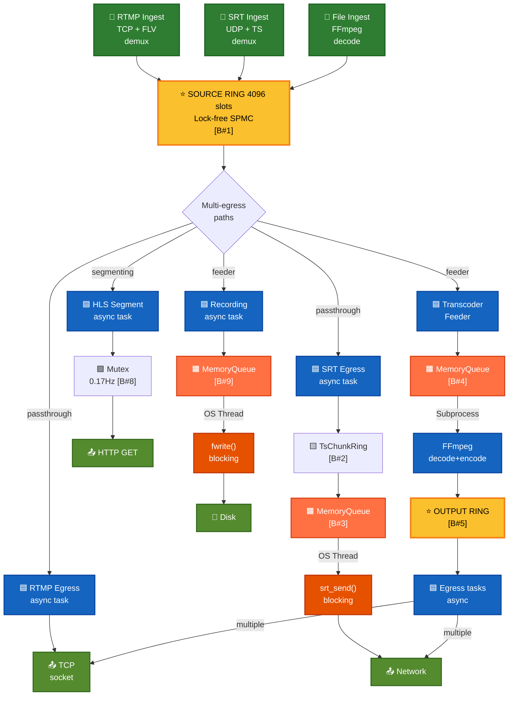
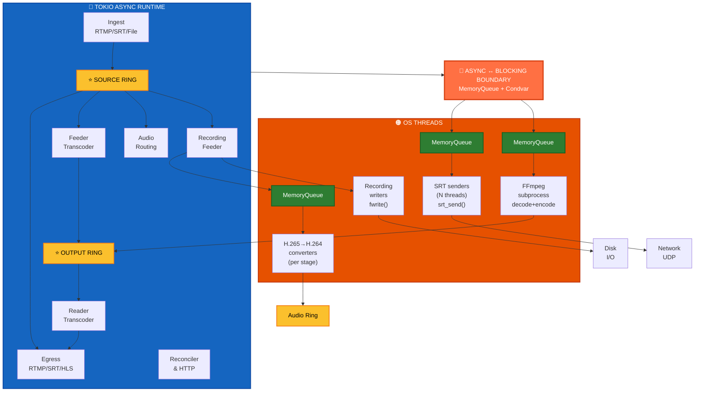
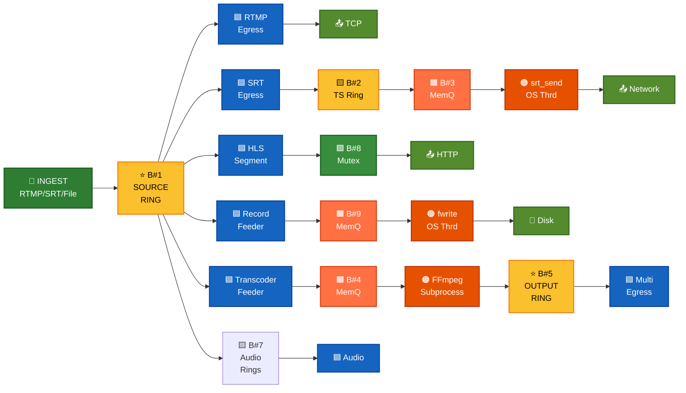
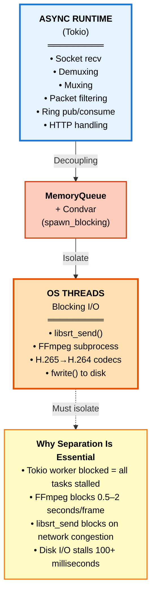
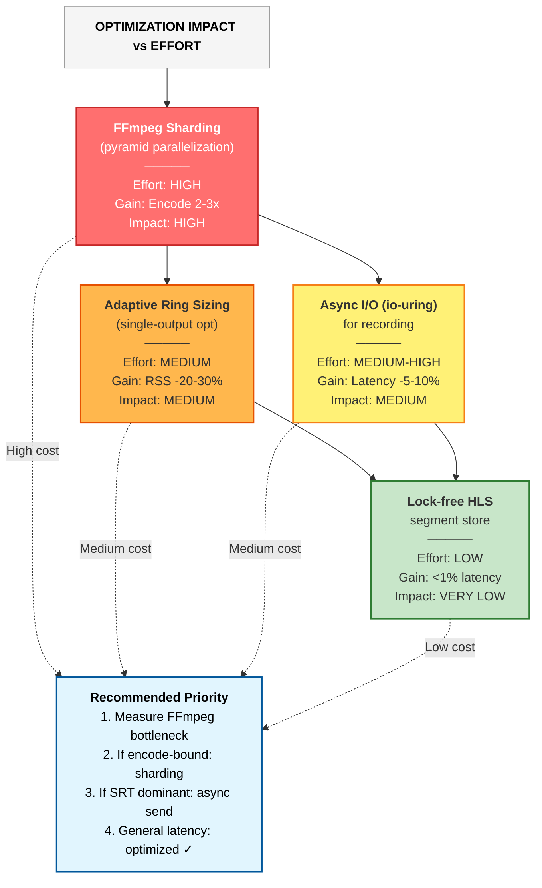
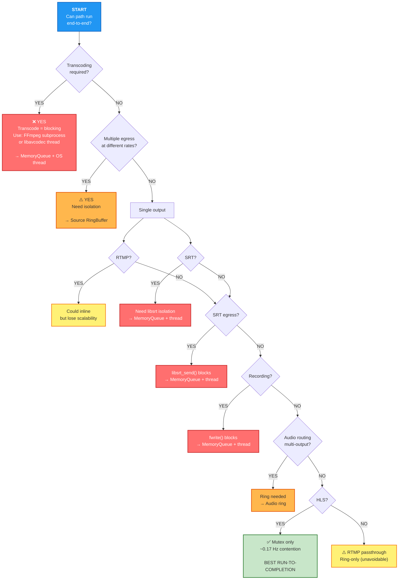

# Run-to-Completion Analysis: Protocol Combination Graph

This document maps every ingest/egress/transcoding branch, identifies decoupling points, and explains why run-to-completion is not achievable for all paths.

**Note:** ASCII diagrams below can also be viewed as clean SVG renderings in [diagrams/](diagrams/)

## Complete System Architecture



---

## Thread and Task Topology



---

## Decoupling Boundaries Summary

All 9 boundaries and their purposes:



**Why each boundary exists:**
- **B#1:** Multi-egress at independent rates ← CANNOT REMOVE
- **B#2:** Shared muxer → multiple SRT connections
- **B#3:** MANDATORY → libsrt_send() blocks indefinitely
- **B#4:** MANDATORY → FFmpeg subprocess blocks  
- **B#5:** Multi-consumer egress at independent rates
- **B#6:** Per-SRT connection reader state
- **B#7:** Audio track routing per config
- **B#8:** HLS Mutex (0.17 Hz) ✅ BEST CASE (low contention)
- **B#9:** Disk I/O isolation

## Blocking Boundaries (Cannot Be Removed)



---

## Protocol Matrix

### Ingress protocols
- **RTMP** (TCP, FLV-wrapped payloads)
- **SRT** (UDP, MPEG-TS)
- **File** (FFmpeg subprocess, MPEG-TS)

### Egress protocols
- **RTMP** (TCP, FLV-wrapped)
- **SRT** (UDP, MPEG-TS)
- **HLS** (HTTP, MPEG-TS segments in memory)
- **Recording** (File, raw MPEG-TS)

### Transcoding modes
- **source** (passthrough, no video re-encode)
- **preset** (720p, 1080p, 480p with scale + re-encode)

---

## Branch-by-Branch Analysis

### Path 1: RTMP ingest → RTMP egress (source, passthrough)

**Current flow:**
```
TCP socket → RTMP parser (inline tokio task)
  → FLV demux → MediaPacket(Flv format)
  → source RingBuffer.push() [DECOUPLING #1]
  ↓
RingBuffer.pull() (per egress task, 1+ readers)
  → FLV mux (payload.clone() only, zero-copy)
  → TCP socket.write()
```

**Run-to-completion potential: 🟠 Medium**

**Why decoupled:** Multiple RTMP egress outputs read at independent rates. One publisher, N consumers. A ring is the right structure.

**Why not run-to-completion:** Cannot block one egress on another (backpressure isolation). Cannot guarantee single consumer.

**Could be run-to-completion if:** Only one RTMP egress output exists **and** we inline the socket write. But that eliminates multi-egress capability.

**Cost of decoupling:** One `Arc` allocation per packet (40B), one release-ordered store, one `notify_waiters()` wakeup per packet batch.

**Optimization opportunity:** None without losing multi-egress. The ring is necessary.

---

### Path 2: RTMP ingest → SRT egress (source, passthrough)

**Current flow:**
```
TCP socket (RTMP) → FLV demux → MediaPacket(Flv)
  → source RingBuffer.push() [DECOUPLING #1]
  ↓
RingBuffer.pull() (SRT egress task)
  → video_for_ts() [strip FLV header, validate codec]
  → TsMuxer (inline, ~0.6µs/pkt)
  → TsChunkRing.push() [DECOUPLING #2]
  ↓
TsChunkRing.pull() (per SRT connection)
  → MemoryQueue.write() [DECOUPLING #3]
  ↓
OS thread (libsrt_send blocker)
  → srt_send() (blocks indefinitely)
  → kernel UDP buffer
```

**Run-to-completion potential: 🔴 Low**

**Decoupling points:**
- **#1 (source ring):** Necessary for multi-egress
- **#2 (TsChunkRing):** Shared muxer result; one TsMuxer task feeds multiple SRT egress tasks. Avoids per-connection mux work.
- **#3 (MemoryQueue):** Isolates blocking libsrt_send on an OS thread from async Tokio. **Cannot be removed without changing SRT architecture.**

**Why multiple queues:**
- Source ring: multi-consumer fan-out (multiple egress outputs)
- TsChunkRing: sharing muxed TS packets across multiple SRT connections
- MemoryQueue: moving blocking I/O off the async runtime

**Optimization opportunity:** Could merge #1 and #2 if all SRT egress outputs fed directly to a single queue per connection, avoiding TsChunkRing. But MemoryQueue → OS thread boundary is hard.

---

### Path 3: SRT ingest → RTMP egress (source, passthrough)

**Current flow:**
```
UDP socket (SRT) → libsrt recv (non-blocking in epoll loop)
  → TsDemuxer (inline async task, parse MPEG-TS)
  → MediaPacket(Raw format, Annex-B)
  → source RingBuffer.push() [DECOUPLING #1]
  ↓
RingBuffer.pull() (RTMP egress task)
  → build_avcc_seq_hdr() [reconstruct AVCC from Raw Annex-B]
  → video_for_rtmp() (AVCC wrap, allocates ~2 small Vecs for NALUs)
  → RTMP FLV mux (inline)
  → TCP socket.write()
```

**Run-to-completion potential: 🟠 Medium**

**Why decoupled:** Multiple RTMP egress outputs.

**Codec cost:** Converting Raw → AVCC adds allocation overhead (2 small Vecs per video frame), but is unavoidable:
- SRT delivers Raw Annex-B (from MPEG-TS demux)
- RTMP requires AVCC wrapping (FLV standard)
- Conversion must happen per RTMP egress (cannot share, each frame may have different NALUs)

**Optimization:** Could use `annexb_to_avcc_with_scratch()` to reuse a single pre-allocated Vec, saving ~18B per frame (currently using two-pass which is faster for IDR frames).

---

### Path 4: SRT ingest → SRT egress (source, passthrough)

**Current flow:**
```
UDP socket (SRT ingest) → TsDemuxer (inline)
  → MediaPacket(Raw)
  → source RingBuffer.push() [DECOUPLING #1]
  ↓
RingBuffer.pull() (SRT egress task)
  → TsMuxer (inline, ~0.6µs/pkt, no codec conversion)
  → TsChunkRing.push() [DECOUPLING #2]
  ↓
TsChunkRing.pull() (per SRT connection)
  → MemoryQueue.write() [DECOUPLING #3]
  ↓
OS thread → srt_send()
```

**Run-to-completion potential: 🔴 Low**

**Same as path 2**, but slightly cheaper (no codec conversion, Raw → Raw passthrough).

**Could be more run-to-completion if:**
- We inlined TsMuxer into the pull loop (currently done ✓)
- We collapsed source RingBuffer and TsChunkRing (but breaks multi-egress isolation)
- We eliminated MemoryQueue and called srt_send directly from Tokio (blocks, crashes runtime)

---

### Path 5: RTMP ingest → RTMP egress (720p preset, transcoded)

**Current flow:**
```
RTMP ingest → FLV demux → source RingBuffer.push()
  ↓
Transcoder feeder task (video:720p)
  → RingBuffer.pull_burst(32)
  → video_for_ts() [strip FLV or pass Raw]
  → TsMuxer [inline, mux to MPEG-TS]
  → MemoryQueue.write_batch() [DECOUPLING #2a]
  ↓
OS thread (external FFmpeg subprocess)
  stdin ← MPEG-TS from MemoryQueue
  → [scale=1280:720, libx264]
  → stdout MPEG-TS
  ↓
Transcoder stdout reader task
  → TsDemuxer (parse FFmpeg output)
  → MediaPacket(Raw, H.264 720p)
  → output_ring.push() [DECOUPLING #3]
  ↓
RTMP egress task (reads from output_ring)
  → video_for_rtmp() [AVCC wrap]
  → RTMP mux (inline)
  → TCP socket.write()
```

**Decoupling points:**
1. **source ring:** Multi-egress isolation (RTMP-src, SRT-src, HLS, recording, all share source)
2. **MemoryQueue→FFmpeg:** Isolates blocking subprocess I/O from async runtime
3. **FFmpeg stdout→output_ring:** Decouples subprocess stdout parsing from egress
4. *(implicit)* FFmpeg subprocess is a **separate process entirely** — not a thread hop, but a process boundary.

**Run-to-completion potential: 🔴 Very Low**

**Why:** Transcoding is **fundamentally blocking and expensive.** Cannot run end-to-end.
- FFmpeg decode (blocking, ~100–500 ms per second of video)
- Scale/filter (CPU-bound, varies by resolution)
- Encode (CPU-bound, ~500 ms–2s per second of video)

**Must be off the async runtime** to avoid starving other tasks.

**Current design is near-optimal:**
- Shared transcoder per `(pipeline, preset)` (one ffmpeg subprocess, not N)
- Feeder burst-reads from source ring
- Stdout reader burst-reads from FFmpeg
- Output ring allows multiple outputs to read at independent rates

**Optimization opportunity:** Could use internal transcoder (in-process via MemoryQueue + libavcodec) instead of subprocess, but doesn't change decoupling structure, only process/thread boundary.

---

### Path 6: SRT ingest → SRT egress (720p preset, transcoded)

**Current flow:**
```
SRT ingest → TsDemuxer (inline) → source RingBuffer
  ↓
Transcoder feeder (video:720p, shared)
  → RingBuffer.pull_burst(32)
  → TsMuxer [Raw → MPEG-TS, inject SPS/PPS]
  → MemoryQueue.write_batch() [DECOUPLING #2a]
  ↓
FFmpeg subprocess [decode, scale, re-encode]
  ↓
Transcoder stdout reader
  → TsDemuxer → output_ring.push() [DECOUPLING #3]
  ↓
SRT egress task
  → TsMuxer (output_ring → TsChunkRing)
  → TsChunkRing.pull() → MemoryQueue.write() [DECOUPLING #3b]
  ↓
OS thread → srt_send()
```

**Run-to-completion potential: 🔴 Very Low**

**Same as path 5** (transcoding is blocking) **plus** the SRT sender isolation (#3b).

---

### Path 7: RTMP ingest → HLS egress (source, passthrough)

**Current flow:**
```
RTMP ingest → FLV demux → source RingBuffer.push()
  ↓
HLS segmenter task (inline, per pipeline)
  → RingBuffer.pull_burst(32)
  → video_for_ts_into() [strip FLV hdr, reuse scratch buffer]
  → TsMuxer (inline, ~0.6µs/pkt)
  → accumulate TS bytes in segment buffer
  → on keyframe + min_duration:
      HLS_store.push_segment() [DECOUPLING #2]
      └─ Mutex<VecDeque<HlsSegment>>
  ↓
Axum GET handler (HTTP request)
  → HLS_store.read() [fetch latest segments]
  → send m3u8 + .ts chunks
```

**Run-to-completion potential: 🟢 High**

**Why only one boundary (Mutex<HLS_store>):**
- Single async task does all muxing
- Segmenting happens inline in that task
- Storage is a simple Mutex — no queue, no thread hop
- HTTP reads are independent async handlers

**Could be fully run-to-completion if:**
- HLS had only one HTTP client (unlikely)
- We cached segments and didn't need the Mutex (could work, but needs careful cleanup)

**Current cost:** Mutex lock per 6-second segment (~0.17 Hz contention), not a hot path.

**Optimization opportunity:** Replace Mutex with lock-free atomic swaps of the segment list, or pre-allocate segment objects with atomic pointers. But overhead is already low; only worth it if HLS becomes heavy.

---

### Path 8: RTMP ingest → Recording (source, passthrough)

**Current flow:**
```
RTMP ingest → FLV demux → source RingBuffer.push()
  ↓
Recording feeder task (per active recording)
  → RingBuffer.pull_burst(32)
  → video_for_ts_into() [strip FLV hdr]
  → MemoryQueue.write_batch() [DECOUPLING #2]
  ↓
OS thread (TS file writer)
  → MemoryQueue.read() [blocked on Condvar while empty]
  → fwrite() to disk (blocking I/O)
  └─ data.db (raw MPEG-TS)
```

**Run-to-completion potential: 🔴 Low**

**MemoryQueue is necessary:**
- Disk I/O can stall (page evictions, fsync, scheduling delays)
- Cannot block async runtime on `fwrite()`
- Feeder must decouple from writer thread

**Could be run-to-completion if:**
- We eliminated the file write (not recording)
- We used async I/O (io-uring, but adds complexity)
- We used DirectI/O (kernel bypass, specialized setup)

**Current cost:** One write per burst (~8 ms), Condvar wakeup, thread scheduling. Not hot path.

**Optimization:** Already using `write_batch()` for burst writes. Could add io-uring support, but unlikely to show improvement on typical setups.

---

### Path 9: SRT ingest → H.265 RTMP egress with H.265→H.264 conversion

**Current flow:**
```
SRT ingest (H.265) → TsDemuxer → source RingBuffer(H.265)
  ↓
┌─ SRT-src (passthrough): 
│   → TsMuxer → MPEG-TS (H.265 native) → SRT socket
│
├─ RTMP-src (needs conversion):
│   → TsMuxer → MPEG-TS (H.265)
│   → MemoryQueue.write() [DECOUPLING #2a]
│   ↓
│   OS thread (hevc_to_h264:from:source)
│   → [libavcodec H.265→H.264]
│   → TsDemuxer → h264_src_ring.push() [DECOUPLING #2b]
│   ↓
│   RTMP egress task
│   → video_for_rtmp() → RTMP socket
│
└─ 720p-preset (all outputs share one transcoder):
    → FFmpeg subprocess (scale + libx265)
    → output_ring
    ├─ SRT-720p: TsMuxer → TsChunkRing → MemoryQueue → srt_send()
    └─ RTMP-720p (needs conversion):
        → TsMuxer → MemoryQueue (RTMP-specific)
        → OS thread (hevc_to_h264:from:720p)
        → h264_720p_ring → RTMP socket
```

**Decoupling potential: 🔴 Very Low**

**Decoupling #1:** source ring (multi-egress)
**Decoupling #2a:** MemoryQueue (isolates H.265→H.264 OS thread from async)
**Decoupling #2b:** hevc_to_h264 output ring (multiple RTMP outputs may need same conversion)
**Decoupling #3:** FFmpeg transcoder (same as paths 5-6)
**Decoupling #4:** H.265→H.264 conversion again after transcode (different stage key)

**Why multiple stages for H.265→H.264?**
- RTMP-src and RTMP-720p feed different upstream rings
- Keying by upstream (`hevc_to_h264:from:source` vs. `hevc_to_h264:from:720p`) creates independent OS threads
- Allows parallel execution without contention
- **Cost:** 2 libavcodec threads, ~260 MB extra RSS, codec work parallelized

**Could reduce to 1 thread if:** Only one RTMP output exists, but that eliminates the multi-output capability.

---

### Path 10: SRT ingest with 2 audio tracks → 720p preset + audio track selection

**Current flow:**
```
SRT ingest (H.264 + 2 AAC tracks) → TsDemuxer → source RingBuffer
  ↓
video:720p transcoder (shared, ONE subprocess)
  → output_ring(H.264 + 2 AAC track0 + track1)
  ├─ RTMP-720p encoding="720p+atrack:0" (select track 0 only)
  │   → audio:atrack:0:from:720p (tokio task, packet filter)
  │   → audio0_ring(H.264 + track0)
  │   → video_for_rtmp() → RTMP socket
  │
  └─ SRT-720p encoding="720p+atrack:0,1" (keep both)
      → audio:atrack:0,1:from:720p (tokio task)
      → audio01_ring(H.264 + track0 + track1)
      → TsMuxer → TsChunkRing → MemoryQueue → srt_send()
```

**Decoupling points:**
1. source ring (ingest)
2. output_ring (transcoder)
3. audio0_ring, audio01_ring (per audio selection)
4. SRT TsChunkRing → MemoryQueue → OS thread

**Run-to-completion potential: 🟠 Medium**

**Good news:** Audio routing tasks are **pure packet filters** (tokio tasks, no OS threads).
- Select or reindex tracks
- Push to audio routing ring
- Egress pulls and muxes

**Could merge audio routing + egress if:**
- Only one RTMP + one SRT output per preset (eliminates multi-consumer isolation)
- No track selection (direct passthrough)
- We inlined the audio ring

**Optimization:** Audio routing rings are necessary only for multi-output isolation. If there's a single RTMP-720p and single SRT-720p, we could:
```
output_ring → audio:atrack:0 (inline packet filter) → RTMP mux
            → audio:atrack:0,1 (inline packet filter) → SRT mux
```
But this requires knowing output count ahead of time. Current design is general.

---

## Visual Flow Graphs: All 10 Paths

### Path 1 & 4: RTMP/SRT Passthrough (No Transcode)

```
┌────────────────┐    ┌─────────────────┐
│ RTMP/SRT       │───▶│ SOURCE RING     │
│ INGEST         │    │ (multi-consumer)│
│ (demux)        │    └────────┬────────┘
└────────────────┘             │
                    ┌──────────┼──────────┬─────────────┐
                    │          │          │             │
                    ▼          ▼          ▼             ▼
          ┌────────────────┐ ┌─────────────────┐ ┌──────────────┐
          │ RTMP EGRESS    │ │ SRT EGRESS      │ │ HLS SEGMENTER│
          ├────────────────┤ ├─────────────────┤ ├──────────────┤
          │ FLV mux        │ │ TS mux          │ │ TsMuxer      │
          │ Payload clone  │ │ TsChunkRing     │ │ Accum buf    │
          └────────┬───────┘ │ MemoryQueue     │ │ Mutex        │
                   │         │ srt_send()      │ └──────┬───────┘
                   ▼         └────────┬────────┘        │
              ┌─────────┐             ▼                 ▼
              │ TCP     │        ┌──────────┐      ┌──────────┐
              │ SOCKET  │        │ SRT      │      │ HTTP     │
              │ (egress)│        │ SOCKET   │      │ CLIENTS  │
              └─────────┘        │ (egress) │      └──────────┘
                                 └──────────┘

                    ┌────────────────────┐
                    │ RECORDING          │
                    ├────────────────────┤
                    │ MemoryQueue        │
                    │ fwrite()           │
                    └────────┬───────────┘
                             ▼
                        ┌─────────────┐
                        │ DISK FILE   │
                        └─────────────┘

RUN-TO-COMPLETION POTENTIAL: 🟠 Medium
  • Ring necessary for multi-consumer isolation
  • Each consumer has independent buffering
  • Cheap operations (FLV/TS mux): ~0.6-1µs per packet
  • Socket writes decouple naturally (network speed)
```

### Path 5 & 6: Transcoded (720p, External FFmpeg)

```
┌──────────────────────────────────────────────────────────┐
│ SOURCE RING (also feeds HLS, Recording)                  │
└────────────┬─────────────────────────────────────────────┘
             │
             ▼
       ┌──────────────────────┐
       │ TRANSCODER FEEDER    │
       │ (pull_burst)         │
       └──────────┬───────────┘
                  │
                  ▼
       ┌──────────────────────┐
       │ TS MUXER             │
       │ MemoryQueue          │
       └──────────┬───────────┘
                  │
                  ▼
       ┌──────────────────────┐
       │ FFMPEG SUBPROCESS    │
       │ scale=1280:720       │
       │ libx264/libx265      │
       └──────────┬───────────┘
                  │
                  ▼
       ┌──────────────────────┐
       │ FFMPEG STDOUT        │
       │ TS DEMUXER           │
       └──────────┬───────────┘
                  │
                  ▼
      ┌─────────────────────────────┐
      │ OUTPUT RING (4096 slots)    │
      │ (multi-consumer SRT+RTMP)   │
      └──────┬──────────────┬───────┘
             │              │
             ▼              ▼
      ┌─────────────┐  ┌──────────────┐
      │ SRT EGRESS  │  │ RTMP EGRESS  │
      ├─────────────┤  ├──────────────┤
      │ TS MUXER    │  │ AVCC wrap    │
      │ TsChunkRing │  │ FLV mux      │
      │ MemoryQueue │  └──────┬───────┘
      │ srt_send()  │         │
      │ (OS thread) │         ▼
      └──────┬──────┘  ┌──────────────┐
             │         │ RTMP SOCKET  │
             ▼         │ (egress)     │
      ┌──────────────┐ └──────────────┘
      │ SRT SOCKET   │
      │ (egress)     │
      └──────────────┘

RUN-TO-COMPLETION POTENTIAL: 🔴 Very Low
  • FFmpeg decode: ~100-500ms per second of video
  • FFmpeg encode: ~500ms-2s per second of video
  • MUST be off async runtime (blocks everything else)
  • Output ring needed for multiple egress (SRT + RTMP)
  • MemoryQueues: input (feeder↔FFmpeg) + output (egress↔srt_send)
```

### Path 3 & 9: SRT Ingest with H.265→H.264 Conversion

```
┌─────────────────────┐
│ SRT INGEST (H.265)  │
│ (TS format)         │
└──────────┬──────────┘
           │
           ▼
       ┌────────────┐
       │ TS DEMUXER │
       └──────┬─────┘
              │
              ▼
    ┌──────────────────────┐
    │ SOURCE RING (H.265)  │
    └────┬──────────┬──────┘
         │          │
         │          └──────────────────────────────┐
         │                                         │
         ▼                                         ▼
    ┌──────────────┐                  ┌──────────────────────┐
    │ SRT-src PATH │                  │ 720p TRANSCODER PATH │
    │ (passthrough)│                  │ (FFmpeg subprocess)  │
    ├──────────────┤                  └──────────┬───────────┘
    │ TS MUXER     │                             │
    │ TS (H.265)   │                  ┌──────────▼──────────┐
    └──────┬───────┘                  │ OUTPUT RING (H.264) │
           │                          │ + AAC tracks        │
           ▼                          └────┬──────┬─────────┘
    ┌──────────────┐                      │      │
    │ SRT SOCKET   │         ┌────────────┘      └─────────┐
    │ (H.265 out)  │         │                              │
    └──────────────┘         ▼                              ▼
                      ┌──────────────────┐    ┌──────────────────┐
         ┌──────────┐ │ SRT-720p (H.265) │    │ RTMP-720p PATH   │
         │ RTMP-src │ │ TS MUXER         │    │ (H.265→H.264 cvt)│
         │ PATH     │ └────────┬─────────┘    ├──────────────────┤
         │(conversion) │        ▼              │ MemoryQueue      │
         ├──────────┤ │  SRT SOCKET (H.265)   │ hevc_to_h264      │
         │TS MUXER  │ │                        │ (libavcodec)     │
         │→TS H.265 │ └────────────────────────│ (OS thread)      │
         │MemoryQ   │                          │ h264_ring        │
         │ hevc_to  │                          └────────┬─────────┘
         │ h264 cdc │                                   │
         │(libavc)  │                                   ▼
         │(OS thrd) │                          ┌──────────────────┐
         │h264_ring │                          │ RTMP SOCKET      │
         └────┬─────┘                          │ (H.264 out)      │
              │                                └──────────────────┘
              ▼
         ┌────────────┐
         │ RTMP SOCKET│
         │ (H.264 out)│
         └────────────┘

RUN-TO-COMPLETION POTENTIAL: 🔴 Very Low
  • Three sources of decoupling:
    1. SOURCE RING (multi-egress isolation)
    2. HEVC_TO_H264 MemoryQueue (async↔blocking codec work)
    3. FFmpeg transcoder (async↔blocking subprocess)
  • H.265→H.264 conversion MANDATORY for RTMP (protocol limitation)
  • Two independent conversion threads if both passthrough+preset RTMP
```

### Path 7: HLS Segmentation (Best Run-to-Completion)

```
┌──────────────────────────┐
│ SOURCE RING (all proto)  │
└────────────┬─────────────┘
             │
             ▼
    ┌──────────────────────┐
    │ HLS SEGMENTER TASK   │
    │ (1 per pipeline)     │
    └────────────┬─────────┘
                 │
        ┌────────┴─────────┐
        │                  │
        ▼ (Per packet)     ▼ (Per segment: on keyframe + min_dur)
   ┌─────────────┐    ┌──────────────┐
   │video_for_ts │    │ Mutex lock   │
   │(scratch buf)│    │ (segment     │
   │TS MUXER     │    │  complete)   │
   │(~0.6µs/pkt) │    └──────┬───────┘
   │Accumulate   │           │
   │TS bytes     │           ▼
   └─────┬───────┘    ┌──────────────────────┐
         │            │ HLS_STORE (Mutex)    │
         │            │ SegmentVecDeque      │
         │            │ in memory            │
         │            └──────────┬───────────┘
         │                       │
         ├───────────────────────┤
         │                       │
         ▼                       ▼
    ┌─────────────┐      ┌─────────────┐
    │             │      │ HTTP GET    │
    │             │      │ /playlist.  │
    │             │      │ m3u8        │
    │             │      │ Handlers    │
    │             │      │ (async)     │
    │             │      └──────┬──────┘
    │             │             │
    │             │             ▼
    │             │      ┌──────────────┐
    │             │      │ Read from    │
    │             │      │ HLS_STORE    │
    │             │      │ Send m3u8 +  │
    │             │      │ .ts chunks   │
    │             │      │ over HTTP    │
    │             │      └──────────────┘
    └─────────────┘

RUN-TO-COMPLETION POTENTIAL: 🟢 High (Best path!)
  • Only ONE Mutex at segment boundaries (~6 second intervals)
  • Contention is ~0.17 Hz (1 lock per 6 seconds)
  • No MemoryQueue, no OS threads
  • No codec conversion (passthrough, inline TS mux)
  • Could eliminate Mutex with lock-free atomic swaps (if needed)
  • Currently near-optimal design with minimal decoupling
```

### Path 8: Recording (Disk I/O Blocking)

```
┌────────────────────┐
│ SOURCE RING        │
└─────────┬──────────┘
          │
          ▼
   ┌──────────────────┐
   │ RECORDING FEEDER │
   │ (1 per recording)│
   └─────────┬────────┘
             │
             ▼
   ┌──────────────────────┐
   │ video_for_ts_into    │
   │ (reuse scratch buf)  │
   │                      │
   │ MemoryQueue          │
   │ .write_batch()       │
   └─────────┬────────────┘
             │
             ▼
   ┌──────────────────────┐
   │ OS THREAD: WRITER    │
   │                      │
   │ MemoryQueue.read()   │
   │ (Condvar: wait if    │
   │  empty)              │
   │                      │
   │ fwrite() to disk     │
   │ (0-100+ ms stall)    │
   └─────────┬────────────┘
             │
             ▼
   ┌──────────────────────┐
   │ data.db (MPEG-TS)    │
   │ (persistent storage) │
   └──────────────────────┘

RUN-TO-COMPLETION POTENTIAL: 🔴 Low
  • fwrite() blocks indefinitely (cannot be on Tokio)
  • Disk I/O stalls (page cache, fsync delays)
  • MemoryQueue mandatory to isolate from async runtime
  • Already using write_batch() for burst efficiency
  • Could use io-uring (async I/O), but:
    - Adds kernel version dependency
    - Minimal benefit on typical hardware
    - Complexity not justified for non-critical path
```

### Path 10: Multi-Audio Track Selection

```
┌────────────────────────┐
│ SOURCE RING            │
└─────────────┬──────────┘
              │
              ▼
   ┌──────────────────────────┐
   │ video:720p TRANSCODER    │
   │ (shared FFmpeg subprocess)
   └────────────┬─────────────┘
                │
                ▼
   ┌──────────────────────────────┐
   │ OUTPUT RING (H.264 + AAC)    │
   │ track0, track1               │
   └──────┬────────────────┬──────┘
          │                │
          ▼                ▼
  ┌──────────────────┐  ┌──────────────────┐
  │ audio:ATRACK:0   │  │ audio:ATRACK:0,1 │
  │ (packet filter)  │  │ (packet filter)  │
  │ select track 0   │  │ keep both tracks │
  └────────┬─────────┘  └────────┬─────────┘
           │                     │
           ▼                     ▼
  ┌──────────────────┐  ┌──────────────────┐
  │ audio0_ring      │  │ audio01_ring     │
  │ (track selection)│  │ (track selection)│
  └────────┬─────────┘  └────────┬─────────┘
           │                     │
           ▼                     ▼
  ┌──────────────────┐  ┌──────────────────┐
  │ RTMP EGRESS      │  │ SRT EGRESS       │
  │ (AVCC wrap)      │  │ (TS MUXER)       │
  │ FLV mux          │  │ (TsChunkRing)    │
  └────────┬─────────┘  │ (MemoryQueue)    │
           │            │ (srt_send)       │
           ▼            │ (OS thread)      │
  ┌──────────────────┐  └────────┬─────────┘
  │ RTMP SOCKET      │           │
  │ (egress)         │           ▼
  └──────────────────┘  ┌──────────────────┐
                        │ SRT SOCKET       │
                        │ (egress)         │
                        └──────────────────┘

RUN-TO-COMPLETION POTENTIAL: 🟠 Medium
  • Audio routing is CHEAP (packet filter, no codec work)
  • Routing tasks run on Tokio (not blocking)
  • Could inline if only ONE output per audio config
    (currently general: supports N outputs per config)
  • Each audio config creates separate ring (by design)
  • Trade-off: generality vs. latency
  
OPTIMIZATION OPPORTUNITY:
  If single-output-per-config is common:
    output_ring → [inline filter: atrack:0] → RTMP mux
                → [inline filter: atrack:0,1] → SRT mux
  
  But requires statically knowing output count at config time.
  Current approach is more flexible for multi-output scenarios.
```

---

## Summary: Fundamental Decoupling Boundaries

| Decoupling reason | Can it be removed? | Cost of keeping | Priority |
|---|---|---|---|
| **Multi-consumer fan-out (rings)** | No, if N egress outputs at independent rates | 1 source ring + per-preset output ring(s) | Essential |
| **Transcoding isolation (FFmpeg subprocess or OS thread)** | No, if video decode/encode needed | Subprocess process or OS thread, MemoryQueue | Essential |
| **SRT libsrt_send blocking** | No, if using SRT protocol | 1 OS thread per SRT output, MemoryQueue | Essential |
| **Recording disk I/O blocking** | No, if recording to disk | 1 OS thread per recording, MemoryQueue | Low-priority (recording not in hot path) |
| **Codec conversion (Raw↔FLV↔AVCC)** | Partially: unavoidable per-output work, but can reuse scratch buffers | Small Vec allocations per frame | Low-priority (already optimized) |
| **Audio track selection (multi-audio)** | Partially: can inline if single consumer | One ring per audio configuration | Medium (only if multi-audio common) |
| **HLS segment store (Mutex)** | Mostly: could use lock-free swaps | Low contention (~0.17 Hz) | Very low |

---

## Current Run-to-Completion Opportunities

### 🟢 Already Implemented or Nearly So

1. **RTMP→RTMP passthrough (source):** Ring necessary for multi-egress, but ingest→ring→egress is minimal (FLV passthrough, no codec work).

2. **HLS segmenting:** Inline TsMuxer in async task, minimal Mutex contention, near-ideal design.

3. **Audio routing (atrack):** Pure packet filters in tokio tasks, no blocking, optimally cheap.

4. **SRT ingest demuxing:** Inline `TsDemuxer` (async), `push_batch()` directly to ring, no thread hop.

### 🟡 Partially Achievable (with trade-offs)

1. **SRT→SRT passthrough:** Could eliminate TsChunkRing if only one SRT egress (but breaks multi-SRT isolation). Current design is correct for N egresses.

2. **Recording:** Could use async I/O (io-uring), but adds kernel-version dependency and complexity. Current MemoryQueue + OS thread is portable.

3. **Codec conversions (FLV→AVCC, Raw→AVCC):** Already using `_into` scratch variants. Could pool scratch buffers per-task, but gains would be <2% per frame.

### 🔴 Fundamentally Unavoidable

1. **Transcoding (preset, 720p, etc.):** FFmpeg decode/encode is blocking and expensive. **Must be off async runtime.** Current shared-subprocess architecture is optimal.

2. **Multi-egress fan-out:** Different consumers may run at different rates (network jitter, socket backpressure). **Ring or queue required.** Source ring is the right structure.

3. **SRT sender blocking on libsrt_send():** libsrt blocks on network I/O. **Must isolate from Tokio.** Current MemoryQueue + dedicated OS thread is correct.

4. **H.265→H.264 conversion (RTMP-only):** RTMP cannot carry H.265. Conversion is mandatory for RTMP egress from H.265 sources. **Cannot be avoided** (only optimized via stage keying).

---

## Recommended Focus Areas

### If increasing run-to-completion is the goal:

1. **Verify multi-egress buffering is necessary:** Can we reduce source ring depth for single-output pipelines? (Currently 4096 slots, ~24s of video at 4K60.)
   - Measurement: Create a pipeline with 1 RTMP output, 1 SRT output. Measure ring overflow frequency and overflow→keyframe-seek frequency.
   - Action: If rare, could use adaptive sizing (shrink on creation, grow on first overflow).

2. **Consider direct socket writes instead of MemoryQueue for SRT egress (if libsrt allows non-blocking):**
   - Current: output_ring → MemoryQueue → OS thread → srt_send()
   - Possible: output_ring → TsChunkRing → Tokio task → srt_send_nonblocking()
   - **Blockers:** Need to verify libsrt supports non-blocking send with sufficient throughput, and that backpressure doesn't starve other tasks.

3. **Measure FFmpeg internal bottlenecks (decode vs. encode):**
   - If encode is the bottleneck, could parallelize by staging multiple FFmpeg instances per preset (pyramid sharding).
   - Measurement: Profile FFmpeg subprocess CPU with `perf`, identify which codec operations consume time.

4. **Reduce audio track routing rings for single-output cases:**
   - Current: output_ring → audio:atrack:0 → audio0_ring → egress
   - Possible: Direct inline filtering if only one output per audio configuration.
   - Measurement: Benchmark multi-audio pipelines; if rare, accept extra rings as generality cost.

### If optimizing within current constraints:

1. ✅ **Already done:** Burst APIs (`push_batch`, `pull_burst`), zero-allocation codec converters (`_into`), shared transcoder per preset.

2. ✅ **Already done:** Inline TsDemuxer for SRT ingest, inline TsMuxer for HLS and SRT egress.

3. ✅ **Already done:** Cached byte-counter atomics to eliminate per-packet registry lookups.

4. 🔄 **Consider:** Lock-free segment store for HLS (replace Mutex with atomic pointer swaps) — low priority, currently low contention.

5. 🔄 **Consider:** Pooled MemoryQueue chunks instead of byte-oriented VecDeque — would reduce allocations if many recordings run in parallel.

---

## Critical Files for Reference

- `src/media/engine.rs` (1,583 lines) — Stage graph, output reconciliation
- `src/media/ring_buffer.rs` (568 lines) — Lock-free SPMC ring, hot-path core
- `src/media/mpegts.rs` (2,111 lines) — TsDemuxer, TsMuxer, packet conversion
- `src/media/transcoder.rs` (420 lines) — Feeder/reader tasks, external FFmpeg subprocess
- `src/media/srt.rs` (2,387 lines) — SRT ingest, shared muxer, egress sender threads
- `src/media/rtmp.rs` (1,690 lines) — RTMP ingest/egress tasks
- `src/media/hls.rs` (338 lines) — Segmenter task, segment store, HTTP routes
- `src/media/recording.rs` (228 lines) — Feeder + writer thread
- `src/lib.rs` (525 lines) — App composition, reconciler main loop

---

## Path Comparison Chart

```mermaid
graph TD
    Title["<b>RUN-TO-COMPLETION POTENTIAL RANKING</b>"]
    
    R1["<b>1. HLS segmenting</b><br/>🟢 High Potential<br/>1 Decoupling (Mutex)<br/>Bottleneck: HTTP clients"]
    
    R2["<b>2. RTMP→RTMP passthrough</b><br/>🟠 Medium Potential<br/>1 Decoupling (ring)<br/>Bottleneck: Multi-consumer"]
    
    R3["<b>3. Audio routing</b><br/>🟠 Medium Potential<br/>1 Decoupling (ring)<br/>Bottleneck: Multi-consumer"]
    
    R4["<b>4. SRT ingest demux</b><br/>🟠 Medium Potential<br/>1 Decoupling (ring)<br/>Bottleneck: Multi-consumer"]
    
    R5["<b>5. SRT→SRT passthrough</b><br/>🔴 Low Potential<br/>3 Decoupling (ring+chunk+Q)<br/>Bottleneck: libsrt_send"]
    
    R6["<b>6. SRT→RTMP + codec</b><br/>🔴 Low Potential<br/>2 Decoupling (ring+Q)<br/>Bottleneck: AVCC codec"]
    
    R7["<b>7. Recording</b><br/>🔴 Low Potential<br/>2 Decoupling (ring+Q)<br/>Bottleneck: Disk I/O"]
    
    R8["<b>8. Multi-audio routing</b><br/>🔴 Low Potential<br/>2-3 Decoupling (rings)<br/>Bottleneck: libsrt_send"]
    
    R9["<b>9. Transcoded RTMP 720p</b><br/>🔴 Very Low Potential<br/>4 Decoupling (ring+Q+ring+Q)<br/>Bottleneck: FFmpeg encode"]
    
    R10["<b>10. Transcoded SRT H.265</b><br/>🔴 Very Low Potential<br/>6+ Decoupling (multiple)<br/>Bottleneck: FFmpeg + H.265→H.264"]
    
    Title --> R1 --> R2 --> R3 --> R4 --> R5 --> R6 --> R7 --> R8 --> R9 --> R10
    
    style R1 fill:#c8e6c9,stroke:#2e7d32,stroke-width:2px,color:#333
    style R2 fill:#fff176,stroke:#f57f17,stroke-width:2px,color:#333
    style R3 fill:#fff176,stroke:#f57f17,stroke-width:2px,color:#333
    style R4 fill:#fff176,stroke:#f57f17,stroke-width:2px,color:#333
    style R5 fill:#ff6f6f,stroke:#c62828,stroke-width:2px,color:#fff
    style R6 fill:#ff6f6f,stroke:#c62828,stroke-width:2px,color:#fff
    style R7 fill:#ff6f6f,stroke:#c62828,stroke-width:2px,color:#fff
    style R8 fill:#ff6f6f,stroke:#c62828,stroke-width:2px,color:#fff
    style R9 fill:#ff1744,stroke:#b71c1c,stroke-width:2px,color:#fff
    style R10 fill:#ff1744,stroke:#b71c1c,stroke-width:2px,color:#fff
    style Title fill:#f5f5f5,stroke:#9e9e9e,stroke-width:1px,color:#000
```



---

## Latency Model: Where Time Is Spent

```mermaid
graph LR
    T0["<b>0 μs</b><br/>Ingest<br/>socket read<br/>+ parse<br/>~0.5-3 μs<br/>RTMP/SRT"]
    
    T1["<b>~3 μs</b><br/>Source<br/>RingBuffer<br/>Arc+publish<br/>~0.15 μs"]
    
    T2["<b>~3.2 μs</b><br/>Reader<br/>acquire<br/>per egress<br/>~0.03 μs"]
    
    T3["<b>~3.25 μs</b><br/>Egress<br/>processing<br/>RTMP: 0.1 μs<br/>SRT: 0.6 μs<br/>Codec: 0.7-2 μs<br/>H.265: 5-50 ms<br/>HLS: 0.6 μs"]
    
    T4["<b>~4 μs</b><br/>TsChunkRing<br/>SRT path<br/>only<br/>~0.1 μs"]
    
    T5["<b>~4.1 μs</b><br/>MemoryQueue<br/>write<br/>SRT path<br/>Mutex: 0.05 μs<br/>Push: 0.01 μs<br/>Notify: 0.1 μs"]
    
    T6["<b>~4.3 μs</b><br/>OS thread<br/>wakeup<br/>context switch<br/>~0.5-5 ms"]
    
    T7["<b>~4.3+ms</b><br/>libsrt_send<br/>blocking<br/>Network I/O<br/>~1-100+ ms<br/>UDP kernel buffer"]
    
    T8["<b>~100+ms</b><br/>Packet exits<br/>Network latency"]
    
    T0 --> T1 --> T2 --> T3
    T3 --> T4
    T4 --> T5 --> T6 --> T7 --> T8
    
    Transcoding["<b>Transcoding</b><br/>Add ~0.5-2000 ms<br/>FFmpeg codec work"]
    
    T3 -.->|If preset| Transcoding
    
    style T0 fill:#e3f2fd,stroke:#1976d2,stroke-width:2px,color:#000
    style T1 fill:#e8f5e9,stroke:#2e7d32,stroke-width:2px,color:#000
    style T2 fill:#e8f5e9,stroke:#2e7d32,stroke-width:2px,color:#000
    style T3 fill:#fff3e0,stroke:#e65100,stroke-width:2px,color:#000
    style T4 fill:#b39ddb,stroke:#512da8,stroke-width:2px,color:#fff
    style T5 fill:#ffccbc,stroke:#d84315,stroke-width:2px,color:#333
    style T6 fill:#ffb74d,stroke:#e65100,stroke-width:2px,color:#333
    style T7 fill:#ff6f6f,stroke:#c62828,stroke-width:2px,color:#fff
    style T8 fill:#ff6f6f,stroke:#c62828,stroke-width:2px,color:#fff
    style Transcoding fill:#ff1744,stroke:#b71c1c,stroke-width:2px,color:#fff
```



---

## Optimization Opportunity Matrix



---

## Decoupling Decision Tree



---

## Key Takeaways

**Three Architectural Decoupling Boundaries That Cannot Be Removed:**

1. **Source Ring (multi-egress isolation):** Different outputs run at different rates. Removing this would stall fast outputs waiting for the slowest egress. Essential for multi-egress capability.

2. **Transcoder MemoryQueue→OS thread (blocking codec work):** FFmpeg operations block indefinitely. Running them on Tokio would starve all other async tasks. This boundary is non-negotiable.

3. **SRT Sender MemoryQueue→OS thread (blocking network I/O):** libsrt_send() blocks on UDP kernel buffers. Running it on Tokio would block async event loop. This boundary is required by the protocol.

**You've already optimized the hot paths:**
- Burst APIs reduce per-packet overhead
- Inline TsMuxer/TsDemuxer eliminate thread hops
- Zero-allocation codec converters minimize allocations
- Shared transcoder per preset eliminates redundant encoding

**Further improvements require either:**
- Trading off multi-egress isolation (adaptive ring sizing for single-output case)
- Restructuring SRT egress to use non-blocking libsrt (verify feasibility first)
- Profiling and reshaping transcoder parallelization (pyramid sharding for encode-bound workloads)
