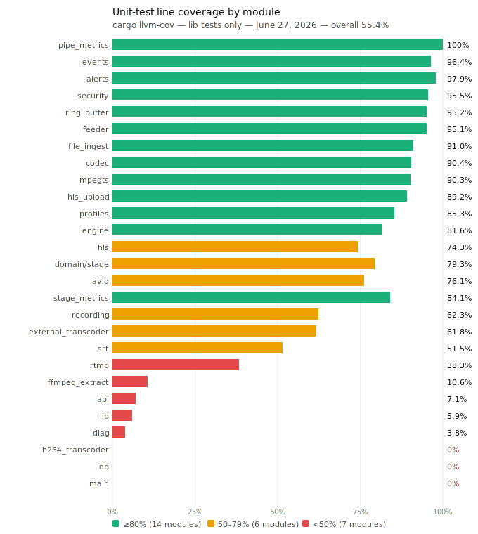

# Testing

## Rust Test Suite

Run the full suite:

```sh
scripts/resource-limit cargo test
```

As of June 27, 2026 this runs 541 passing non-doctest tests:

| Suite | Tests | Source |
|---|---:|---|
| Library/unit | 429 | `src/` modules (ring buffer, SRT, RTMP, MPEG-TS, codec, HLS, engine, etc.) |
| API integration | 66 | `tests/api.rs` |
| AV sync integration | 14 | `tests/av_sync.rs` |
| Codec integration | 17 | `tests/codec.rs` |
| Database integration | 15 | `tests/db.rs` |
| Transcoder integration | 7 | `tests/transcoder.rs` (fixture-dependent, see note) |
| **Total** | **541** | |

The 7 transcoder tests require `test/artifacts/test-h264.ts` which is not
committed; they fail with a missing-fixture error. All other suites pass.

The doctest suite also runs; the single codec example is intentionally ignored.

## Scoped Verification Loop

Prefer the smallest test and benchmark set that directly covers the changed
behavior, then broaden only when the risk calls for it. This keeps agent and
developer loops fast while still making the verification signal precise.

Good scoped Rust patterns:

```sh
scripts/resource-limit cargo test --lib <test-name-or-module-filter>
scripts/resource-limit cargo test --test api <test-name-filter>
scripts/resource-limit cargo test --test transcoder <test-name-filter>
```

Good scoped benchmark patterns:

```sh
scripts/resource-limit cargo bench --bench <bench-name> --profile bench-dev -- <criterion-filter>
scripts/resource-limit cargo bench --bench high_performance_data_path --profile bench-dev -- egress_progress
```

Use the full `cargo test` suite, full benchmark suites, or live integration
modes as a broader confidence pass when a change crosses module boundaries,
changes a shared contract, affects protocol behavior, or touches a hot path
whose blast radius is unclear. If an unrelated full-suite test or benchmark
fails, report it separately from the scoped signal for the current change.

### Composable Verification Stages

Large suites should be broken into named stages that can run independently and
compose into larger gates. A failure in one stage should identify the affected
behavior slice instead of turning the entire test or benchmark program into an
opaque blocker.

| Stage | Purpose | Typical commands |
|---|---|---|
| 0. Preflight/static | Prove the environment and cheap invariants before spending runtime. | `scripts/resource-limit cargo fmt --check`, integration `--preflight` |
| 1. Changed behavior | Fastest proof for the exact code path touched by a change. | `cargo test --lib <filter>`, `cargo test --test api <filter>` |
| 2. Contract slice | Neighboring API, graph, stage, protocol, or lifecycle contracts that consume the changed behavior. | Filtered package/integration tests by module, endpoint, protocol, or stage kind |
| 3. Hot-path cost | Criterion group that measures the touched hot path only. | `cargo bench --bench <bench> --profile bench-dev -- <criterion-filter>` |
| 4. Live protocol slice | One live protocol/topology check with minimal fanout and targeted assertions. | `run-integration.sh --fast --only smoke,ffprobe,hls,lifecycle mixed-scale` |
| 5. Scale/degradation slice | A bounded load, ramp, restart, queue-pressure, or bonding slice for resource shape. | `N_OUTPUTS=<small>` ramp, `N_PER_GROUP=<small>` mixed-scale, `bonding` |
| 6. Full confidence gate | Release or milestone pass assembled from the relevant stages above. | Full `cargo test`, selected full benches, full integration modes |

When a suite grows too large, split it along composable axes instead of adding
more mandatory work to a single command:

- behavior: ingest, egress, HLS, recording, graph, diagnostics, alerts
- protocol: RTMP, SRT, HLS, RTMPS, SRT bonding
- codec/media shape: H.264, H.265, B-frames, multi-audio, audio remap/downmix
- topology: passthrough, one shared stage, mixed presets, package sharing
- load shape: smoke, small fanout, ramp, soak, downstream restart, queue pressure
- evidence: unit assertion, API snapshot, graph invariant, ffprobe/readback,
  resource baseline, Criterion benchmark

Prefer adding selectors, manifest entries, and result artifacts over adding a
new all-or-nothing suite. A milestone can still require multiple stages, but it
should state which slices are required and preserve each slice's separate
pass/fail result.

Unit coverage includes:

- RTMP FLV H.264/AAC parsing and signed composition time
- HLS playlist/window behavior
- SRT stream-ID normalization, URL/bond parsing, codec mapping, payload
  extraction, rate deltas, socket option IDs, listener UDP-stat parsing
- Linux `TCP_INFO`/`SO_MEMINFO` conversion and live socket collection
- Transcoder stage sharing and audio-routing parsing
- External HLS PUT upload delivery through a dummy HTTP sink
- FFmpeg-backed audio remap/downmix stage argument generation and fixture-backed
  execution
- Internal decode/scale/encode coverage for the built-in video profiles
- Ring buffer push/pull ordering, overflow fast-forward to keyframe,
  multi-reader isolation, fill/capacity reporting, burst APIs
- DTS monotonicity enforcement (equal, decreasing, PTS < DTS correction,
  per-stream independence, B-frame composition-time preservation)
- Engine lifecycle: ingest/egress register/unregister/cancel, idempotent
  unregister, pipeline create/remove, egress byte counters, health snapshot
  pipeline filtering, recording lifecycle, noop on nonexistent pipelines
- MPEG-TS demux/mux: packet parsing, PID dispatch, PES assembly, continuity
  counters, Annex-B NAL scanning, vectorized resync
- Codec helpers: FLV stripping, video/audio payload conversion for TsMuxer

The API suite (66 tests) covers authentication, configuration, pipeline/output
CRUD, ingests, HLS aliases, status, graph, diagnostics preconditions, custom
encoding persistence/rejection for runtime outputs, HLS upload output
acceptance, RTMPS output acceptance, egress-pipeline association in `/health`,
deletion-cancellation of egress tasks, pipeline and aggregate alerts response
shape, system metrics structured response, agent graph-diff-preview compiled-out
behavior, and operator telemetry/events/overview/summary endpoints.

## API Route Coverage Matrix

Every route in `src/api.rs` audited against unit tests (`tests/api.rs`) and
live integration tests (`src/bin/test_harness.rs`). As of June 27, 2026 all
59 routes have at least one test. Legend: ✓ = covered, — = not covered,
~ = precondition only.

**Auth**

| Method | Route | Unit | Live | Notes |
|---|---|:---:|:---:|---|
| `POST` | `/api/auth/login` | ✓ | ✓ | |
| `POST` | `/api/auth/logout` | ✓ | — | |
| `POST` | `/api/auth/change-password` | ✓ | — | |

**Config**

| Method | Route | Unit | Live | Notes |
|---|---|:---:|:---:|---|
| `GET` | `/config` | ✓ | ✓ | |
| `PATCH` | `/config` | ✓ | — | 3 tests incl. transcode profiles |
| `GET` | `/audio-caps` | ✓ | — | |
| `GET` | `/stream-keys` | ✓ | — | |

**Pipelines**

| Method | Route | Unit | Live | Notes |
|---|---|:---:|:---:|---|
| `GET` | `/pipelines` | ✓ | ✓ | |
| `POST` | `/pipelines` | ✓ | ✓ | Create |
| `POST` | `/pipelines/:id` | ✓ | — | Update |
| `DELETE` | `/pipelines/:id` | ✓ | ✓ | fault-resilience SRT test |

**File ingest**

| Method | Route | Unit | Live | Notes |
|---|---|:---:|:---:|---|
| `GET` | `/pipelines/:id/file-ingest` | ✓ | — | |
| `PUT` | `/pipelines/:id/file-ingest` | ✓ | ✓ | |
| `DELETE` | `/pipelines/:id/file-ingest` | ✓ | — | |

**Outputs**

| Method | Route | Unit | Live | Notes |
|---|---|:---:|:---:|---|
| `POST` | `/pipelines/:id/outputs` | ✓ | ✓ | Create |
| `POST` | `/pipelines/:id/outputs/:oid` | ✓ | — | Update |
| `DELETE` | `/pipelines/:id/outputs/:oid` | ✓ | — | |
| `POST` | `/.../outputs/:oid/start` | ✓ | ✓ | |
| `POST` | `/.../outputs/:oid/stop` | ✓ | ✓ | |
| `GET` | `/.../outputs/:oid/status` | ✓ | ✓ | |

**Pipeline detail**

| Method | Route | Unit | Live | Notes |
|---|---|:---:|:---:|---|
| `GET` | `/pipelines/:id/probe` | — | ✓ | mixed-scale, correctness-* |
| `GET` | `/pipelines/:id/graph` | ✓ | ✓ | |
| `GET` | `/pipelines/:id/alerts` | ✓ | — | auth + response shape |
| `GET` | `/pipelines/:id/diagnostics` | ~ | — | SSE; precondition only |
| `POST` | `/.../recording/start` | — | ✓ | mixed-anchor |
| `POST` | `/.../recording/stop` | — | ✓ | mixed-anchor |

**Encodings**

| Method | Route | Unit | Live | Notes |
|---|---|:---:|:---:|---|
| `GET` | `/encodings/custom` | ✓ | — | |
| `PUT` | `/encodings/custom` | ✓ | — | |

**Ingests**

| Method | Route | Unit | Live | Notes |
|---|---|:---:|:---:|---|
| `GET` | `/api/ingests` | ✓ | ✓ | |
| `POST` | `/api/ingests` | ✓ | — | |
| `PUT` | `/api/ingests/:id` | ✓ | — | |
| `DELETE` | `/api/ingests/:id` | ✓ | — | |
| `POST` | `/api/ingests/:id/start` | ✓ | ✓ | |
| `POST` | `/api/ingests/:id/stop` | — | ✓ | fault-resilience |

**Status and health**

| Method | Route | Unit | Live | Notes |
|---|---|:---:|:---:|---|
| `GET` | `/api/status` | ✓ | — | |
| `GET` | `/api/status/sbom` | ✓ | — | |
| `GET` | `/api/media` | ✓ | — | |
| `DELETE` | `/api/media/:filename` | ✓ | — | Path traversal tested |
| `GET` | `/health` | ✓ | ✓ | |
| `GET` | `/healthz` | ✓ | ✓ | |
| `GET` | `/metrics/system` | ✓ | — | Structured cpu/memory/disk/network |

**V1 operator API**

| Method | Route | Unit | Live | Notes |
|---|---|:---:|:---:|---|
| `GET` | `/api/logs` | — | — | New; unit tests pending |
| `GET` | `/api/logs/stream` | — | — | SSE; new; unit tests pending |
| `GET` | `/api/v1/alerts` | ✓ | — | Aggregate across all pipelines |
| `GET` | `/api/v1/events` | ✓ | — | Filtering tested |
| `GET` | `/api/v1/overview` | ✓ | — | |
| `GET` | `/api/v1/engine/telemetry` | ✓ | — | |
| `GET` | `/api/v1/pipelines/:id/telemetry` | ✓ | — | |
| `GET` | `/api/v1/stages/:key/telemetry` | ✓ | — | |
| `GET` | `/api/v1/pipelines/:id/summary` | ✓ | — | |

**Agent API**

| Method | Route | Unit | Live | Notes |
|---|---|:---:|:---:|---|
| `GET` | `/api/v1/agent/capabilities` | ✓ | — | |
| `GET` | `/api/v1/agent/context` | ✓ | — | |
| `POST` | `/api/v1/agent/investigations` | ✓ | — | |
| `POST` | `/api/v1/agent/plans` | ✓ | — | |
| `POST` | `/api/v1/agent/plans/validate` | ✓ | — | |
| `POST` | `/api/v1/agent/graph-diff-preview` | ✓ | — | 404 when compiled out |
| `POST` | `/api/v1/agent/operations` | ✓ | — | |
| `GET` | `/api/v1/agent/operations/:id` | ✓ | — | |
| `POST` | `/.../operations/:id/approve` | ✓ | — | |
| `POST` | `/.../operations/:id/apply` | ✓ | — | |
| `POST` | `/.../operations/:id/verify` | ✓ | — | |
| `POST` | `/api/v1/agent/verify` | ✓ | — | 404 when compiled out |

## Code Coverage

Line coverage from `cargo llvm-cov` (unit tests only, June 27, 2026):



| Module | Lines | Covered | Coverage |
|---|---:|---:|---:|
| `pipe_metrics` | 21 | 21 | 100.0% |
| `events` | 278 | 268 | **96.4%** |
| `alerts` | 517 | 506 | 97.9% |
| `security` | 220 | 210 | 95.5% |
| `ring_buffer` | 875 | 833 | 95.2% |
| `feeder` | 226 | 215 | 95.1% |
| `file_ingest` | 566 | 515 | 91.0% |
| `codec` | 730 | 660 | 90.4% |
| `mpegts` | 2,438 | 2,201 | 90.3% |
| `hls_upload` | 232 | 207 | 89.2% |
| `profiles` | 334 | 285 | 85.3% |
| `stage_metrics` | 44 | 37 | 84.1% |
| `engine` | 2,920 | 2,383 | 81.6% |
| `domain/stage` | 227 | 180 | 79.3% |
| `avio` | 469 | 357 | 76.1% |
| `hls` | 526 | 391 | **74.3%** |
| `recording` | 310 | 193 | **62.3%** |
| `external_transcoder` | 583 | 360 | **61.8%** |
| `srt` | 2,189 | 1,127 | 51.5% |
| `rtmp` | 1,682 | 644 | 38.3% |
| `api` | 3,350 | 239 | 7.1%† |
| `db` | 855 | 0 | 0.0%† |
| **Total** | **23,918** | **13,250** | **55.4%** |

† `api.rs` is tested via 66 integration tests in `tests/api.rs` which `llvm-cov --lib` does not instrument. `db.rs` is tested via `tests/db.rs`. Their unit-only coverage is not representative.

These numbers reflect unit-test-only instrumentation. `api.rs` shows 7% because
`cargo llvm-cov` does not instrument `tests/api.rs` integration tests by
default — the real API test coverage is much higher (66 tests across all 59
routes). Similarly, `db.rs`, `rtmp.rs`, and `srt.rs` are primarily exercised by
the live integration harness which is not captured by `llvm-cov`.

### Coverage interpretation

- **≥80% (14 modules)**: core media pipeline logic — ring buffer, codec,
  MPEG-TS, engine, HLS upload, file ingest, alerts, events, security, profiles,
  feeder, stage_metrics. Well covered by unit tests.
- **50–79% (6 modules)**: socket-heavy protocol handlers, HLS store, and
  recording logic. Primarily exercised by the live harness with real ffmpeg;
  unit-testing their socket loops would require significant mocking for little
  added benefit.
- **<50% (7 modules)**: API/DB/diagnostics layers tested through integration
  tests not captured by `llvm-cov`, or FFmpeg-dependent transcoder code that
  requires the binary running.

## Live Integration Tests

All live integration tests are unified under one entry point:

```sh
scripts/resource-limit ./test/run-integration.sh [--host] [--fast] [--json path] [--only checks] <mode>
```

By default every mode that manages its own server processes runs inside a
private loopback network namespace (`unshare --net`) so ports never conflict
with the host. Pass `--host` to skip the namespace wrapper.

Required tools: `ffmpeg`, `ffprobe`, `mediamtx`, `curl`, `jq`.

Common runner flags:

| Flag | Purpose |
|---|---|
| `--preflight` | Check binary, dependencies, namespace support, and host-mode port conflicts without starting the test. |
| `--fast` | Set `N_PER_GROUP=1`, `N_OUTPUTS=1`, `SNAP_EVERY=999`, and skip snapshot sleeps for quick agent loops. |
| `--json <path>` | Write JSONL assertion records alongside the human-readable log. Failed ffprobe assertions include stderr and log tails. |
| `--only <checks>` | Run selected `mixed-scale` assertion groups. Supported checks: `smoke`, `ffprobe`, `hls`, `lifecycle`, `tc-spawns`, `load`. |
| `--skip-load` | Skip resource snapshot sleeps and load assertion records while preserving correctness setup. |
| `--resume-from <id>` | Skip named assertion records until the requested assertion ID is reached. |
| `--baseline <path>` | Compare `mixed-scale` RSS summary against a saved CSV baseline. `RSS_BASELINE_THRESHOLD_PCT` defaults to 5. |
| `--save-baseline <path>` | Save the current `mixed-scale` RSS summary as a baseline CSV. |

The runner kills only processes it starts. Set `ALLOW_GLOBAL_PROCESS_CLEANUP=1`
only when you explicitly want the legacy host-wide `restream`/`mediamtx`
cleanup before a run.

### Artifact Disk Guards

Live integration runs write logs, JSONL assertions, ffprobe stderr, SQLite
fixtures, generated media, and manifests under `test/artifacts/` by default.
The runner applies two disk-safety guards before starting live services:

- `RESTREAM_ARTIFACT_MIN_FREE_MB` (default `2048`) fails the run when the
  artifact filesystem has less free space than the configured floor. Set it to
  `0` only for an intentional no-floor diagnostic run.
- old top-level `test/artifacts/` directories are pruned so only the latest
  three runs remain. The active run directory is protected. Set
  `KEEP_ARTIFACTS=1` only for a deliberate manual-retention/debug session.

`--preflight` emits an `artifact-disk` JSON record with the artifact root,
current free MB, configured floor, and pass/fail status. Protocol-matrix runs
inherit the same guard for each delegated mode. When `--host` is used,
preflight emits the candidate `ports` list and checks the actual ports a mode
binds: legacy live modes check the configured Restream/MediaMTX ports, while
Rust-only harness modes check the harness loopback ports (`11935` for RTMP,
`11080` for SRT, and `HLS_PUT_PORT` for the dummy HLS PUT sink).
If a live mode needs `target/release/restream` and the repo-managed static SRT
archive is also missing, the binary check points agents at
`scripts/resource-limit ./scripts/setup-static-build.sh` before the release
build step.

Typical quick agent loop:

```sh
scripts/resource-limit ./test/run-integration.sh --preflight --json /tmp/restream-preflight.jsonl mixed-scale
scripts/resource-limit ./test/run-integration.sh --fast --json /tmp/restream-mixed.jsonl --only smoke,hls,lifecycle mixed-scale
```

### Manual Dashboard Live Env

For UI/debug sessions it is useful to run a long-lived dashboard plus an
independent MediaMTX sink outside the integration wrapper. This is not a
release certification gate; it is an operator-facing smoke setup that makes the
dashboard, processing graph, status page, HLS preview, output history, and
media library easy to inspect while real traffic is flowing.

Current local shape used on June 27, 2026:

| Component | Ports / paths |
|---|---|
| Restream dashboard/API | `http://127.0.0.1:39280` |
| Restream RTMP ingest | `rtmp://127.0.0.1:32080/live/<streamKey>` |
| Restream SRT ingest | `srt://127.0.0.1:31280?streamid=publish:live/<streamKey>` |
| MediaMTX RTMP sink | `rtmp://127.0.0.1:33080/live/<path>` |
| MediaMTX SRT sink | `srt://127.0.0.1:34080?streamid=publish:live/<path>` |
| MediaMTX HLS sink | `http://127.0.0.1:35080/<path>/index.m3u8` |
| Runtime work dir | `/tmp/restream-live-current` |

The live traffic is published by one combined FFmpeg process with three looping
inputs and multiple outputs:

| Pipeline | Ingest | Expected input | Sink outputs |
|---|---|---|---|
| `RTMP 1080p50 H264` | RTMP | H.264 `1920x1080` 50 fps, at least 8 Mbps | RTMP source sink, SRT source sink |
| `SRT 4K60 H264` | SRT | H.264 `3840x2160` 60 fps, at least 20 Mbps, two AAC tracks | SRT source sink, RTMP source sink |
| `SRT 4K60 H265` | SRT | HEVC `3840x2160` 60 fps, at least 20 Mbps, two AAC tracks | SRT HEVC passthrough sink, RTMP H.264 compatibility sink |

Expected sink-probe behavior:

- SRT sinks should preserve the source codec, dimensions, and frame rate.
- RTMP sinks from H.264 sources should remain H.264 at source dimensions.
- RTMP from the H.265 source uses the `hevc_to_h264` compatibility stage. It is
  expected to probe as H.264, not HEVC, and may not preserve the source frame
  rate exactly while that compatibility path is under active tuning.
- MediaMTX accepting these streams is interop evidence for the live setup, not
  proof that every protocol-matrix release gate has passed.

### `ramp` — Sequential output ramp

```sh
N_OUTPUTS=10 scripts/resource-limit ./test/run-integration.sh ramp
```

Sweeps eight ingest×egress×encoding combinations (RTMP/SRT ingest × RTMP/SRT
output × source/720p encoding). For each config, outputs are added one by one
and RSS + FFmpeg subprocess counts are snapshotted at every step. Useful for
spotting per-output memory growth and spotting encoding-stage leaks.

Env: `N_OUTPUTS` (default 10), `ISOLATE=1` (restart restream+mediamtx per
config for a clean baseline), `SNAP_EVERY` (default 1, snapshot every N outputs).

The public shell mode has begun moving behind typed Rust harness slices. By
default, all eight ramp configs are delegated to
`cargo run --bin test_harness -- ramp-family`, which starts the production
`restream` binary and MediaMTX, drives the HTTP API, and appends the same
`scale.csv` and `summary.txt` formats. Set `RAMP_RUST_FAMILY=0` to force the
legacy all-bash ramp path while bisecting harness behavior, or set
`RAMP_FAMILY_CONFIGS` to hand a subset back to bash for focused comparisons.

### `mixed-scale` — Concurrent group load

```sh
N_PER_GROUP=25 scripts/resource-limit ./test/run-integration.sh mixed-scale
```

Exercises five ingest configurations covering every codec/protocol/audio-track
combination used in production. Each config fans out to `4×N_PER_GROUP` outputs
added group-by-group (all RTMP-src, then all RTMP-720p, then all SRT-src, then
all SRT-720p):

| Config | Ingest | Codec | Audio | Role |
|---|---|---|:---:|---|
| `h264-rtmp` | RTMP | H.264 | 1 | RTMP/FLV ingest baseline |
| `h264-srt` | SRT | H.264 | 1 | **anchor**: HLS + smoke + fatal ffprobe + stop lifecycle |
| `h265-srt` | SRT | H.265 | 1 | TC_SPAWNS=1 assertion |
| `h264-srt-multi` | SRT | H.264 | 2 | multi-audio track routing |
| `h265-srt-multi` | SRT | H.265 | 2 | HEVC + multi-audio |

**Anchor config (`h264-srt`)** runs three merged correctness checks in addition
to the resource measurements:

1. **Smoke** — after source outputs are live, asserts no external transcoder has
   fired (source passthrough must not trigger the 720p encoder).
2. **Fatal ffprobe** — after all groups, `verify_stream` (fatal, 30×2s retries)
   on RTMP-src, RTMP-720p, SRT-src, SRT-720p, HLS/mediamtx, and HLS/restream
   endpoints.
3. **Stop lifecycle** — calls `/stop` on every output and polls `/config` until
   all reach `"stopped"` within 60 s.

**h265-srt** asserts `1 ≤ TC_SPAWNS ≤ ext_ffmpeg# + 1`: the number of shared
internal h264-tc transcoders must be bounded by the number of distinct consumer
paths (one for RTMP source outputs, one feeding each external ffmpeg for 720p),
not proportional to N. With both source and 720p output groups this bound is 2
regardless of N. If sharing breaks, each output spawns its own h264-tc and
TC_SPAWNS would equal N (or more).

Expected resource counts (see
[media-pipeline.md § Scale Test Pipeline Paths](media-pipeline.md#scale-test-pipeline-paths)):

| Config | `ext_ffmpeg#` | `TC_SPAWNS` bound |
|---|:---:|:---:|
| `h264-rtmp` | 1 | N/A |
| `h264-srt` | 1 | N/A (H.264 ingest, no h264-tc needed) |
| `h265-srt` | 1 | ≤ 2 (1 source path + 1 720p path) |
| `h264-srt-multi` | 1 | N/A |
| `h265-srt-multi` | 1 | N/A |

Env: `N_PER_GROUP` (default 25).

The `mixed-scale` configs are now Rust-owned by default through
`test_harness` entry points while the shell wrapper keeps the public CLI,
manifest, CSV, summary, and JSONL assertion layout intact. The multi-audio
Rust slices preserve the two-audio SRT publisher, RTMP `720p+atrack:0`, and SRT
`720p+atrack:0,1` route encodings.

The wrapper no longer sets `FFMPEG_BIN_PATH` for Rust-owned mixed-scale slices
by default, so the production `restream` child uses the embedded standalone
`public/bin/ffmpeg`. Set `FFMPEG_BIN_PATH=/usr/bin/ffmpeg` explicitly only for
streaming-logic diagnosis against the system binary. When using the embedded
path, the wrapper fails early if `RESTREAM_BIN` is older than
`public/bin/ffmpeg`, because the binary embeds those asset bytes at build time.
The mixed-scale manifest also includes `mixedScaleLogs`, a JSON index of the
per-slice harness and restream logs.

The five mixed-scale slices are intentionally non-redundant: `h264-rtmp`,
`h264-srt`, `h265-srt`, `h264-srt-multi`, and `h265-srt-multi`. All selected
`ffprobe` checks now emit fatal JSONL assertions and honor `--resume-from`.

### `resource-sweep` — CPU and memory attribution sweep

```sh
scripts/resource-limit cargo build --profile bench --bin test_harness
./target/release/test_harness resource-sweep
```

Measures current-code CPU and memory across baseline, ingest-only, ingest
growth, egress growth, source-vs-transcode, and HEVC bridge scenarios. The
script records:

- process RSS plus `smaps_rollup` (`Anonymous`, `Private_Dirty`, `Shared_Clean`, `Pss`)
- internal memory accounting from `/api/v1/engine/telemetry`
- child FFmpeg RSS
- 1 Hz raw samples and per-stage aggregates

See [resource-sweep.md](resource-sweep.md) for the artifact layout and env
knobs.

### `bonding` — SRT socket bonding

```sh
scripts/resource-limit ./test/run-integration.sh bonding
```

Verifies libsrt group-socket bonding using dedicated C helper binaries compiled
from `test/srt-bond-server.c` and `test/srt-bond-client.c` against a statically
linked libsrt 1.5.5 built with `ENABLE_BONDING=ON`. The script calls
`scripts/resource-limit ./scripts/setup-static-build.sh` automatically on first
run.

Two bonding modes are tested:

| Mode | Members | `failover` | Messages |
|---|:---:|:---:|:---:|
| `broadcast` | 2 | 0 | 1 |
| `backup` | 2 | 1 | 2 |

Fails if `SRTO_GROUPCONNECT` is unavailable, the two member sockets do not
attach to the group, or backup delivery does not continue after the primary
member closes.

Note: `bonding` runs on the host network (random ports) so it is exempt from
the netns wrapper even without `--host`.

### `burst-verify` — Closed-GOP reader telemetry matrix

```sh
scripts/resource-limit ./test/run-integration.sh burst-verify
```

Streams a closed-GOP RTMP/SRT matrix across H.264/H.265, 1080p/4K, selected
frame rates, and single/dual-audio variants. Each case starts a source output,
waits for ingest, samples `/pipelines/:id/graph`, and fails if active ring
readers do not report positive `burstCount` and `avgBurstSize` telemetry.

Env: `BURST_SETTLE_SECS` (default 8), `BURST_CONFIGS` (optional
space-separated config allow-list, e.g. `BURST_CONFIGS="srt-h265-1080p-24fps-1a"`).

The public shell mode is now a thin artifact/summary wrapper around
`cargo run --bin test_harness -- burst-verify`; the config matrix, RTMP/SRT
publishers, dummy burst readers, graph snapshots, and burst-stat assertions are
implemented in Rust. RTMP/FLV can publish only one audio stream, so the Rust
result records both requested and actually published audio-track counts while
SRT retains dual-audio coverage.

### `hls-put` — HTTP HLS upload dummy sink

```sh
scripts/resource-limit ./test/run-integration.sh hls-put
```

Publishes one SRT H.264/AAC input, starts both HTTP/YouTube-style `file=` and
path-style HLS PUT outputs, and verifies that a local dummy sink receives
`seg<N>.ts` media segments plus playlists with the expected content types. The
path-style output also verifies signed query preservation. Uploaded segments
from both output shapes are probed with `ffprobe`. The mode then restarts the
dummy sink and requires fresh segment PUTs after recovery for both shapes.

Env: `HLS_PUT_PORT` (default 8990), `HLS_PUT_SETTLE_SECS` (default 8),
`HLS_PUT_RESTART_SECS` (default 12).

The public shell mode is now a thin artifact/summary wrapper around
`cargo run --bin test_harness -- hls-put`; the dummy PUT sink, SRT publisher,
HLS segmenter/uploader tasks, ffprobe checks, signed-query assertions, and sink
restart recovery are implemented in Rust.

### `bframe-rtmp` — RTMP B-frame timestamp round-trip

```sh
scripts/resource-limit ./test/run-integration.sh bframe-rtmp
```

Publishes one RTMP H.264/AAC input with B-frames, starts an RTMP source output,
and probes the egress packet stream with `ffprobe -show_packets`. The mode
requires at least one video packet with `PTS > DTS` and verifies DTS stays
monotone across the captured egress packets.

The public shell mode is now a thin artifact/summary wrapper around
`cargo run --bin test_harness -- bframe-rtmp`; the live scenario, packet probe,
and assertions are implemented in Rust.

## Validation Results: June 20, 2026

Environment: WSL2, 20 logical CPUs, 7.6 GiB RAM, 2 GiB swap.

### Correctness

An eight-second generated H.264/AAC MPEG-TS file was looped through real FFmpeg
publishers.

| Test | Result | External `ffprobe` |
|---|---|---|
| File → RTMP ingest → RTMP read | PASS | H.264 640x360 + AAC 48 kHz mono |
| File → SRT ingest → SRT read | PASS | H.264 640x360 + AAC 48 kHz mono |
| RTMP source → RTMP egress → RTMP sink read | PASS | H.264 640x360 + AAC 48 kHz mono |
| RTMP source → SRT egress → SRT sink read | PASS | H.264 640x360 + AAC 48 kHz mono |

Every probe contained exactly one video and one audio stream.

### In-Process Load

```text
500 RingBuffer readers, 2,000 source packets, 1,316-byte payload
→ 1,000,000/1,000,000 deliveries, 1.316 GB logical, 51.36 M deliveries/s
→ 27,516 KiB peak RSS
```

### Bounded Network Load

```text
32 RTMP egress sessions, in-process RTMP handshake-and-discard sink, 5s hold
→ 32/32 connections, 9,408 media messages, 9.686 Mbps aggregate
→ 28,800 KiB peak RSS
```

### FFmpeg Assembly Benchmark (June 21, 2026)

Matched static FFmpeg 6.1.5, pinned single-CPU, median of seven runs:

| Workload | No x86 asm | x86 asm | Speedup |
|---|---:|---:|---:|
| 4K HEVC decode, 3s | 2.48 s | 1.27 s | 1.95× |
| 1080p H.264 decode, 5s | 0.62 s | 0.29 s | 2.14× |
| 4K HEVC decode + 1080p scale, 2s | 3.82 s | 1.22 s | 3.13× |
| 4K HEVC → 1080p H.264/x264, 2s | 5.45 s | 2.49 s | 2.19× |

## End-to-End Test Plan

### Deterministic Fixtures

**Dual-Audio H.264:**
```bash
ffmpeg -y \
  -f lavfi -i "testsrc2=size=1920x1080:rate=30" \
  -f lavfi -i "sine=frequency=440:sample_rate=48000" \
  -f lavfi -i "sine=frequency=880:sample_rate=48000" \
  -t 120 \
  -map 0:v -map 1:a -map 2:a \
  -c:v libx264 -preset slow -g 60 -bf 2 \
  -c:a aac -b:a 128k \
  -metadata:s:a:0 title=track-440hz \
  -metadata:s:a:1 title=track-880hz \
  test/artifacts/dual-audio-h264.mkv
```

**Dual-Audio H.265:**
```bash
ffmpeg -y \
  -f lavfi -i "testsrc2=size=1920x1080:rate=30" \
  -f lavfi -i "sine=frequency=440:sample_rate=48000" \
  -f lavfi -i "sine=frequency=880:sample_rate=48000" \
  -t 120 \
  -map 0:v -map 1:a -map 2:a \
  -c:v libx265 -preset slow -x265-params "keyint=60:bframes=2" \
  -c:a aac -b:a 128k \
  test/artifacts/dual-audio-h265.mkv
```

Also retain short 10-second versions for smoke tests.

### Phase 1: Ingest Equivalence

Publish the same H.264 fixture to both RTMP and SRT pipelines. Verify:

- both active within 10 seconds
- correct protocol reported
- bytes and bitrate increase continuously
- process survives sequence headers, B-frames, reconnects, and shutdown
- no subtitle, data, or unknown streams in the media ring

### Phase 2: Probe Matching

Use both engine snapshots (`/pipelines/:id/probe`) and external `ffprobe` via
matching protocol. Compare: video codec, dimensions, frame rate, audio codec,
sample rate, channels, track count, GOP interval.

| Field | Tolerance |
|---|---|
| Codec, dimensions, sample rate, channels | Exact |
| Frame rate | ±0.01 fps |
| GOP interval | ±1 frame |
| Average bitrate | ±10% after warm-up |
| A/V start offset | ≤ 50 ms |
| A/V drift over 10 min | ≤ 20 ms |

### Phase 3: Egress Correctness Matrix

2 ingests × 6 video shapes × 6 audio modes × 3 protocols = 216 cases.
Use pairwise reduction for CI; full Cartesian nightly. Always include collision
cases (`720p+atrack:0`, `720p+atrack:1`, `1080p+atrack:0`, `source+atrack:0`)
to prove stage sharing and audio isolation.

Per-output assertions:

- correct stream count and types
- resolution matches preset
- all packets decode for 30s with `-xerror`
- DTS monotonic per stream
- valid PTS/DTS reordering for B-frames
- A/V start offset ≤ 50 ms
- no drift beyond 20 ms over long test
- stopping one output does not interrupt shared stages

Audio routing content assertions (via `astats`, `channelsplit`, frequency
detection):

| Routing | Assertion |
|---|---|
| `passthrough` | Both 440 Hz and 880 Hz tracks remain |
| `atrack:0` | Only 440 Hz |
| `atrack:1` | Only 880 Hz |
| `atrack:0,1` | Both in requested order |
| `remap:0:1:0` | Correct channel derivation |
| `downmix:0` | Stereo with expected contribution |

### Phase 4: H.265 Coverage

Publish H.265 via SRT. Verify SRT passthrough preserves HEVC identity, RTMP
egress capability test, no silent HEVC-as-H.264 mislabeling.

`cargo run --bin test_harness -- correctness-hevc-rtmp` covers the RTMP edge:
it ingests H.265 over SRT, runs the shared `hevc_to_h264` stage, and verifies
the RTMP egress as H.264 video plus AAC audio.

`cargo run --bin test_harness -- correctness-hevc-srt` covers native SRT
passthrough: it ingests H.265 over SRT, loops it through SRT egress, and
verifies HEVC video plus AAC audio at the SRT read endpoint.

`cargo run --bin test_harness -- correctness-srt-rtmp` covers the direct
cross-protocol packetization path: it ingests H.264/AAC over SRT, loops it
through RTMP egress, and verifies H.264 video plus AAC audio at the RTMP read
endpoint.

### Phase 5: Recovery and Isolation

- publisher stop/restart
- sink restart during active outputs
- 1%, 3%, 5% packet loss + 50 ms jitter on SRT
- add/remove outputs sharing video stages
- one slow sink does not stall others
- readers recover at keyframe after ring overflow
- shared stages survive while dependents exist, terminate after last stops

### Phase 6: Scale Benchmarks

**In-process** (no network): 500 null consumers, deterministic packet replay.
Measures engine CPU/memory independent of network.

**Networked**: custom separate-process sink (RTMP/SRT/HLS PUT listeners),
ramp 1→10→50→100→250→500 outputs, hold 30 min at 500, 2-hour soak.

Functional gates: 500/500 publishing, all receive bytes, no unexpected
termination, aggregate bitrate ±5%, no ring overflow, resources return to
baseline on stop.

### Automation

Currently checked in:

```text
scripts/resource-limit ./test/run-integration.sh ramp
scripts/resource-limit ./test/run-integration.sh mixed-scale
scripts/resource-limit ./test/run-integration.sh bonding
scripts/resource-limit ./test/run-integration.sh burst-verify
scripts/resource-limit ./test/run-integration.sh hls-put
scripts/resource-limit ./test/run-integration.sh bframe-rtmp
scripts/resource-limit ./test/run-integration.sh correctness-srt-rtmp
scripts/resource-limit ./test/run-integration.sh correctness-hevc-rtmp
scripts/resource-limit ./test/run-integration.sh correctness-hevc-srt
test/run-media-validation.sh
test/run-bitrate-scale-test.py
```

Aggregate release-evidence wrapper:

```sh
./test/run-protocol-matrix.sh --run-id <run-id>
```

This thin shell wrapper delegates to the Rust `protocol_matrix` binary. It
creates `test/artifacts/<run-id>/manifest.json`, runs preflight plus each
checked-in integration mode in a per-mode subdirectory, and records one JSONL
result per mode in `test/artifacts/<run-id>/results.jsonl`. Pass `--fast` for a
quick agent loop, `--preflight-only` to audit readiness for every selected mode
without starting live services, `--only-modes hls-put,bframe-rtmp` while
iterating on a subset, or `--continue-on-fail` when collecting failure artifacts
for every mode. `--help` and `--list-modes` are handled by the shell wrapper
without compiling, and `--only-modes` is validated before `cargo run`, so
agents can inspect and slice the matrix cheaply; real matrix runs invoke
`cargo run` through `scripts/resource-limit`. The wrapper sets
`RESTREAM_PROTOCOL_MATRIX_ONLY=1` for that orchestrator build so aggregate
preflight does not require the media-native SRT/FFmpeg link prefix before any
live mode starts. Do not set that flag for `restream` or `test_harness` builds;
it is only for the non-media protocol-matrix orchestrator binary. The Rust
orchestrator removes that variable before delegating to `test/run-integration.sh`
so selected live modes still build/link their media-native binaries normally.
For release-parity preflight, build the static binary with
`scripts/resource-limit ./scripts/setup-static-build.sh` followed by
`scripts/resource-limit ./scripts/build-static.sh`, then pass
`--restream-bin .build/static/cargo-target/release/restream` to the matrix
wrapper.

Keep new aggregate orchestration in Rust and leave shell wrappers as argument
parsers/launchers only. `burst-verify`, `hls-put`, `bframe-rtmp`,
`correctness-srt-rtmp`, `correctness-hevc-rtmp`, and `correctness-hevc-srt`
are behind typed Rust harness entry points, and `ramp` now delegates its full
eight-config matrix to `test_harness ramp-family`. `mixed-scale` now delegates
its five config slices to Rust and leaves the shell layer as a launcher plus
summary renderer.

`test/run-integration.sh` writes `manifest.json` in the selected `WORK_DIR`
for each checked-in mode. The manifest starts as `RUNNING` and is finalized to
`PASS` or `FAIL` with timestamps, git head, network mode, and primary artifact
paths. This applies even to setup failures after the mode has initialized its
artifact directory, making failed matrix attempts auditable instead of silent.

Planned scenario families for the remaining matrix should be added as Rust
`test_harness` or `protocol_matrix` entries, with shell kept to compatibility
launching only:

```text
ingest-equivalence
egress-matrix
h265
recovery
scale-inprocess
scale-500
```

Each completed matrix run should write artifacts to `test/artifacts/<run-id>/` with manifest,
environment, per-case results (PASS/FAIL/EXPECTED_FAIL/SKIPPED/INFRA_FAILURE),
ffprobe output, captures, metrics, logs, and summary.

## Capability Gates

These capabilities must be treated as test results, not assumptions:

| Capability | Gate |
|---|---|
| RTMP H.264/AAC ingest and egress | B-frame timestamp round-trip through `test/run-integration.sh bframe-rtmp` |
| SRT H.264 and H.265 ingest/egress | Full correctness matrix |
| H.265 SRT passthrough | Live HEVC identity preservation through `test/run-integration.sh correctness-hevc-srt` |
| H.265 source to RTMP egress | Live H.265→H.264 edge conversion through `test/run-integration.sh correctness-hevc-rtmp` |
| Cross-protocol SRT→RTMP | Live H.264/AAC packetization through `test/run-integration.sh correctness-srt-rtmp` |
| Built-in video presets (`h264`, `720p`, `1080p`) | Decode/filter/encode loop is covered by transcoder integration tests |
| Additional/custom video presets | Must be explicitly profiled and matrix-tested before advertising |
| Embedded FFmpeg subprocess feature set | `scripts/build-static.sh` runs `restream-ffmpeg-capabilities` to prove the required codecs, `file`/`pipe` protocols, and `mov`/`matroska`/`mpegts` mux/demux surface are present |
| HLS live segments | Native TsMuxer validates in-memory |
| HLS upload egress | YouTube-style `file=` and path-style signed-query HTTP PUT delivery plus destination restart recovery are covered by unit tests and `test/run-integration.sh hls-put` dummy sink tests |
| Recording | Readable file with correct streams/timestamps |
| Audio remap/downmix | Channel-level filtering is implemented for the default runtime; full audio-content matrix remains required |
| Custom encoding | Runtime output selection must stay rejected until custom args are applied by a transcoder backend |
| Bonded SRT ingest | Separate-process broadcast + backup tests |

## Bitrate Scaling and Load Test Results (June 23, 2026)

This section presents the results of the automated bitrate scaling and load test executed across the 5 ingest configurations at bitrates of **1.5M, 4.0M, and 8.0M**. 

Correctness was verified first via `ffprobe` on all 4 output streams (`rtmp-src`, `rtmp-720p`, `srt-src`, `srt-720p`) at each stage, ensuring the outputs had stabilized before recording resource stats.

### 📊 Summary of Measurements

Below is the structured data of parent and child process resources collected directly from the `/proc` filesystem:

| Ingest Config | Bitrate | Restream RSS (KB) | Restream Delta (KB) | Restream CPU (%) | FFmpeg Subprocesses | FFmpeg Total RSS (KB) | Total memory (KB) | Correctness (ffprobe) |
| :--- | :---: | :---: | :---: | :---: | :---: | :---: | :---: | :---: |
| **h264-rtmp** | 1.5M | 93,096 | 20,092 | 4.5% | 1 | 430,732 | 523,828 | **PASS** |
| | 4.0M | 100,832 | 27,416 | 5.2% | 1 | 422,752 | 523,584 | **PASS** |
| | 8.0M | 115,944 | 41,952 | 6.3% | 1 | 425,100 | 541,044 | **PASS** |
| **h264-srt** | 1.5M | 94,628 | 20,628 | 4.5% | 1 | 430,280 | 524,908 | **PASS** |
| | 4.0M | 98,388 | 23,620 | 5.3% | 1 | 423,404 | 521,792 | **PASS** |
| | 8.0M | 114,952 | 39,000 | 6.1% | 1 | 425,480 | 540,432 | **PASS** |
| **h265-srt** | 1.5M | 237,756 | 163,556 | 67.7% | 1 | 426,628 | 664,384 | **PASS** |
| | 4.0M | 274,160 | 199,692 | 73.5% | 1 | 426,944 | 701,104 | **PASS** |
| | 8.0M | 305,088 | 229,240 | 81.3% | 1 | 424,908 | 729,996 | **PASS** |
| **h264-srt-multi**| 1.5M | 95,020 | 21,048 | 5.4% | 1 | 431,260 | 526,280 | **PASS** |
| | 4.0M | 99,032 | 24,008 | 5.7% | 1 | 424,212 | 523,244 | **PASS** |
| | 8.0M | 115,404 | 39,160 | 7.6% | 1 | 426,284 | 541,688 | **PASS** |
| **h265-srt-multi**| 1.5M | 224,708 | 150,488 | 74.3% | 1 | 425,000 | 649,708 | **PASS** |
| | 4.0M | 250,008 | 175,176 | 76.4% | 1 | 424,948 | 674,956 | **PASS** |
| | 8.0M | 273,164 | 197,092 | 82.9% | 1 | 423,640 | 696,804 | **PASS** |

### 🔍 Key Findings and Analysis

#### 1. FFmpeg Subprocess RSS Stability
* **Observation:** Regardless of the ingest bitrate (from `1.5M` to `8.0M`), the external `ffmpeg` transcoder process RSS remains extremely stable at around **422 MB to 431 MB**.
* **Reasoning:** The FFmpeg subprocess allocates decoder/encoder frames and scale filters statically on startup depending on the configuration and preset resolutions (scaling from `1920x1080` down to `1280x720`) rather than scaling dynamically with raw payload bitrate.

#### 2. Restream Parent Process Memory (RSS)
* **H.264 Ingests:** Restream consumes only **~93 MB to ~115 MB** (with a tiny delta of `20 MB` to `41 MB`). This represents a very flat memory scaling with increasing bitrate.
* **H.265 Ingests:** Restream memory grows to **~224 MB to ~305 MB**. This additional **~130-180 MB** overhead is caused by the in-process `hevc_to_h264` stage running inside the Rust process using FFmpeg C-FFI bindings.

#### 3. CPU Utilization
* **H.264 Ingests:** Restream CPU usage is extremely low (**4.5% to 7.6%**) because all video transcoding is delegated to the external `ffmpeg` subprocess. The Rust process only handles basic packet routing and demuxing.
* **H.265 Ingests:** Restream CPU usage increases significantly (**67% to 83%**) because the in-process `hevc_to_h264` stage performs decoding/encoding directly inside the Rust parent process.

#### 4. Verification and Correctness
* **Result:** Correctness checks successfully verified all 4 output streams (RTMP source, RTMP 720p, SRT source, SRT 720p) for every test case.
* **Fix details:** Setting a GOP size of 30 frames (`-g 30`) on the publisher allowed `ffprobe` to receive keyframes and sequence headers immediately, validating the stream resolution on all egress types.

---

## Memory Optimization Findings (2026-06-27)

### Ring and Queue Sizing

Rings are the dominant memory consumer in `restream`. Each slot holds an `Arc<MediaPacket>` that persists until the slot is overwritten — so the full ring capacity is always resident once the ring has wrapped. The right mental model is: **ring RSS ≈ capacity × avg_packet_payload**.

The scale test now samples `/api/v1/engine/telemetry` → `memoryAccounting` every 5 s to track retained payload per ring type.

**Optimizations applied (on top of commit `7c8c343` which dropped rings from 4096→1024):**

| Component | Before | After | Rationale |
|---|---|---|---|
| Source ring (ingest) | 1024 slots | 1024 slots (unchanged) | Must cover 5 s @ 170 pkt/s (4K60); 1024/170 = 6 s ✓ |
| Transcoder ring (output) | 1024 slots | **512 slots** | Transcoder output is always single-stream 720p30 (~80 pkt/s); 512/80 = 6.4 s ✓ |
| Shared TS mux ring | 1024 chunks | **256 chunks** | SRT protocol's own 12 MB send buffer is the real jitter absorber; ring only bridges mux→socket (sub-ms) |
| AVIO queue | 2 MB | **512 KB** | Peak measured HWM = 398 KB at 8 Mbps RTMP; 0 blocked_writes across all 15 test cases |

**Measured savings (15-case scale test, 0 ring overflows):**

| Config | RSS before | RSS after | Saved | Ring payload before | After |
|---|---|---|---|---|---|
| h265-srt 4M | 278 MB | 205 MB | **−73 MB** | 94 MB | 47 MB |
| h265-srt-multi 8M | 259 MB | 237 MB | −22 MB | 108 MB | 77 MB |
| h264-rtmp 8M | 127 MB | 116 MB | −11 MB | 42 MB | 35 MB |
| **All 15 cases** | — | — | **−205 MB total** | — | **−175 MB total** |

### Adaptive Ring Sizing for Multi-Track Streams

The source ring is created at the default (1024 slots) before the stream format is known. After the SRT probe fires (~2–3 s), `adapt_pipeline_ring()` computes the needed capacity:

```
needed = ceil((video_fps + audio_track_count × 50) × 6.0)
```

If `needed > current_capacity`, it swaps in a larger ring and cancels any egress connections that attached to the old ring (so the reconciler restarts them on the correctly-sized one within ~1 s). At stream start this reconnect is invisible to viewers.

**Example:** 2v16a (H.264 30 fps + 16 AAC tracks) → 830 pkt/s → 4980 slots (6.0 s headroom). Without adaptation: 1024/830 = 1.2 s — below the 5 s resilience requirement.

4K 60 fps single-track → 110 pkt/s → 1024/110 = 9.3 s — the default already covers it, no resize.

Telemetry: `GET /api/v1/pipelines/{id}/telemetry` → `sourceRing.bufferDepthSecs` and `sourceRing.estimatedPktRatePerSec`.

### CPU Profile

Profiled with `perf record -e task-clock -F 999` for 30 s under RTMP 8 Mbps → RTMP source + SRT source + SRT 720p transcode (bench binary, WSL2 kernel 6.18 — hardware PMU not available, software sampling used).

| Self % | Function | Notes |
|---|---|---|
| 3.28% | `__memmove_avx_unaligned_erms` | TS mux accumulator: FFmpeg AVIO output → `ts_accum` BytesMut copy |
| 2.60% | `pthread_mutex_lock` | SRT internal queues + MemoryQueue mutex |
| 1.55% | `__libc_recvmsg` | SRT UDP receive syscall |
| 1.24% | `srt::CRcvQueue::worker` | SRT receive queue OS thread |
| 1.18% | `__vdso_clock_gettime` | SRT latency tracking (called per-packet) |
| 0.87% | `_int_malloc` | Per-packet `Arc::new(MediaPacket)` heap allocation |
| 0.56% | `arc_swap::debt::Debt::pay_all` | Ring slot Arc reference cleanup on read |
| 0.43% | `VecDeque::extend` | AVIO queue byte write |
| 0.43% | `TsMuxer::mux_packet` | MPEG-TS packetization |

**Top optimization opportunity (not yet implemented):** 3.7% self-time in `memmove` + `VecDeque::extend` traces to a two-copy path: FFmpeg writes to its internal AVIO buffer (32 KB fixed) → we `extend_from_slice` into `ts_accum` (BytesMut) → push to TsChunkRing. Eliminating one copy (have FFmpeg write directly into pre-sized BytesMut) would save ~2% CPU but requires refactoring the AVIO→TsMux interface.

### Profiling Setup on WSL2

Hardware PMU counters (`cycles`, `instructions`, `cache-misses`) are not available under Hyper-V. Use software sampling instead:

```bash
sudo sh -c 'echo -1 > /proc/sys/kernel/perf_event_paranoid'
sudo apt-get install -y linux-tools-generic
PERF=/usr/lib/linux-tools/6.8.0-124-generic/perf

$PERF record -F 999 -p <restream_pid> --call-graph dwarf -o /tmp/perf.data -- sleep 30
$PERF report -i /tmp/perf.data --stdio --demangle --no-children --sort=sym 2>&1 | \
  grep -v '\[k\]\|unknown' | awk '($1+0) >= 0.3 {print}' | head -30
```

**Build safety on WSL2:** never run `cargo build/clippy/test` while restream + FFmpeg processes are running. The debug binary + FFmpeg children + compiler (`clippy-driver` ~690 MB) can push `Committed_AS` past 8 GB causing a kernel panic. Kill all media processes first:

```bash
pkill -x restream; pkill -x mediamtx; pkill -x ffmpeg
```
